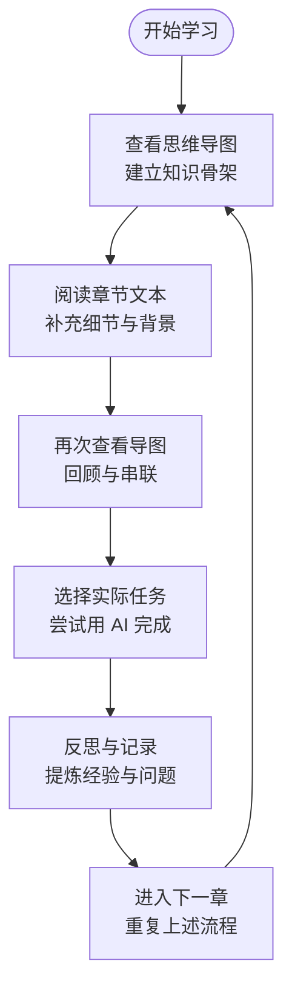
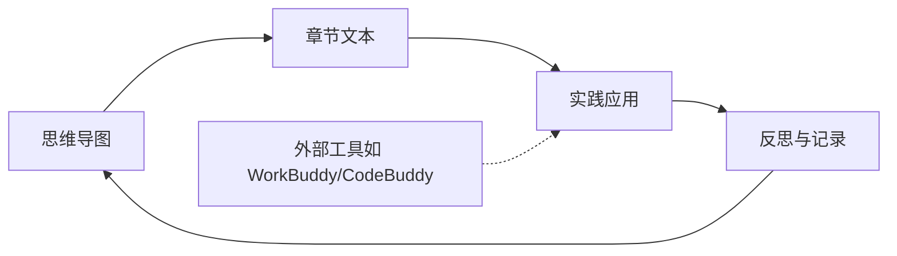

# 使用指南

<cite>
**本文引用的文件**
- [README.md](file://README.md)
- [00_overview.md](file://00_overview/00_overview.md)
- [01_ai_intro.md](file://01_ai_intro/01_ai_intro.md)
- [02_ai_how_it_works.md](file://02_ai_how_it_works/02_ai_how_it_works.md)
- [03_llm_capabilities.md](file://03_llm_capabilities/03_llm_capabilities.md)
- [04_llm_differences.md](file://04_llm_differences/04_llm_differences.md)
- [05_llm_tiers.md](file://05_llm_tiers/05_llm_tiers.md)
- [06_iq_and_params.md](file://06_iq_and_params/06_iq_and_params.md)
- [07_api_vs_local.md](file://07_api_vs_local/07_api_vs_local.md)
- [08_applications.md](file://08_applications/08_applications.md)
- [09_workbuddy_codebuddy.md](file://09_workbuddy_codebuddy/09_workbuddy_codebuddy.md)
- [10_prompt_engineering.md](file://10_prompt_engineering/10_prompt_engineering.md)
- [11_hallucination.md](file://11_hallucination/11_hallucination.md)
- [12_summary.md](file://12_summary/12_summary.md)
</cite>

## 目录
1. [引言](#引言)
2. [项目结构](#项目结构)
3. [核心组件](#核心组件)
4. [架构概览](#架构概览)
5. [详细组件分析](#详细组件分析)
6. [依赖分析](#依赖分析)
7. [性能考虑](#性能考虑)
8. [故障排除指南](#故障排除指南)
9. [结论](#结论)
10. [附录](#附录)

## 引言
本课程面向零基础成年人，通过“思维导图作骨架、文字作详解”的方式，帮助学习者从“完全不懂”逐步走向“熟练用 AI 解决问题”。课程强调实用性和可操作性，避免复杂公式与代码，聚焦于“AI 是什么、能做什么、怎么挑、怎么用、怎么避坑”。

- 适合对象：对 ChatGPT、文心、豆包、Claude 等工具有所耳闻但缺乏系统认知的人群；希望在工作、学习、生活中真正用上 AI 的学习者。
- 学习目标：掌握 AI 与大模型的基本概念，理解参数、API、本地部署等术语，学会提示词与上下文工程，识别并规避“幻觉”，并将 WorkBuddy、CodeBuddy 等工具融入日常生产力。

**章节来源**
- [README.md:1-69](file://README.md#L1-L69)

## 项目结构
课程采用“章节文件夹 + 双文件（.md + .xmind）”的组织方式，便于建立知识骨架与深入学习相结合的学习节奏。每章包含：
- XX_xxx.md：详细讲解文本，建议从头读到尾；
- XX_xxx.xmind：思维导图，适合复习、分享、打印展示。

推荐学习顺序遵循“先看导图建立框架 → 再读 md 补充细节 → 再看导图回顾”的循环模式，以实现高效记忆与迁移应用。

```mermaid
graph TB
subgraph "课程结构"
O["00_overview<br/>课程总览"]
I["01_ai_intro<br/>AI 是什么"]
W["02_ai_how_it_works<br/>AI 如何工作"]
C["03_llm_capabilities<br/>大模型能做什么"]
D["04_llm_differences<br/>大模型的差异化"]
T["05_llm_tiers<br/>大模型的能力梯队"]
P["06_iq_and_params<br/>智商与参数的关系"]
A["07_api_vs_local<br/>API 与本地部署"]
U["08_applications<br/>应用场景"]
B["09_workbuddy_codebuddy<br/>WorkBuddy 与 CodeBuddy"]
E["10_prompt_engineering<br/>提示词与上下文工程"]
H["11_hallucination<br/>幻觉与验证"]
S["12_summary<br/>总结与展望"]
end
O --> I --> W --> C --> D --> T --> P --> A --> U --> B --> E --> H --> S
```

**图表来源**
- [README.md:24-40](file://README.md#L24-L40)

**章节来源**
- [README.md:42-53](file://README.md#L42-L53)

## 核心组件
- 思维导图骨架：每章配套的 xmind 文件用于快速建立知识框架，便于复习与分享。
- 详细讲解文本：每章的 md 文件提供深入浅出的解释，帮助理解细节与背景。
- 实践应用：课程强调“学完一章后，挑一两个身边实际任务去试着用 AI 完成”，以巩固所学并形成迁移能力。

学习节奏建议：
- 每章阅读时间约 12-15 分钟，12 章总计约 3 小时；
- 不必一次性读完，每天 1-2 章，持续一周即可通盘掌握；
- 在阅读后立即进行小规模实践，效果最佳。

**章节来源**
- [README.md:42-59](file://README.md#L42-L59)

## 架构概览
课程整体采用“导图先行、文本补充、导图回顾”的三段式学习架构，配合实践应用，形成“认知—理解—迁移”的闭环。

[此图为概念性流程图，无需图表来源]

## 详细组件分析
以下按章节梳理学习要点与实践建议，帮助不同学习风格的人群高效掌握：

### 课程总览（00_overview）
- 目标：看清整张地图，选好学习路径。
- 建议：先浏览总览，明确学习目标与整体结构，再按推荐顺序逐章推进。

**章节来源**
- [00_overview.md](file://00_overview/00_overview.md)

### AI 是什么（01_ai_intro）
- 目标：用一杯咖啡的时间，搞懂 AI 的本质。
- 建议：结合导图中的关键词，尝试用自己的语言复述“AI 是什么”，并举出身边例子加深理解。

**章节来源**
- [01_ai_intro.md](file://01_ai_intro/01_ai_intro.md)

### AI 如何工作（02_ai_how_it_works）
- 目标：用“超级鹦鹉”理解大模型的原理。
- 建议：绘制个人化的“原理简化图”，将抽象概念映射到具体类比，便于记忆与讲解。

**章节来源**
- [02_ai_how_it_works.md](file://02_ai_how_it_works/02_ai_how_it_works.md)

### 大模型能做什么（03_llm_capabilities）
- 目标：文字、图像、语音、视频、代码……的能力清单。
- 建议：列出自己最关心的 3 个能力，结合导图中的分类，思考在工作/学习中的潜在应用场景。

**章节来源**
- [03_llm_capabilities.md](file://03_llm_capabilities/03_llm_capabilities.md)

### 大模型的差异化（04_llm_differences）
- 目标：通用 vs 垂直、闭源 vs 开源、国内外。
- 建议：制作对比表格，从“适用场景、优缺点、典型产品”三个维度梳理，便于后续选型参考。

**章节来源**
- [04_llm_differences.md](file://04_llm_differences/04_llm_differences.md)

### 大模型的能力梯队（05_llm_tiers）
- 目标：一梯队、二梯队、三梯队代表与选型建议。
- 建议：结合自身需求（如写作、编程、图像生成），标注各梯队的典型能力边界，形成“我的选型清单”。

**章节来源**
- [05_llm_tiers.md](file://05_llm_tiers/05_llm_tiers.md)

### 智商与参数的关系（06_iq_and_params）
- 目标：为什么“参数越大越聪明”是误区。
- 建议：用导图中的关键点画出“能力与参数关系”的思维图，标注“非线性、场景化、训练质量”等要点。

**章节来源**
- [06_iq_and_params.md](file://06_iq_and_params/06_iq_and_params.md)

### API 与本地部署（07_api_vs_local）
- 目标：两种使用方式的区别与适用人群。
- 建议：制作“使用方式对比表”，从“易用性、可控性、成本、技术门槛”四个维度评估，形成自己的决策依据。

**章节来源**
- [07_api_vs_local.md](file://07_api_vs_local/07_api_vs_local.md)

### 应用场景（08_applications）
- 目标：办公、学习、创作、生活、专业领域。
- 建议：选择 2-3 个高频场景，设计“用 AI 完成某任务”的步骤清单，形成可执行的行动方案。

**章节来源**
- [08_applications.md](file://08_applications/08_applications.md)

### WorkBuddy 与 CodeBuddy（09_workbuddy_codebuddy）
- 目标：腾讯的 AI 助手，口语中也叫“龙虾”。
- 建议：记录一次完整的使用流程（任务描述→输入提示→调整输出→复核结果），形成“我的使用手册”。

**章节来源**
- [09_workbuddy_codebuddy.md](file://09_workbuddy_codebuddy/09_workbuddy_codebuddy.md)

### 提示词与上下文工程（10_prompt_engineering）
- 目标：让 AI 输出你想要的结果的实战技巧。
- 建议：准备一个“提示词模板库”，按“角色+任务+约束+格式”四要素整理常用模板，边用边优化。

**章节来源**
- [10_prompt_engineering.md](file://10_prompt_engineering/10_prompt_engineering.md)

### 幻觉与验证（11_hallucination）
- 目标：识别“胡编乱造”，守住最后一道防线。
- 建议：建立“事实核查清单”，包含“来源标注、交叉验证、专家确认”等步骤，作为每次重要输出的检查清单。

**章节来源**
- [11_hallucination.md](file://11_hallucination/11_hallucination.md)

### 总结与展望（12_summary）
- 目标：趋势、学习路径、持续精进建议。
- 建议：制定“阶段性复盘计划”，每两周回顾一次学习成果与改进点，保持长期迭代。

**章节来源**
- [12_summary.md](file://12_summary/12_summary.md)

## 依赖分析
- 导图与文本的互补关系：导图负责“结构与记忆”，文本负责“细节与理解”，二者缺一不可。
- 实践与反思的闭环：每次学习后的小规模实践，有助于将知识转化为能力；反思与记录则促进元认知提升。
- 工具与内容的分离：课程强调“工具以官方最新版本为准”，避免因工具版本差异影响学习效果。

[此图为概念性依赖关系图，无需图表来源]

## 性能考虑
- 时间管理：每章 12-15 分钟，每天 1-2 章，可持续一周完成，避免信息过载。
- 记忆效率：导图先行建立骨架，再读文本填充细节，最后回看导图强化记忆。
- 能力迁移：在阅读后立即进行小规模实践，将“理解”转化为“可用技能”。

[本节为通用建议，无需章节来源]

## 故障排除指南
- 学习动力不足
  - 策略：设定每日微目标（如“今天只读 10 分钟”“只做 1 个小任务”），降低启动阻力。
  - 参考：课程建议“不必一次读完，每天 1-2 章，持续一周就能通盘掌握”。
- 记忆不牢固
  - 策略：利用导图快速回顾，配合“用自己的话讲一遍”的方式检验理解。
  - 参考：课程建议“看导图建立框架 → 读 md 补充细节 → 再看导图回顾”。
- 实践无从下手
  - 策略：从最简单的日常任务开始（如写一段邮件、整理会议纪要），逐步扩展到复杂任务。
  - 参考：课程建议“学完一章后，挑一两个身边的实际任务去试着用 AI 完成”。
- 对工具感到困惑
  - 策略：以“功能目标”为导向，先明确“我要解决什么问题”，再选择“用什么工具/方法”。
  - 参考：课程强调“具体使用以官方最新版本为准”。

**章节来源**
- [README.md:42-59](file://README.md#L42-L59)

## 结论
本课程通过“导图—文本—实践”的闭环设计，帮助零基础学习者在短时间内建立对 AI 的系统认知，并将其迁移到实际工作与生活中。坚持每日少量学习、及时实践与反思，是取得长期进步的关键。

[本节为总结性内容，无需章节来源]

## 附录
- 学习风格差异化建议
  - 视觉学习者：多用导图与颜色标记，将抽象概念可视化；尝试绘制“个人知识地图”。
  - 逻辑学习者：建立“对比表格”“因果链条图”，梳理概念间的逻辑关系；用“问题—原因—解决方案”结构组织笔记。
  - 实践学习者：以“任务驱动”为主，边学边做，记录“做了什么—遇到什么—如何解决—下次如何改进”的过程。
- 思维导图使用与制作流程
  - 流程：先看导图建立骨架 → 读文本补充细节 → 回看导图回顾串联 → 实践应用 → 反思记录。
  - 制作要点：围绕“主题—分支—关键词—关联”展开，突出层级与逻辑；用颜色与图标增强记忆。
- 学习进度跟踪方法
  - 方法：以“章节完成度 + 实践任务数 + 反思记录数”作为三维度指标；每周进行一次小结。
  - 工具：可用电子表格或轻量笔记软件记录，重点在于持续与可回溯。
- 学习效果评估方式
  - 自评：能否用一句话讲清本章核心？能否用 AI 完成一个简单任务？能否向他人解释关键概念？
  - 外评：与同伴互相讲解，或在实际工作中应用后复盘。

[本节为通用建议，无需章节来源]