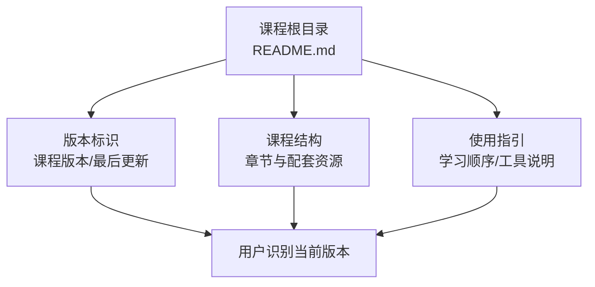
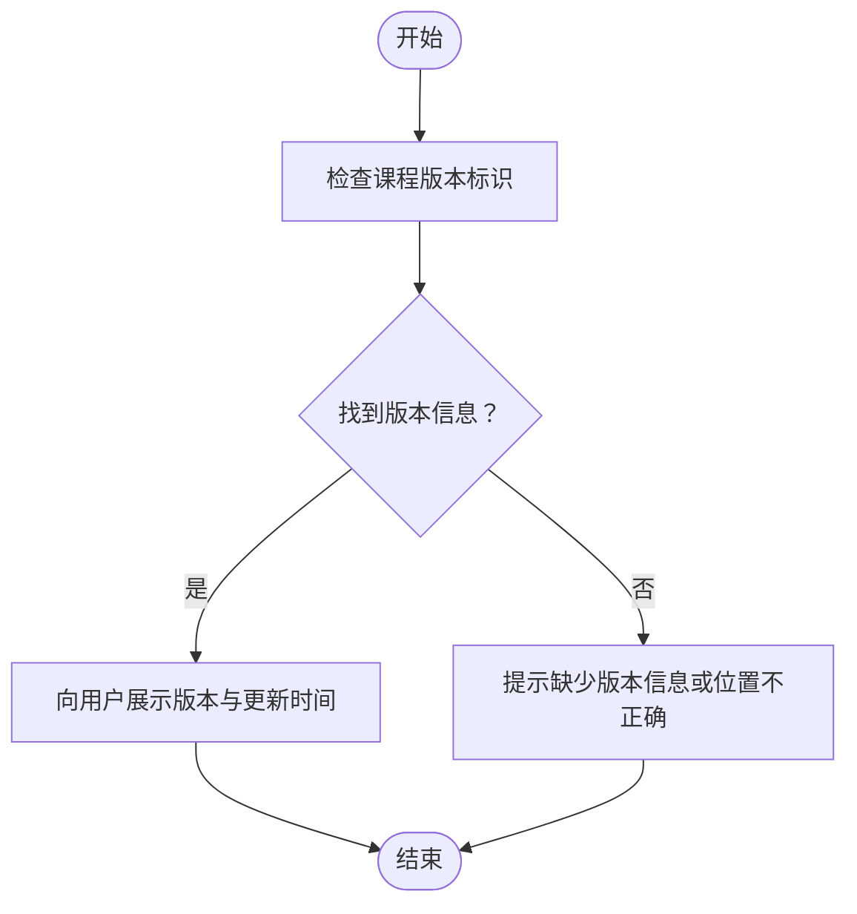
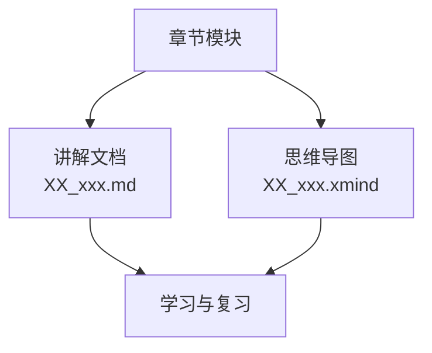
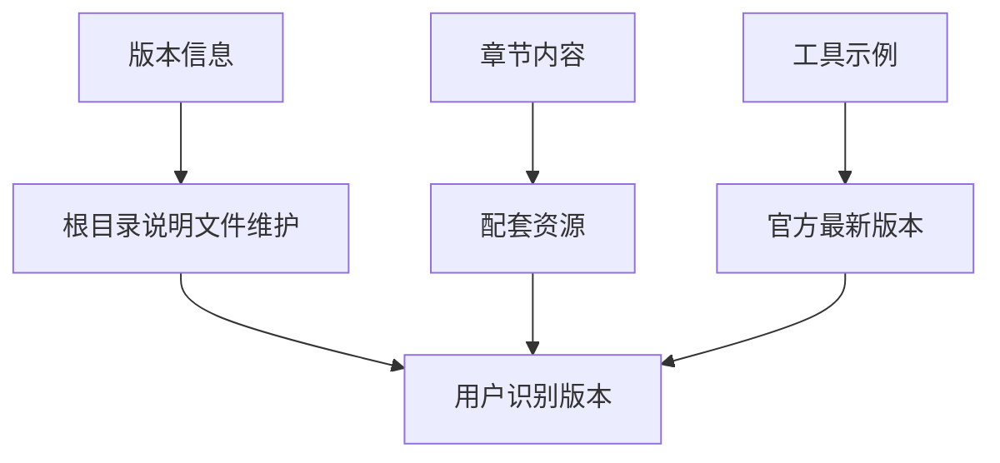

# 版本信息

<cite>
**本文档引用的文件**
- [README.md](file://README.md)
</cite>

## 目录
1. [简介](#简介)
2. [项目结构](#项目结构)
3. [核心组件](#核心组件)
4. [架构总览](#架构总览)
5. [详细组件分析](#详细组件分析)
6. [依赖关系分析](#依赖关系分析)
7. [性能考虑](#性能考虑)
8. [故障排除指南](#故障排除指南)
9. [结论](#结论)
10. [附录](#附录)

## 简介
本文件为“AI 科普教育课程”的版本信息文档，聚焦课程版本历史、更新日志与重要变更说明，帮助用户了解课程版本演进、兼容性与升级迁移路径。当前仓库中明确标注了课程版本与最后更新时间，作为版本信息的权威来源。

- 课程版本：第一版
- 最后更新：2026 年 6 月

以上信息来源于课程根目录的说明文件，用于指导用户识别当前版本状态与更新周期。

**章节来源**
- [README.md:67-70](file://README.md#L67-L70)

## 项目结构
课程采用“章节化组织 + 导图与文本配套”的结构，便于学习者通过思维导图建立知识框架、再通过章节文本补充细节。课程整体包含若干章节模块，每个模块通常包含一个 Markdown 讲解文档与一个思维导图文件，便于复习与分享。

- 章节组织：按编号与主题划分（例如“AI 是什么”“大模型能力”等）
- 学习流程：先看导图建立框架 → 再读章节文本补充细节 → 再看导图回顾
- 工具说明：课程中涉及的工具（如 WorkBuddy、CodeBuddy）为示例性质，使用时应以官方最新版本为准

该结构有利于版本迭代时对单个章节进行独立更新与维护，同时保持整体学习路径的连贯性。

**章节来源**
- [README.md:24-59](file://README.md#L24-L59)

## 核心组件
- 版本标识与更新周期：课程版本与最后更新日期在根目录说明文件中明确标注，作为当前版本状态的依据
- 章节内容与配套资源：每个章节包含讲解文档与思维导图，便于学习与复习
- 工具使用提示：课程强调所列工具仅为示例，实际使用需参考官方最新版本

这些组件共同构成课程的版本管理与发布基础，确保用户可清晰识别当前版本并据此进行学习与升级。

**章节来源**
- [README.md:63-70](file://README.md#L63-L70)

## 架构总览
课程版本信息的呈现与管理遵循以下思路：
- 版本标识：在根目录说明文件中标注“课程版本”与“最后更新”
- 更新策略：以“章节为单位”的内容迭代为主，配合导图与文本资源的同步更新
- 用户指引：明确学习顺序与工具使用注意事项，降低因工具版本差异带来的学习成本

## 详细组件分析
### 版本标识与更新周期
- 当前版本：第一版
- 最后更新：2026 年 6 月
- 作用：为用户提供当前课程版本状态，便于判断是否需要升级或关注后续更新

**章节来源**
- [README.md:67-70](file://README.md#L67-L70)

### 章节组织与配套资源
- 组织方式：每章包含讲解文档与思维导图，便于建立框架与复习巩固
- 更新策略：章节内容可独立迭代，导图与文本同步更新，保证学习体验一致性

**章节来源**
- [README.md:43-54](file://README.md#L43-L54)

### 工具使用提示
- 工具示例：WorkBuddy、CodeBuddy 等
- 使用原则：课程中的工具为示例，实际使用应以官方最新版本为准，避免因工具版本差异影响学习效果

**章节来源**
- [README.md:62-65](file://README.md#L62-L65)

## 依赖关系分析
- 版本信息依赖于根目录说明文件的正确维护，确保用户可快速定位当前版本状态
- 章节内容与配套资源相互依赖，共同支撑学习路径与复习体系
- 工具使用提示依赖于外部官方版本的稳定性与更新频率，课程需定期校准工具示例

## 性能考虑
- 版本信息的可见性与准确性直接影响用户的学习体验与升级决策
- 章节内容的独立更新能力有助于减少大规模重构带来的维护成本
- 明确的工具使用提示可降低因工具版本差异导致的学习阻滞

## 故障排除指南
- 若发现版本信息缺失或位置异常，请检查根目录说明文件的版本标识字段是否正确填写
- 若章节内容与配套资源不同步，请优先核对章节文件命名与组织结构是否符合课程规范
- 若工具示例与实际使用存在偏差，请以官方最新版本为准，并在课程中及时更新示例说明

## 结论
当前仓库的版本信息以“课程版本：第一版；最后更新：2026 年 6 月”为核心标识，结合章节化组织与配套资源，形成清晰的学习与升级路径。建议在后续版本中：
- 在版本标识中增加更细粒度的版本号与变更摘要
- 增设版本兼容性说明与升级迁移指南
- 建立版本路线图与未来更新计划，提升用户预期管理

## 附录
- 学习建议：按照“看导图建立框架 → 读章节文本补充细节 → 再看导图回顾”的流程进行学习
- 工具使用：课程中的工具为示例，实际使用请以官方最新版本为准

**章节来源**
- [README.md:50-65](file://README.md#L50-L65)