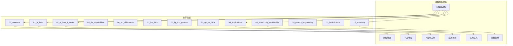
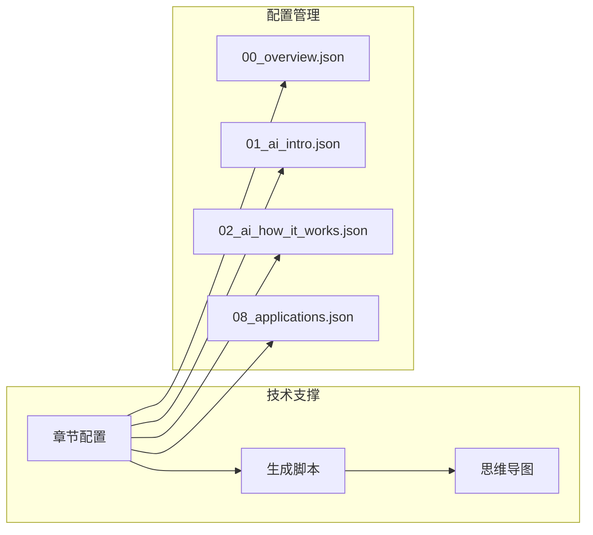
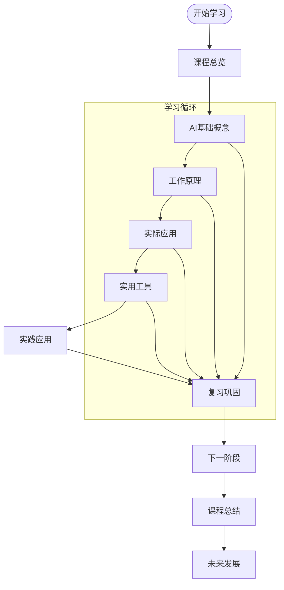
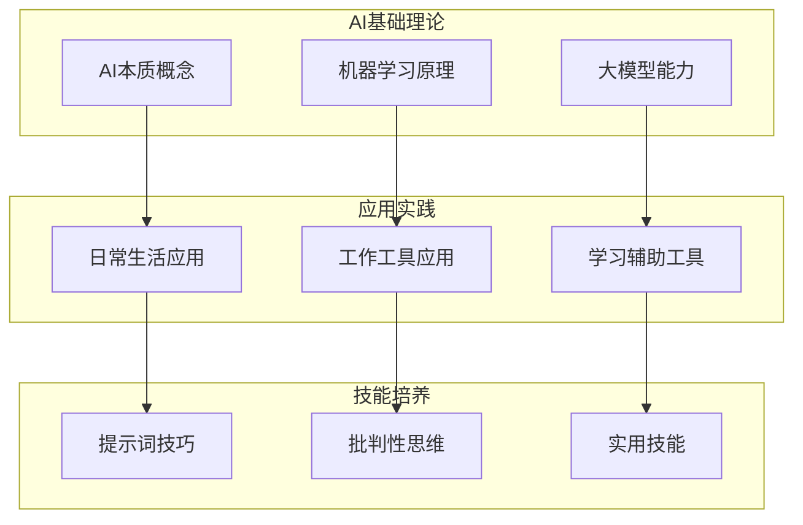
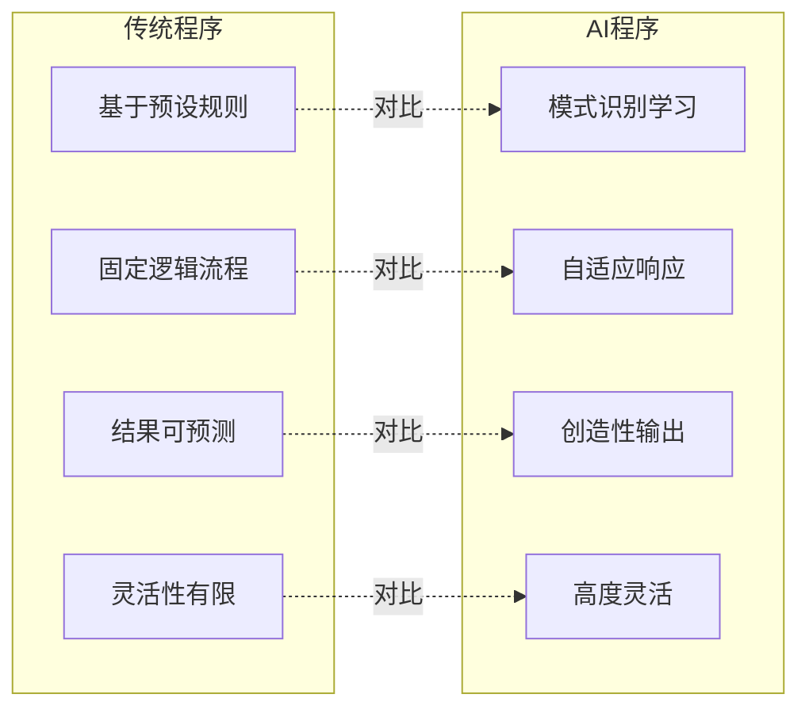
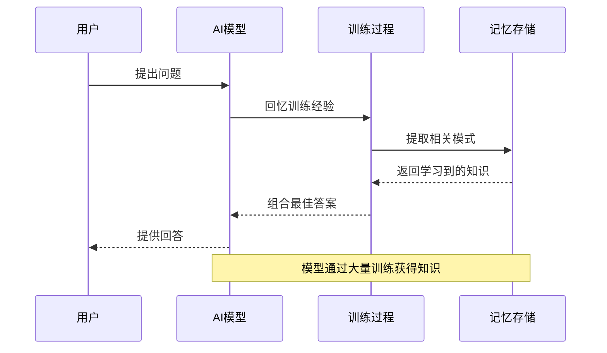
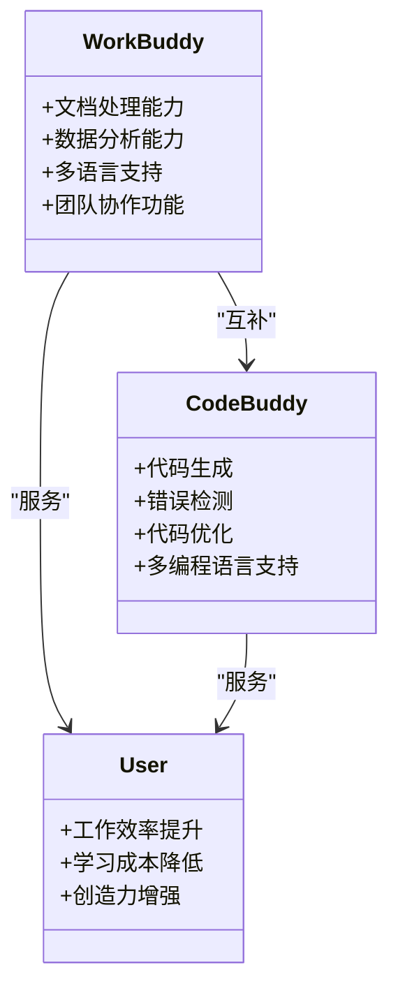
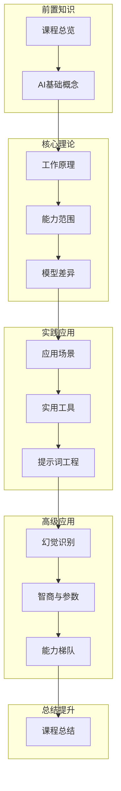

# AI入门基础

<cite>
**本文档引用的文件**
- [README.md](file://README.md)
- [00_overview.md](file://00_overview/00_overview.md)
- [01_ai_intro.md](file://01_ai_intro/01_ai_intro.md)
- [02_ai_how_it_works.md](file://02_ai_how_it_works/02_ai_how_it_works.md)
- [08_applications.md](file://08_applications/08_applications.md)
- [09_workbuddy_codebuddy.md](file://09_workbuddy_codebuddy/09_workbuddy_codebuddy.md)
- [12_summary.md](file://12_summary/12_summary.md)
- [generate_xmind.js](file://scripts/generate_xmind.js)
- [00_overview.json](file://scripts/chapters/00_overview.json)
- [01_ai_intro.json](file://scripts/chapters/01_ai_intro.json)
- [02_ai_how_it_works.json](file://scripts/chapters/02_ai_how_it_works.json)
- [08_applications.json](file://scripts/chapters/08_applications.json)
</cite>

## 目录
1. [引言](#引言)
2. [项目结构](#项目结构)
3. [核心组件](#核心组件)
4. [架构概览](#架构概览)
5. [详细组件分析](#详细组件分析)
6. [依赖关系分析](#依赖关系分析)
7. [性能考虑](#性能考虑)
8. [故障排除指南](#故障排除指南)
9. [结论](#结论)
10. [附录](#附录)

## 引言

本课程是一套面向零基础成年人的AI通识教育课程，采用"思维导图作骨架，文字作详解"的方式，帮助学习者从完全不懂AI开始，逐步掌握AI的本质、原理和应用方法。课程设计遵循循序渐进的学习原则，通过13个精心设计的章节，让学习者能够在一杯咖啡的时间内理解AI的核心概念。

### 课程特色

- **零基础友好**：不涉及复杂的数学公式和编程代码，专注于概念理解和实际应用
- **实用导向**：每章都配有具体的使用场景和实践建议
- **系统性强**：从AI本质到实际应用形成完整的知识体系
- **持续精进**：提供学习路径规划和长期发展建议

### 目标学习者

本课程特别适合以下人群：
- 听说过ChatGPT、文心、豆包、Claude等AI产品，但不清楚其本质的人群
- 希望在工作、学习、生活中真正运用AI解决问题的实践者
- 不想被技术术语困扰，只关心"AI是什么、能做什么、怎么用"的用户

**章节来源**
- [README.md:7-22](file://README.md#L7-L22)

## 项目结构

基于仓库的实际结构，本课程采用模块化组织方式，每个章节独立成章，便于学习者按需选择和重复学习。

**图表来源**
- [README.md:24-41](file://README.md#L24-L41)

### 章节分布特点

- **基础理论层**（00-02章）：建立AI基础知识框架
- **应用实践层**（08-09章）：连接理论与实际应用
- **总结提升层**（12章）：系统梳理和未来规划

**章节来源**
- [README.md:24-41](file://README.md#L24-L41)

## 核心组件

### 教学内容组件

每个章节都包含两个核心组成部分：

1. **详细讲解文本**（XX_xxx.md）
   - 深入浅出的概念解释
   - 实际应用场景分析
   - 互动式问题设计

2. **思维导图文件**（XX_xxx.xmind）
   - 知识框架可视化
   - 便于复习和记忆
   - 支持打印和分享

### 技术支持组件

**图表来源**
- [generate_xmind.js](file://scripts/generate_xmind.js)
- [00_overview.json](file://scripts/chapters/00_overview.json)
- [01_ai_intro.json](file://scripts/chapters/01_ai_intro.json)
- [02_ai_how_it_works.json](file://scripts/chapters/02_ai_how_it_works.json)
- [08_applications.json](file://scripts/chapters/08_applications.json)

**章节来源**
- [README.md:43-48](file://README.md#L43-L48)

## 架构概览

### 学习路径架构

### 知识体系架构

**图表来源**
- [README.md:26-41](file://README.md#L26-L41)

## 详细组件分析

### AI基础概念章节（01_ai_intro）

#### 核心概念解析

AI（人工智能）的本质可以理解为让机器模拟人类智能行为的技术集合。这一概念包含以下几个关键要素：

**传统程序 vs AI程序的根本区别**：

**图表来源**
- [01_ai_intro.md](file://01_ai_intro/01_ai_intro.md)

#### 机器学习核心思想

机器学习的核心在于让计算机通过大量数据自动发现规律，而不是依赖人工编写的所有规则。这种学习过程具有以下特征：

- **数据驱动**：从数据中提取模式和规律
- **自动优化**：随着数据增加而不断改进
- **泛化能力**：能够处理未见过的新情况
- **概率性推理**：基于统计概率做出判断

### AI工作原理章节（02_ai_how_it_works）

#### "超级鹦鹉"理解模型

该章节采用生动的比喻帮助理解AI的工作机制：

**图表来源**
- [02_ai_how_it_works.md](file://02_ai_how_it_works/02_ai_how_it_works.md)

#### 知识获取与应用过程

AI系统的学习和应用过程可以分为三个层次：

1. **知识输入**：通过训练数据学习模式
2. **知识存储**：将学到的模式保存在模型参数中
3. **知识应用**：面对新问题时调用相关知识

### 应用场景章节（08_applications）

#### 日常生活中的AI应用

AI已经深度融入我们的日常生活，主要体现在以下几个方面：

**办公场景应用**：
- 文档自动撰写和润色
- 数据分析和报告生成
- 会议记录和摘要
- 邮件自动分类和回复

**学习场景应用**：
- 个性化学习路径推荐
- 知识点解释和答疑
- 作业批改和反馈
- 学习进度跟踪

**创作场景应用**：
- 文学作品创作辅助
- 图像和视频内容生成
- 音乐创作灵感
- 设计方案优化

**图表来源**
- [08_applications.md](file://08_applications/08_applications.md)

### 实用工具章节（09_workbuddy_codebuddy）

#### WorkBuddy与CodeBuddy工具

这两个腾讯开发的AI助手工具代表了AI在实际工作中的应用：

**图表来源**
- [09_workbuddy_codebuddy.md](file://09_workbuddy_codebuddy/09_workbuddy_codebuddy.md)

**章节来源**
- [09_workbuddy_codebuddy.md](file://09_workbuddy_codebuddy/09_workbuddy_codebuddy.md)

## 依赖关系分析

### 章节间依赖关系

**图表来源**
- [README.md:24-41](file://README.md#L24-L41)

### 技术实现依赖

课程的技术实现依赖于以下组件：

1. **配置管理系统**：通过JSON配置文件管理章节信息
2. **自动化生成工具**：JavaScript脚本自动生成思维导图
3. **内容组织结构**：标准化的章节命名和文件组织

**章节来源**
- [generate_xmind.js](file://scripts/generate_xmind.js)
- [00_overview.json](file://scripts/chapters/00_overview.json)

## 性能考虑

### 学习效率优化

基于课程设计理念，以下是提高学习效率的关键策略：

**时间管理**：
- 每章约12-15分钟阅读量
- 建议每天1-2章，持续一周掌握全貌
- 学完一章后立即实践应用

**学习路径优化**：
- 先看思维导图建立框架
- 再读详细内容补充细节
- 最后再看导图回顾巩固

**实践导向**：
- 每章结束后选择1-2个实际任务尝试使用AI完成
- 通过实践加深理解
- 建立从理论到应用的桥梁

## 故障排除指南

### 常见学习障碍及解决方案

**概念理解困难**：
- 建议多看几遍思维导图，建立整体框架
- 结合实际生活中的AI应用案例理解
- 不要急于求成，允许概念在大脑中慢慢沉淀

**实践应用无从下手**：
- 从最简单的应用场景开始（如文档润色、邮件写作）
- 逐步扩展到更复杂的应用（如数据分析、创意写作）
- 利用WorkBuddy和CodeBuddy等工具降低使用门槛

**学习动力不足**：
- 设定小目标，及时获得成就感
- 与朋友分享学习成果，互相激励
- 关注AI技术的发展趋势，保持好奇心

### 技术使用问题

**思维导图查看问题**：
- 确保使用支持XMind格式的软件
- 如果无法打开，可以尝试在线查看
- 导图文件支持打印，便于随时复习

**章节内容获取**：
- 每个章节都有对应的JSON配置文件
- 可以通过配置文件了解章节内容和学习重点
- 按照推荐顺序学习，避免跳跃造成理解困难

## 结论

本AI入门课程通过精心设计的13个章节，构建了一个完整的AI知识体系。课程采用"思维导图+详细讲解"的双重学习模式，既保证了知识的系统性，又提供了直观的学习体验。

### 主要成就

1. **概念清晰化**：通过简单易懂的语言解释复杂的AI概念
2. **应用导向**：强调AI在实际生活中的应用价值
3. **实践性强**：提供具体的操作步骤和使用建议
4. **持续发展**：不仅教授当前技能，还提供未来发展方向

### 学习建议

- 保持开放心态，拥抱新技术带来的变化
- 注重实践应用，在使用中深化理解
- 培养批判性思维，理性看待AI技术
- 持续关注AI发展趋势，终身学习

通过本课程的学习，学习者将能够：
- 用一句话准确描述AI的本质
- 理解不同AI产品的特点和适用场景
- 掌握基本的AI工具使用技巧
- 建立正确的AI认知框架

## 附录

### 学习资源清单

- **官方工具**：WorkBuddy、CodeBuddy等AI助手
- **学习材料**：各章节的详细讲解和思维导图
- **实践平台**：支持AI应用的各种在线工具和服务

### 进阶学习路径

完成本课程后，建议继续深入学习：
- 提示词工程的高级技巧
- 特定领域的AI应用
- AI伦理和安全问题
- AI技术发展趋势

**章节来源**
- [README.md:50-70](file://README.md#L50-L70)