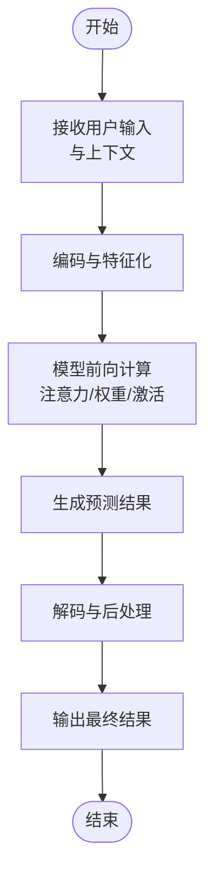
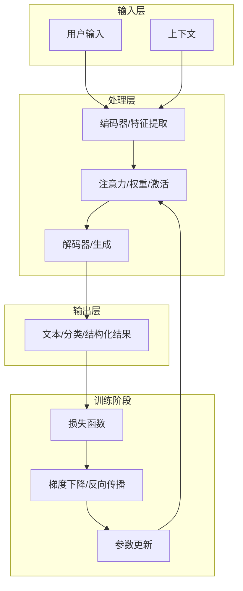
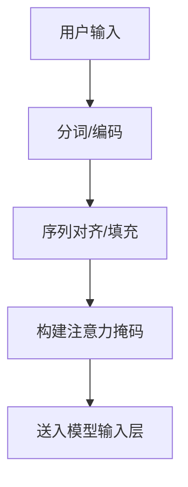
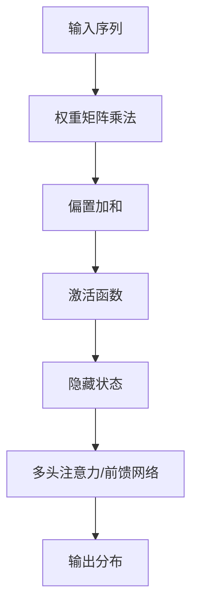
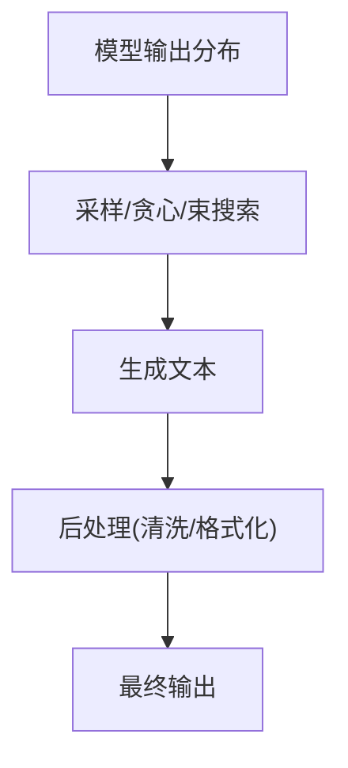
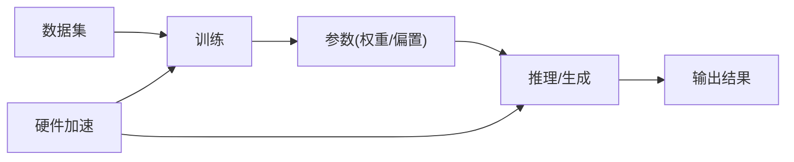

# AI工作原理

<cite>
**本文引用的文件**
- [README.md](file://README.md)
</cite>

## 目录
1. [引言](#引言)
2. [项目结构](#项目结构)
3. [核心组件](#核心组件)
4. [架构总览](#架构总览)
5. [详细组件分析](#详细组件分析)
6. [依赖分析](#依赖分析)
7. [性能考虑](#性能考虑)
8. [故障排除指南](#故障排除指南)
9. [结论](#结论)
10. [附录](#附录)

## 引言
本章节围绕“AI如何工作”展开，目标是以通俗易懂的方式解释AI系统的基本组成与运行机制，帮助零基础读者建立对AI决策过程的直观理解。我们将采用类比与流程图的方式，避免复杂公式与代码，聚焦于数据输入、处理过程与输出结果的整体视图；同时澄清常见误区，强调“理解原理”的重要性。

## 项目结构
该课程采用“思维导图作骨架、文字作详解”的组织方式：每章提供两份材料：
- XX_xxx.md：详细讲解文本，建议从头读到尾
- XX_xxx.xmind：思维导图，便于复习、分享与打印

课程共13章，其中第02章“AI如何工作”直接对应本教学内容的主题。整体学习建议为“看导图建立框架 → 读md补充细节 → 再看导图回顾”，每日1-2章，持续一周即可掌握。


**章节来源**
- [README.md:24-41](file://README.md#L24-L41)
- [README.md:43-54](file://README.md#L43-L54)

## 核心组件
本节从“输入-处理-输出”的视角拆解AI系统的三个关键环节，并结合“超级鹦鹉”类比帮助理解：

- 输入（Input）
  - 文本输入：用户以自然语言提出问题或给出指令
  - 上下文：历史对话、角色设定、任务背景等
  - 特征化：将输入转换为模型可处理的向量表示（抽象理解）

- 处理（Processing）
  - 编码器/解码器：对输入进行特征提取与序列建模
  - 注意力机制：聚焦输入中的关键信息
  - 权重与偏置：通过大量参数控制信息流动与组合方式
  - 激活函数：决定节点是否“兴奋”并传递信号
  - 梯度下降与反向传播：通过比较预测与真实标签，迭代调整权重与偏置

- 输出（Output）
  - 生成文本：按概率分布采样，逐步拼接出回答
  - 结构化结果：分类、打分、抽取等任务的特定格式
  - 置信度/置信区间：反映模型对输出的信心程度



**章节来源**
- [README.md:29](file://README.md#L29)

## 架构总览
下面用一个简化但贴近实际的“黑箱”视角展示AI系统的工作流。该图强调输入、处理与输出之间的关系，以及训练阶段对模型能力的影响。



说明：
- 输入层负责收集用户问题与上下文信息
- 处理层完成特征提取、注意力聚焦与结果生成
- 输出层给出最终可读或可执行的结果
- 训练阶段通过损失函数与梯度下降不断优化权重与偏置

## 详细组件分析

### 数据输入与预处理
- 用户输入通常以自然语言形式出现，系统需要将其转换为模型可理解的向量序列
- 上下文（如历史对话、角色设定）会显著影响模型的输出倾向
- 预处理步骤包括分词、填充、掩码等，确保序列长度一致并屏蔽无关信息



### 模型内部处理
- 注意力机制：让模型在生成每个词时“关注”输入中的关键片段
- 权重与偏置：控制信息在不同层之间的传递强度与方向
- 激活函数：使模型具备非线性拟合能力，从而逼近复杂映射
- 前向传播：从输入到输出的单向计算过程
- 反向传播：根据损失函数对梯度进行反向传播，更新参数



### 训练过程与优化
- 目标：最小化预测分布与真实答案之间的差距
- 方法：计算损失函数，使用梯度下降沿负梯度方向更新权重与偏置
- 收敛：重复多次迭代，直到损失稳定或达到停止条件

```mermaid
sequenceDiagram
participant Train as "训练循环"
participant Model as "模型"
participant Loss as "损失函数"
participant Opt as "优化器"
Train->>Model : 前向传播(输入,标签)
Model-->>Train : 预测分布
Train->>Loss : 计算损失
Loss-->>Train : 损失值
Train->>Opt : 反向传播(梯度)
Opt-->>Model : 更新权重与偏置
```

### 输出与后处理
- 生成式输出：按概率分布采样，逐步拼接词元形成完整回答
- 结果校验：结合上下文一致性与事实准确性进行过滤
- 置信度评估：为后续决策提供不确定性度量



## 依赖分析
- 组件耦合
  - 输入与处理：强耦合（输入质量直接影响处理效果）
  - 处理与输出：弱到中等耦合（输出受模型结构与参数影响）
  - 训练与处理：间接耦合（训练决定参数，进而影响推理）
- 外部依赖
  - 数据集与标注：训练阶段的关键资源
  - 硬件加速：GPU/TPU对训练与推理效率至关重要
  - 工具链：编译器、框架、分布式训练平台



## 性能考虑
- 训练效率
  - 批大小与学习率：影响收敛速度与稳定性
  - 混合精度训练：降低显存占用，提升吞吐
  - 梯度累积：在显存受限时扩大有效批大小
- 推理效率
  - KV缓存：减少重复计算，提升长序列生成速度
  - 动态批处理：按请求规模调整资源分配
  - 模型量化与剪枝：在精度可接受范围内压缩模型体积
- 稳定性
  - 学习率调度与warmup：避免训练初期震荡
  - 正则化与早停：防止过拟合

## 故障排除指南
- 输出不合理
  - 检查输入是否清晰、上下文是否充分
  - 确认角色设定与任务约束是否明确
- 生成重复或啰嗦
  - 调整温度与top-p采样参数
  - 在提示词中加入“简洁回答”的约束
- 训练不收敛
  - 检查学习率是否合适
  - 核对损失函数与标签是否匹配
  - 确认是否存在梯度爆炸或消失
- 显存不足
  - 减小批大小或启用梯度累积
  - 使用混合精度或梯度检查点
  - 评估模型规模与硬件配置的匹配度

## 结论
AI系统本质上是一个“从输入到输出”的映射学习器。通过注意力机制与大量参数，模型能够在海量数据中发现模式并泛化到新情况。理解输入、处理与输出的全链路，有助于我们更有效地提问、更准确地解读结果，并在实践中规避常见陷阱。建议结合思维导图反复回顾，将抽象概念转化为可操作的认知框架。

## 附录
- 学习路径建议
  - 先通过导图建立整体框架，再细读章节内容，最后回到导图巩固记忆
  - 每学完一章，尝试用AI完成1-2个身边的小任务，加深理解
- 常见误区澄清
  - 参数越多不一定越“聪明”：能力取决于训练数据、任务设计与评估指标
  - “提示词即魔法”：提示词是工具，真正的理解来自对原理的把握
  - “AI无所不能”：在特定任务上表现优异，但在创造性、常识与伦理方面仍需谨慎