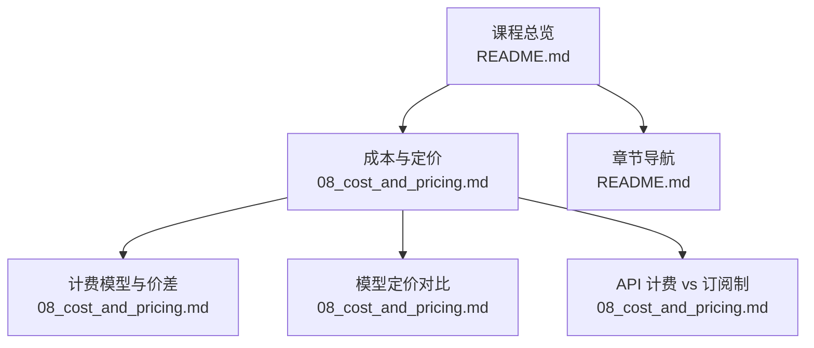
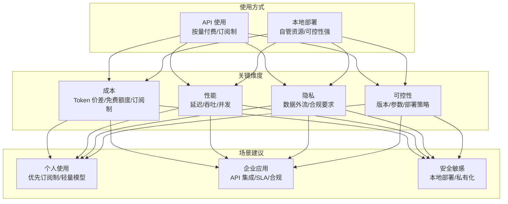
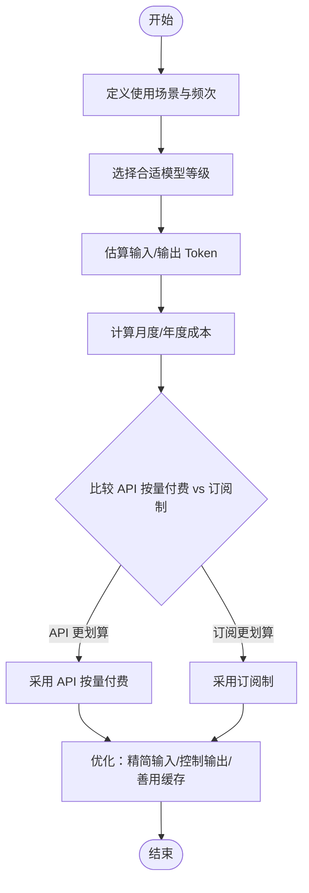
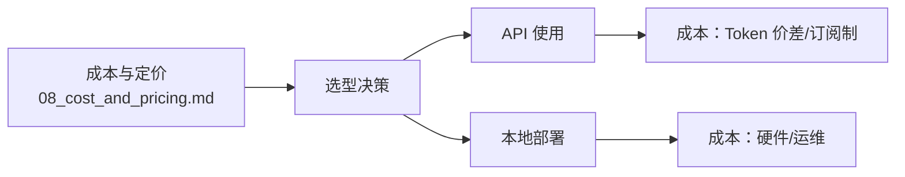

# API与本地部署

<cite>
**本文引用的文件**
- [README.md](file://README.md)
- [08_cost_and_pricing.md](file://08_cost_and_pricing/08_cost_and_pricing.md)
</cite>

## 目录
1. [引言](#引言)
2. [项目结构](#项目结构)
3. [核心组件](#核心组件)
4. [架构概览](#架构概览)
5. [详细组件分析](#详细组件分析)
6. [依赖分析](#依赖分析)
7. [性能考虑](#性能考虑)
8. [故障排查指南](#故障排查指南)
9. [结论](#结论)
10. [附录](#附录)

## 引言
本章围绕“API 使用”与“本地模型部署”两种主流的大模型使用方式展开教学，帮助读者从成本、性能、隐私与可控性等维度进行权衡，并给出不同场景（个人使用、企业应用、安全敏感场景）的选择建议。同时提供部署准备、环境配置与使用注意事项，帮助读者在实际落地中做出稳健决策。

## 项目结构
本仓库为“AI 科普课程”的知识体系，本章内容与“成本与定价”章节存在直接关联，便于读者在了解计费模型后再评估 API 与本地部署的成本差异与取舍。

图表来源
- [README.md:24-41](file://README.md#L24-L41)
- [08_cost_and_pricing.md:126-134](file://08_cost_and_pricing/08_cost_and_pricing.md#L126-L134)

章节来源
- [README.md:24-41](file://README.md#L24-L41)

## 核心组件
- 成本与定价基础：理解 Token 计费、输入/输出价差、主流模型价格区间，以及 API 按量付费与订阅制的适用边界。
- 场景化选择：基于成本、性能、隐私与可控性，给出个人、企业与安全敏感场景的实践建议。
- 部署与配置：概述本地部署的准备步骤、环境要求与注意事项，帮助读者完成从“概念理解”到“动手实践”的过渡。

章节来源
- [08_cost_and_pricing.md:7-31](file://08_cost_and_pricing/08_cost_and_pricing.md#L7-L31)
- [08_cost_and_pricing.md:34-46](file://08_cost_and_pricing/08_cost_and_pricing.md#L34-L46)
- [08_cost_and_pricing.md:48-75](file://08_cost_and_pricing/08_cost_and_pricing.md#L48-L75)
- [08_cost_and_pricing.md:126-134](file://08_cost_and_pricing/08_cost_and_pricing.md#L126-L134)

## 架构概览
下图展示了“API 使用”与“本地部署”的整体对比视角，涵盖成本、性能、隐私与可控性四个关键维度，并给出不同场景的选型建议。

## 详细组件分析

### 组件A：成本与定价（支撑API与本地部署选型）
- Token 是计费最小单位，输入与输出分别计费，输出通常比输入贵 2~4 倍。
- 主流模型价格差异可达几十倍，应结合使用频次与预算做选择。
- 免费额度与省钱技巧（选对模型等级、精简输入、善用缓存、批量处理、控制输出长度、关注优惠）可显著降低总体成本。
- API 按量付费适合开发者与需要集成到系统的用户；订阅制适合普通用户在网页/App 上对话。

图表来源
- [08_cost_and_pricing.md:79-99](file://08_cost_and_pricing/08_cost_and_pricing.md#L79-L99)
- [08_cost_and_pricing.md:103-123](file://08_cost_and_pricing/08_cost_and_pricing.md#L103-L123)
- [08_cost_and_pricing.md:126-134](file://08_cost_and_pricing/08_cost_and_pricing.md#L126-L134)

章节来源
- [08_cost_and_pricing.md:7-31](file://08_cost_and_pricing/08_cost_and_pricing.md#L7-L31)
- [08_cost_and_pricing.md:34-46](file://08_cost_and_pricing/08_cost_and_pricing.md#L34-L46)
- [08_cost_and_pricing.md:48-75](file://08_cost_and_pricing/08_cost_and_pricing.md#L48-L75)
- [08_cost_and_pricing.md:79-99](file://08_cost_and_pricing/08_cost_and_pricing.md#L79-L99)
- [08_cost_and_pricing.md:103-123](file://08_cost_and_pricing/08_cost_and_pricing.md#L103-L123)
- [08_cost_and_pricing.md:126-134](file://08_cost_and_pricing/08_cost_and_pricing.md#L126-L134)

### 组件B：场景化选择与落地建议
- 个人使用：优先考虑订阅制或轻量模型 API，满足日常对话与轻度创作需求，注重易用性与成本控制。
- 企业应用：倾向 API 集成，具备更好的可扩展性、可观测性与 SLA 支撑；若涉及内部数据治理与合规，可考虑本地部署或私有化方案。
- 安全敏感场景：优先本地部署或私有化，确保数据不出域、参数与版本可控，满足严格审计与合规要求。

章节来源
- [08_cost_and_pricing.md:126-134](file://08_cost_and_pricing/08_cost_and_pricing.md#L126-L134)

### 组件C：部署准备与环境配置（本地部署）
- 准备阶段：明确硬件资源（CPU/GPU/内存/存储）、网络带宽与操作系统兼容性；评估推理加速（如 CUDA、TensorRT）与容器化需求。
- 环境配置：安装运行时依赖（Python、CUDA/cuDNN、容器运行时）、下载模型权重与推理引擎、配置服务端口与访问控制。
- 使用注意事项：开启鉴权与加密传输、限制并发与超时、设置日志与监控、定期备份与回滚策略、版本升级与灰度发布流程。

章节来源
- [README.md:18-22](file://README.md#L18-L22)

## 依赖分析
- 本章内容与“成本与定价”章节存在强耦合：API 使用的成本取决于 Token 价差与模型选择；本地部署的成本取决于硬件投入与运维开销。
- 选型依赖于使用场景：个人用户更关注订阅制的便捷性；企业用户更看重 API 的可集成性与稳定性；安全敏感用户更倾向本地部署的可控性。

图表来源
- [08_cost_and_pricing.md:126-134](file://08_cost_and_pricing/08_cost_and_pricing.md#L126-L134)

章节来源
- [08_cost_and_pricing.md:126-134](file://08_cost_and_pricing/08_cost_and_pricing.md#L126-L134)

## 性能考虑
- API 使用：延迟与吞吐受服务商负载与网络影响，适合中小规模并发与交互式对话；可通过缓存 Token 与批量请求优化端到端时延。
- 本地部署：延迟与吞吐由硬件与推理引擎决定，适合高并发与低延迟场景；需关注显存占用、批处理大小与并发线程数的平衡。

## 故障排查指南
- API 使用常见问题
  - 请求失败：检查鉴权、配额与速率限制；确认输入/输出 Token 是否超限。
  - 响应异常：核对提示词与上下文长度；调整温度与最大输出长度。
  - 网络抖动：启用重试与退避策略，必要时切换就近接入点。
- 本地部署常见问题
  - 启动失败：核对依赖版本与驱动兼容性；检查端口占用与权限。
  - 显存不足：降低批处理大小或模型精度；清理缓存与临时文件。
  - 性能瓶颈：分析 CPU/GPU 利用率与内存带宽；优化批处理与并发配置。

## 结论
- 对于个人用户与轻量场景，API 使用（尤其是订阅制与轻量模型）具备更高的性价比与易用性。
- 对于企业级应用，API 集成可提供更好的可扩展性与可观测性；若涉及数据合规与安全敏感，本地部署或私有化更具可控性。
- 在做最终决策前，务必结合自身成本预算、性能目标、隐私与合规要求，进行综合评估与试点验证。

## 附录
- 相关章节导航
  - 课程总览与章节列表：[README.md:24-41](file://README.md#L24-L41)
  - 成本与定价详解：[08_cost_and_pricing.md](file://08_cost_and_pricing/08_cost_and_pricing.md)