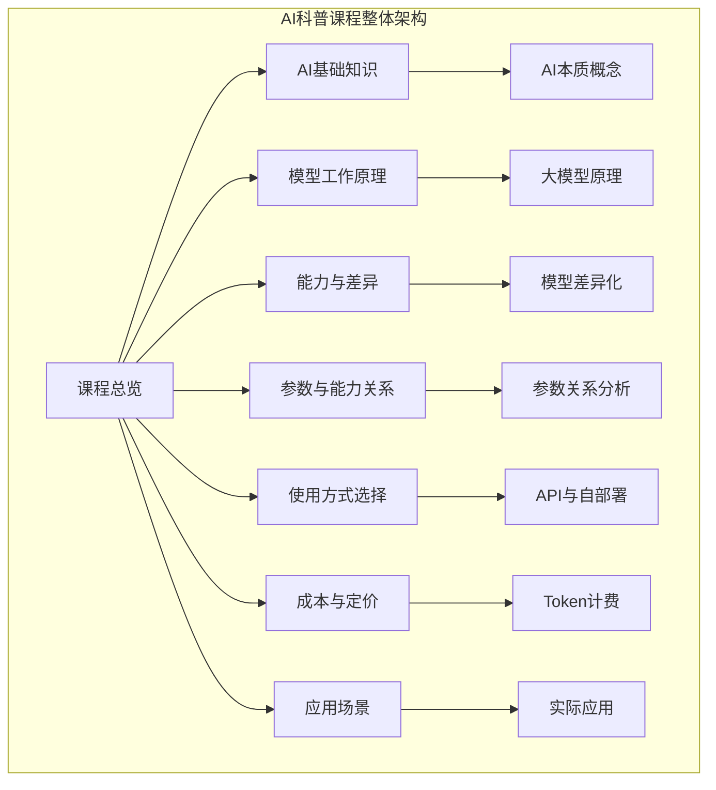
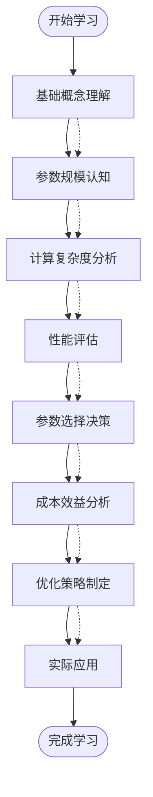
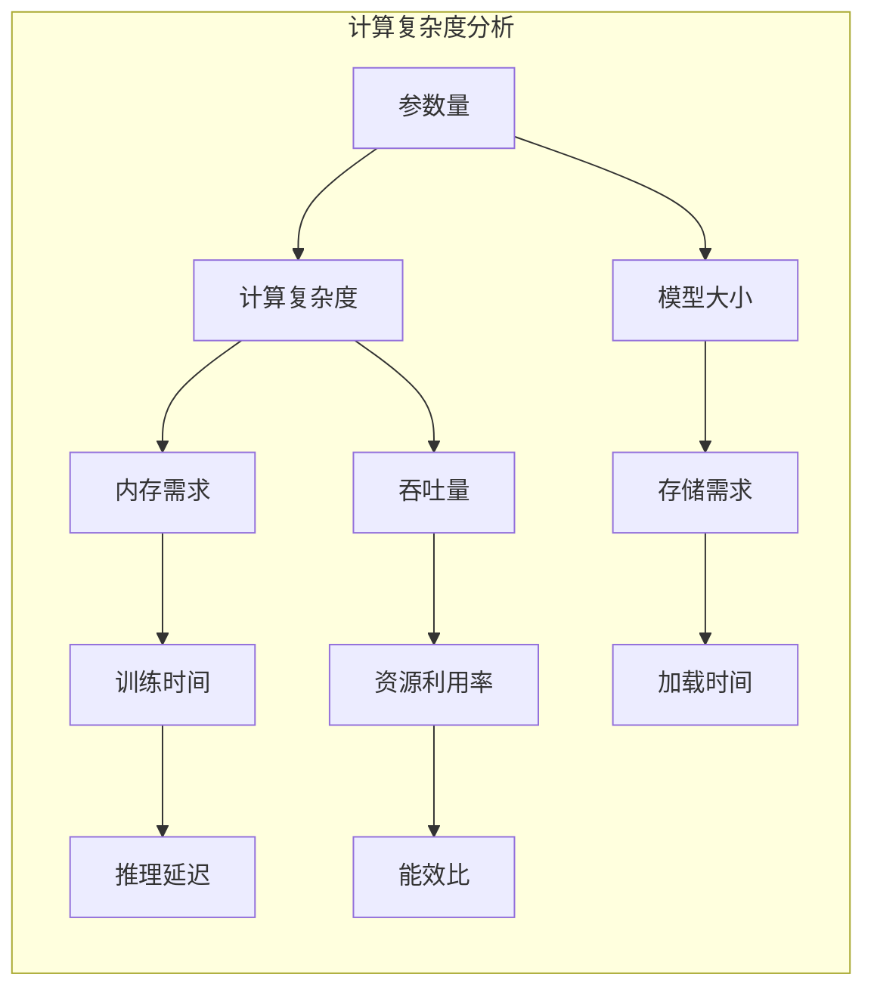
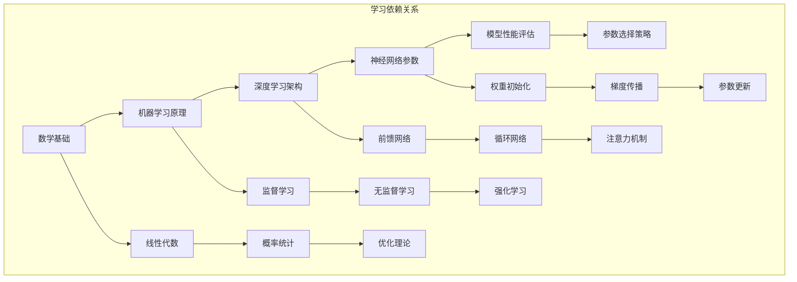

# 参数与能力关系

<cite>
**本文引用的文件**
- [README.md](file://README.md)
- [08_cost_and_pricing.md](file://08_cost_and_pricing/08_cost_and_pricing.md)
</cite>

## 目录
1. [引言](#引言)
2. [项目结构](#项目结构)
3. [核心组件](#核心组件)
4. [架构概览](#架构概览)
5. [详细组件分析](#详细组件分析)
6. [依赖分析](#依赖分析)
7. [性能考虑](#性能考虑)
8. [故障排除指南](#故障排除指南)
9. [结论](#结论)
10. [附录](#附录)

## 引言

在人工智能领域，模型参数规模与性能表现之间的关系是一个复杂而重要的主题。本章节旨在为读者提供一个全面而易于理解的框架，帮助大家理解参数量、计算复杂度与效果提升之间的内在联系，以及如何根据实际需求做出合理的参数选择决策。

参数作为衡量模型规模的核心指标，其增长往往伴随着计算资源需求的指数级上升。然而，这种增长并不总是线性地转化为性能提升，其中涉及复杂的权衡关系。通过深入分析不同参数规模模型的能力差异、使用场景以及优化策略，读者可以更好地理解如何在性能、成本和效率之间找到最佳平衡点。

## 项目结构

本AI科普课程采用模块化设计，每个章节围绕特定主题构建完整的知识体系。项目结构体现了从基础概念到实践应用的渐进式学习路径。

**图表来源**
- [README.md:24-41](file://README.md#L24-L41)

**章节来源**
- [README.md:1-70](file://README.md#L1-L70)

## 核心组件

### 参数规模与性能关系的核心要素

参数规模作为衡量神经网络复杂度的关键指标，直接影响着模型的学习能力和表现潜力。在大语言模型中，参数量的增长通常遵循以下规律：

#### 参数量与计算复杂度的关系
- **线性增长特性**：参数量增加通常导致计算复杂度呈线性或近似线性增长
- **内存需求**：模型参数占用存储空间，影响加载速度和运行效率
- **训练时间**：更大的参数规模需要更多的训练时间和计算资源

#### 性能提升的边际效应
- **初期快速提升**：较小参数规模到中等规模的提升最为显著
- **边际递减规律**：超过某个阈值后，继续增加参数带来的性能提升逐渐减少
- **饱和点理论**：存在最优参数规模，进一步增大可能不会带来明显收益

**章节来源**
- [README.md:34-36](file://README.md#L34-L36)

### 成本效益分析框架

在实际应用中，参数规模的选择需要综合考虑多方面因素：

#### 成本构成要素
- **硬件成本**：GPU/TPU等计算设备的采购和维护费用
- **运营成本**：电力消耗、冷却系统、数据中心租金
- **开发成本**：模型训练、微调、部署的技术投入
- **维护成本**：模型更新、性能监控、技术支持

#### 效率优化策略
- **模型压缩**：通过剪枝、量化等技术减少参数规模
- **混合精度训练**：降低计算精度以提高训练效率
- **分布式训练**：利用多设备并行加速训练过程
- **增量预训练**：针对特定领域的参数微调

**章节来源**
- [08_cost_and_pricing.md:1-151](file://08_cost_and_pricing/08_cost_and_pricing.md#L1-L151)

## 架构概览

参数与能力关系的教学内容采用分层架构设计，从基础概念到高级应用逐步深入：

**图表来源**
- [README.md:13-22](file://README.md#L13-L22)
- [08_cost_and_pricing.md:7-31](file://08_cost_and_pricing/08_cost_and_pricing.md#L7-L31)

## 详细组件分析

### 参数规模分类与能力差异

#### 小规模模型（<1B参数）
- **典型特征**：计算资源需求低，响应速度快
- **适用场景**：嵌入式应用、边缘计算、实时交互
- **性能特点**：基础任务处理能力强，复杂推理能力有限
- **成本优势**：部署和维护成本最低

#### 中等规模模型（1B-10B参数）
- **典型特征**：平衡了性能与效率的黄金分割点
- **适用场景**：企业级应用、个性化服务、多模态处理
- **性能特点**：具备较强的上下文理解和生成能力
- **成本效益**：性价比最优的选择范围

#### 大规模模型（>10B参数）
- **典型特征**：卓越的泛化能力和创造性
- **适用场景**：前沿研究、复杂推理、创意生成
- **性能特点**：在多个领域表现出色，但资源消耗巨大
- **成本考量**：需要充足的预算和技术支持

### 计算复杂度与效率关系

**图表来源**
- [08_cost_and_pricing.md:34-44](file://08_cost_and_pricing/08_cost_and_pricing.md#L34-L44)

#### 复杂度增长模式
- **线性复杂度**：参数量与计算量基本成正比
- **二次复杂度**：注意力机制等操作呈现二次增长
- **混合复杂度**：不同类型层的复杂度组合

#### 效率优化技术
- **稀疏化技术**：通过参数共享减少冗余计算
- **流水线并行**：将计算任务分解到多个设备
- **激活检查点**：在内存和计算之间进行权衡
- **动态批处理**：根据负载调整计算资源分配

**章节来源**
- [08_cost_and_pricing.md:115-122](file://08_cost_and_pricing/08_cost_and_pricing.md#L115-L122)

### 参数优化与效率提升技术

#### 模型压缩技术
- **知识蒸馏**：用大模型指导小模型训练
- **参数剪枝**：移除不重要的连接和参数
- **低秩分解**：将权重矩阵分解为低秩形式
- **量化技术**：降低参数表示精度以节省存储

#### 训练优化策略
- **混合精度训练**：同时使用单精度和半精度计算
- **梯度累积**：在小批量上模拟大批量训练效果
- **学习率调度**：动态调整学习率以提高收敛效率
- **早停策略**：防止过拟合并节省训练时间

#### 推理优化技术
- **动态计算**：根据输入复杂度调整计算深度
- **缓存机制**：重用相似查询的中间结果
- **批处理优化**：合理组织请求以提高吞吐量
- **硬件适配**：针对特定硬件架构进行优化

**章节来源**
- [08_cost_and_pricing.md:103-123](file://08_cost_and_pricing/08_cost_and_pricing.md#L103-L123)

## 依赖分析

参数与能力关系的学习具有层次性依赖特征，需要按照特定顺序掌握相关概念：

**图表来源**
- [README.md:13-22](file://README.md#L13-L22)

### 知识依赖关系

#### 基础知识支撑
- **数学基础**：线性代数、概率论、微积分是理解参数更新的基础
- **编程技能**：Python、NumPy、PyTorch等工具的使用
- **统计学知识**：数据分布、假设检验、回归分析

#### 专业概念关联
- **模型架构**：不同网络结构对参数效率的影响
- **训练算法**：优化器选择与收敛性能的关系
- **评估指标**：准确率、召回率、F1分数等性能度量

### 实践技能要求

#### 开发环境准备
- **硬件配置**：GPU显存、CPU性能、内存容量要求
- **软件工具**：深度学习框架、可视化工具、调试工具
- **数据准备**：训练数据集、验证数据集、测试数据集

#### 项目管理能力
- **实验设计**：对照组设置、变量控制、结果记录
- **版本管理**：代码版本、模型版本、实验记录
- **结果分析**：统计显著性检验、误差分析、趋势预测

**章节来源**
- [README.md:43-60](file://README.md#L43-L60)

## 性能考虑

### 参数规模对性能的影响机制

#### 记忆容量效应
- **上下文长度限制**：参数量影响可处理的文本长度
- **知识存储密度**：更多参数意味着更强的知识表示能力
- **模式识别能力**：复杂参数结构有助于发现数据中的细微模式

#### 推理能力增强
- **多跳推理**：更大模型能够处理更复杂的逻辑推理
- **跨领域迁移**：参数丰富度影响知识迁移效果
- **创造性思维**：充足参数支持更丰富的创意表达

#### 计算效率权衡
- **并行化程度**：大规模参数更适合并行计算架构
- **内存访问模式**：参数分布影响缓存命中率
- **通信开销**：分布式训练中的参数同步成本

### 成本控制策略

#### 经济性分析方法
- **ROI计算**：投资回报率评估不同参数规模的选择
- **TCO分析**：总拥有成本包括硬件、软件、人力等所有费用
- **风险评估**：技术风险、市场风险、政策风险的量化

#### 资源优化技术
- **弹性扩展**：根据负载动态调整资源配置
- **资源共享**：多任务共享计算资源以提高利用率
- **生命周期管理**：从部署到退役的全周期成本控制

**章节来源**
- [08_cost_and_pricing.md:79-99](file://08_cost_and_pricing/08_cost_and_pricing.md#L79-L99)

## 故障排除指南

### 常见问题诊断

#### 训练阶段问题
- **梯度消失/爆炸**：通过参数初始化和正则化解决
- **过拟合现象**：增加数据、正则化、早停策略
- **收敛缓慢**：调整学习率、优化器参数、批大小

#### 推理阶段问题
- **响应时间过长**：模型压缩、缓存优化、硬件升级
- **内存不足**：梯度检查点、混合精度、分布式推理
- **精度下降**：重新训练、微调、知识蒸馏

#### 部署阶段问题
- **兼容性问题**：版本管理、依赖隔离、容器化部署
- **性能瓶颈**：性能分析、瓶颈识别、针对性优化
- **监控告警**：异常检测、自动恢复、容量规划

### 优化建议

#### 参数选择指导原则
- **任务复杂度匹配**：根据具体任务难度选择合适参数规模
- **资源约束考虑**：在可用资源范围内寻找最优解
- **未来扩展预留**：为业务增长预留足够的扩展空间

#### 成本控制策略
- **分阶段投入**：从小规模开始，逐步扩大参数规模
- **A/B测试**：通过对比实验验证不同参数规模的效果
- **自动化运维**：通过自动化减少人工干预成本

**章节来源**
- [08_cost_and_pricing.md:103-134](file://08_cost_and_pricing/08_cost_and_pricing.md#L103-L134)

## 结论

参数与能力关系是AI模型设计的核心议题。通过对参数规模、计算复杂度和性能提升规律的深入分析，我们可以得出以下关键结论：

### 核心要点总结

1. **非线性关系特征**：参数规模与性能提升呈现非线性关系，存在边际递减效应
2. **成本效益平衡**：需要在性能提升与成本增加之间找到最优平衡点
3. **场景适应性**：不同应用场景对参数规模的需求差异很大
4. **技术演进趋势**：随着技术发展，参数效率和训练效率持续提升

### 实践指导原则

- **渐进式扩展**：从小规模开始，根据实际效果逐步增加参数规模
- **成本意识**：始终将成本控制纳入参数选择的重要考量因素
- **技术更新**：关注新技术发展，及时采用更高效的参数优化技术
- **持续评估**：定期评估参数配置的有效性，及时调整优化策略

通过系统性地理解和应用这些原则，读者可以在实际项目中做出更加明智的参数选择决策，在保证性能的同时实现成本效益最大化。

## 附录

### 学习资源推荐

#### 在线资源
- **学术论文**：关注最新的参数效率和模型压缩研究成果
- **技术博客**：跟踪业界专家对参数规模趋势的分析
- **开源项目**：参与开源社区，学习最佳实践和经验

#### 实践工具
- **性能分析工具**：用于监控和分析参数配置的效果
- **成本计算工具**：帮助进行详细的成本效益分析
- **实验管理工具**：系统化地管理参数实验和结果

#### 进阶学习路径
- **深度学习理论**：深入理解参数更新和优化算法
- **系统架构设计**：学习大规模模型的部署和优化技术
- **经济学原理**：掌握成本效益分析和资源配置的经济学基础

通过持续学习和实践，读者可以不断提升在参数与能力关系方面的专业水平，为AI项目的成功实施奠定坚实基础。