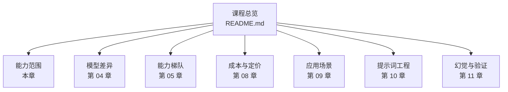
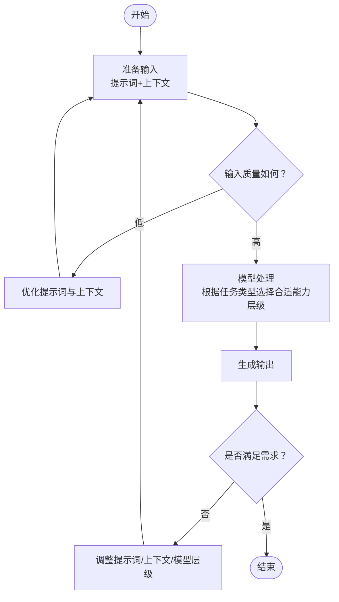
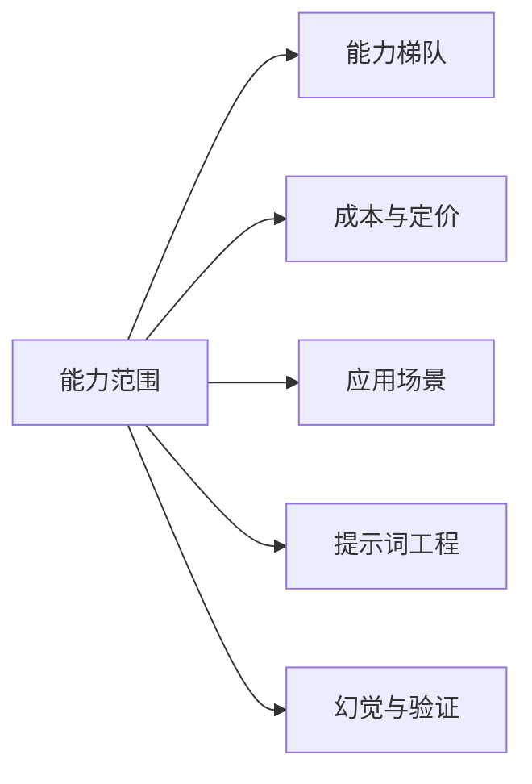

# 大模型能力范围

<cite>
**本文引用的文件**
- [README.md](file://README.md)
- [08_cost_and_pricing.md](file://08_cost_and_pricing.md)
</cite>

## 目录
1. [引言](#引言)
2. [项目结构](#项目结构)
3. [核心能力概览](#核心能力概览)
4. [架构总览](#架构总览)
5. [详细能力分析](#详细能力分析)
6. [依赖关系分析](#依赖关系分析)
7. [性能考量](#性能考量)
8. [故障排查指南](#故障排查指南)
9. [结论](#结论)
10. [附录](#附录)

## 引言
本章节围绕“大模型能力范围”展开教学，目标是帮助读者系统认识当前主流大语言模型的主要能力边界，包括但不限于文本生成、对话理解、多语言支持、逻辑推理等方面。我们将结合课程整体定位与学习路径，给出可操作的能力测试方法与自我评估技巧，帮助你在真实任务中判断“该用什么模型、如何提问、如何验证结果”。

## 项目结构
本课程采用“思维导图作骨架、文字作详解”的组织方式，每章包含一个讲解文档与一个复习导图。针对“大模型能力范围”，课程提供了总体定位与学习顺序建议，便于读者建立全局认知。

图表来源
- [README.md:24-41](file://README.md#L24-L41)

章节来源
- [README.md:24-41](file://README.md#L24-L41)

## 核心能力概览
- 文本生成：覆盖摘要、改写、扩写、风格迁移、创意写作等常见任务。
- 对话理解：支持多轮问答、角色扮演、指令跟随、上下文记忆等。
- 多语言支持：在不同语言下的表达与理解能力，以及跨语言翻译辅助。
- 逻辑推理：数学计算、事实推理、因果推断、策略规划等。
- 代码能力：基础语法理解、简单逻辑实现、注释与解释等。
- 事实核查与幻觉识别：对不确定信息进行标注与提醒，避免误导。

上述能力在课程中作为“能力清单”的一部分出现，帮助学习者建立对“大模型能做什么”的整体认知。

章节来源
- [README.md:31](file://README.md#L31)

## 架构总览
本节从“能力范围”的视角，梳理影响模型表现的关键要素：输入质量（提示词与上下文）、模型能力层级、任务复杂度、以及外部约束（如计费与可用性）。下图展示了“输入→模型→输出”的基本流程，以及影响输出质量的若干变量。

## 详细能力分析
本节聚焦“能力范围”的实操层面，结合课程提供的学习路径，给出能力测试与自我评估的方法论。

### 能力测试方法
- 明确任务类型：区分“生成类”“理解类”“推理类”“代码类”等，有助于选择合适的模型与提示词策略。
- 设定可量化指标：例如“字数上限”“关键词覆盖率”“错误率阈值”等，便于客观评估。
- 对比不同模型/版本：在同一任务上对比不同模型或同一模型的不同版本，观察差异。
- 控制变量：固定提示词模板、上下文长度、输出格式要求，排除干扰因素。

### 自我评估技巧
- 结果初筛：先看“是否完成任务”“是否符合格式要求”“是否包含关键信息”。
- 结果细判：再看“是否存在事实性错误”“逻辑是否连贯”“语言是否自然”。
- 幻觉识别：对“看起来合理但不确定”的信息进行标注与二次验证。
- 成本与效率：在满足质量的前提下，评估“输入成本”“输出成本”“迭代成本”。

### 能力边界与常见陷阱
- 事实性错误：模型可能“一本正经地胡说八道”，需通过外部验证与交叉核对解决。
- 上下文过长：超出上下文窗口会导致信息丢失，应提炼关键信息。
- 多轮对话一致性：需要显式提示与结构化上下文，避免“前后矛盾”。
- 代码与数据：仅能提供思路与解释，不应直接用于生产环境的最终决策。

## 依赖关系分析
“能力范围”与课程其他章节存在强关联：
- 与“能力梯队”（第 05 章）：不同梯队代表不同能力层级，直接影响任务完成度与成本。
- 与“成本与定价”（第 08 章）：模型价格差异显著，需在能力与预算之间做取舍。
- 与“应用场景”（第 09 章）：不同场景对能力的要求不同，应据此选择模型与提示策略。
- 与“提示词工程”（第 10 章）：高质量提示词是发挥模型能力的关键前置条件。
- 与“幻觉与验证”（第 11 章）：识别与规避幻觉是保证输出质量的重要手段。

章节来源
- [README.md:33-37](file://README.md#L33-L37)
- [README.md:40](file://README.md#L40)

## 性能考量
- Token 成本：输出通常比输入昂贵，应尽量精简输入、控制输出长度。
- 模型选择：日常使用优先考虑性价比高的轻量模型，复杂任务再升级到更高能力层级。
- 缓存与复用：在稳定上下文下，利用缓存降低重复成本。
- 批量处理：合并相似任务，减少重复输入带来的开销。

章节来源
- [08_cost_and_pricing.md:34-44](file://08_cost_and_pricing.md#L34-L44)
- [08_cost_and_pricing.md:115-122](file://08_cost_and_pricing.md#L115-L122)

## 故障排查指南
- 任务未完成：检查提示词是否清晰、上下文是否完整、是否需要拆分任务。
- 输出过长或啰嗦：在提示词中明确“用简洁语言回答”“限定字数”等约束。
- 事实错误：对关键事实进行标注与二次验证，必要时引入外部知识源。
- 上下文溢出：缩短上下文或分段处理，确保关键信息在窗口内。
- 多轮对话混乱：统一角色设定与风格，使用结构化提示词管理历史记录。

## 结论
“大模型能力范围”并非一成不变，而是由“任务类型、提示词质量、模型能力层级、成本约束”共同决定的动态空间。通过科学的能力测试与自我评估，你可以更高效地选择合适的模型与策略，在满足质量要求的同时控制成本与风险。

## 附录
- 学习路径建议：先建立“能力范围”的整体认知，再深入“能力梯队”“成本与定价”“应用场景”“提示词工程”“幻觉与验证”等章节，形成闭环。
- 实战建议：每学完一章，选取身边的一个实际任务，尝试用不同模型与提示策略完成，记录结果并总结经验。