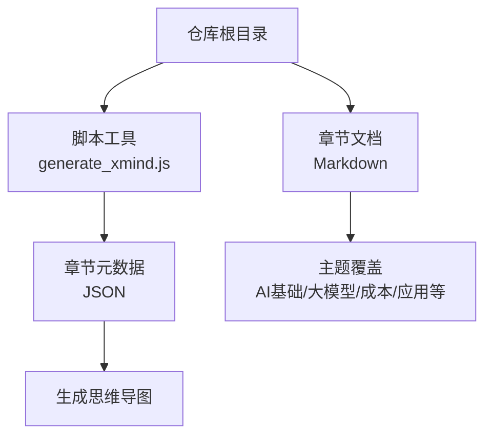
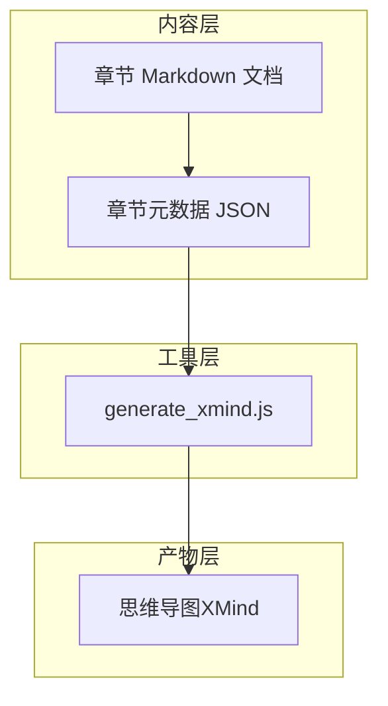
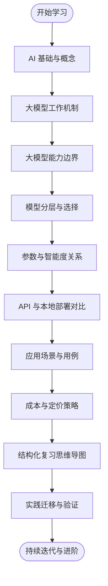
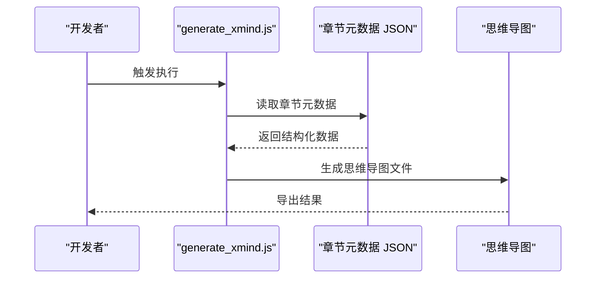

# 学习总结

<cite>
**本文档引用的文件**
- [README.md](file://README.md)
- [08_cost_and_pricing.md](file://08_cost_and_pricing/08_cost_and_pricing.md)
- [generate_xmind.js](file://scripts/generate_xmind.js)
- [00_overview.json](file://scripts/chapters/00_overview.json)
- [01_ai_intro.json](file://scripts/chapters/01_ai_intro.json)
- [02_ai_how_it_works.json](file://scripts/chapters/02_ai_how_it_works.json)
- [03_llm_capabilities.json](file://scripts/chapters/03_llm_capabilities.json)
- [04_llm_differences.json](file://scripts/chapters/04_llm_differences.json)
- [05_llm_tiers.json](file://scripts/chapters/05_llm_tiers.json)
- [06_iq_and_params.json](file://scripts/chapters/06_iq_and_params.json)
- [07_api_vs_local.json](file://scripts/chapters/07_api_vs_local.json)
- [08_applications.json](file://scripts/chapters/08_applications.json)
</cite>

## 目录
1. [引言](#引言)
2. [项目结构](#项目结构)
3. [核心组件](#核心组件)
4. [架构总览](#架构总览)
5. [详细组件分析](#详细组件分析)
6. [依赖分析](#依赖分析)
7. [性能考虑](#性能考虑)
8. [故障排除指南](#故障排除指南)
9. [结论](#结论)
10. [附录](#附录)

## 引言
本学习总结面向完成该AI课程学习的学习者，旨在帮助你系统回顾课程核心知识点、建立自我评估标准、制定知识迁移与实践计划，并提供持续学习与进阶方向。由于仓库中包含课程章节与配套脚本，我们将以这些材料为基础，梳理知识脉络，构建可操作的学习与应用框架。

## 项目结构
该项目采用“主题章节 + 脚本工具”的组织方式：  
- 章节内容以 Markdown 文件形式呈现，覆盖 AI 基础、大模型能力、定价成本、应用场景等主题。  
- 脚本工具用于生成思维导图（XMind）以及维护章节元数据 JSON，便于知识体系可视化与结构化管理。

**图表来源**
- [README.md](file://README.md)
- [generate_xmind.js](file://scripts/generate_xmind.js)
- [00_overview.json](file://scripts/chapters/00_overview.json)

**章节来源**
- [README.md](file://README.md)
- [08_cost_and_pricing.md](file://08_cost_and_pricing/08_cost_and_pricing.md)

## 核心组件
- 章节内容组件：涵盖 AI 概念、大模型工作机制、能力边界、模型分层、参数与智能度关系、API 与本地部署对比、应用场景与成本定价等。  
- 脚本工具组件：通过 generate_xmind.js 将章节元数据 JSON 转换为思维导图，辅助知识结构化与复习。

学习要点提炼（基于现有文件名与脚本用途）：
- 明确 AI 与大模型的基本概念与工作原理，理解不同模型的能力差异与适用层级。  
- 掌握 API 与本地部署的权衡，了解成本与性能的关系。  
- 理解提示工程与幻觉问题，具备基本的提示设计与风险规避意识。  
- 具备将大模型能力迁移到具体应用场景的思路与方法。

**章节来源**
- [README.md](file://README.md)
- [08_cost_and_pricing.md](file://08_cost_and_pricing/08_cost_and_pricing.md)

## 架构总览
下图展示从“章节内容”到“知识结构化输出”的整体流程：

**图表来源**
- [generate_xmind.js](file://scripts/generate_xmind.js)
- [00_overview.json](file://scripts/chapters/00_overview.json)
- [01_ai_intro.json](file://scripts/chapters/01_ai_intro.json)
- [02_ai_how_it_works.json](file://scripts/chapters/02_ai_how_it_works.json)
- [03_llm_capabilities.json](file://scripts/chapters/03_llm_capabilities.json)
- [04_llm_differences.json](file://scripts/chapters/04_llm_differences.json)
- [05_llm_tiers.json](file://scripts/chapters/05_llm_tiers.json)
- [06_iq_and_params.json](file://scripts/chapters/06_iq_and_params.json)
- [07_api_vs_local.json](file://scripts/chapters/07_api_vs_local.json)
- [08_applications.json](file://scripts/chapters/08_applications.json)

## 详细组件分析

### 组件A：章节内容与主题覆盖
- 主题范围：AI 基础、大模型工作机制、能力边界、模型分层、参数与智能度关系、API 与本地部署对比、应用场景与成本定价等。  
- 内容组织：每个主题对应一个章节，便于按主题深入学习与复习。  
- 实践建议：结合“成本与定价”章节，思考在不同预算与场景下的技术选型；结合“应用场景”章节，规划可落地的业务用例。

**图表来源**
- [README.md](file://README.md)
- [08_cost_and_pricing.md](file://08_cost_and_pricing/08_cost_and_pricing.md)

**章节来源**
- [README.md](file://README.md)
- [08_cost_and_pricing.md](file://08_cost_and_pricing/08_cost_and_pricing.md)

### 组件B：脚本工具与知识结构化
- generate_xmind.js：负责读取章节元数据 JSON 并生成思维导图，帮助快速建立知识地图，强化记忆与检索效率。  
- 章节元数据 JSON：记录各章节标题、顺序与关联关系，是生成导图的数据基础。

**图表来源**
- [generate_xmind.js](file://scripts/generate_xmind.js)
- [00_overview.json](file://scripts/chapters/00_overview.json)
- [01_ai_intro.json](file://scripts/chapters/01_ai_intro.json)
- [02_ai_how_it_works.json](file://scripts/chapters/02_ai_how_it_works.json)
- [03_llm_capabilities.json](file://scripts/chapters/03_llm_capabilities.json)
- [04_llm_differences.json](file://scripts/chapters/04_llm_differences.json)
- [05_llm_tiers.json](file://scripts/chapters/05_llm_tiers.json)
- [06_iq_and_params.json](file://scripts/chapters/06_iq_and_params.json)
- [07_api_vs_local.json](file://scripts/chapters/07_api_vs_local.json)
- [08_applications.json](file://scripts/chapters/08_applications.json)

**章节来源**
- [generate_xmind.js](file://scripts/generate_xmind.js)

## 依赖分析
- 内容与工具的耦合：章节 Markdown 通过 JSON 元数据被 generate_xmind.js 读取，形成“内容 → 结构化数据 → 可视化”的链路。  
- 复杂度与扩展性：新增主题仅需补充 Markdown 与对应 JSON，工具链无需改动，具备良好扩展性。  
- 风险点：若 JSON 元数据缺失或格式不正确，可能导致导图生成失败；需确保元数据与内容一致。

**图表来源**
- [generate_xmind.js](file://scripts/generate_xmind.js)
- [00_overview.json](file://scripts/chapters/00_overview.json)
- [01_ai_intro.json](file://scripts/chapters/01_ai_intro.json)
- [02_ai_how_it_works.json](file://scripts/chapters/02_ai_how_it_works.json)
- [03_llm_capabilities.json](file://scripts/chapters/03_llm_capabilities.json)
- [04_llm_differences.json](file://scripts/chapters/04_llm_differences.json)
- [05_llm_tiers.json](file://scripts/chapters/05_llm_tiers.json)
- [06_iq_and_params.json](file://scripts/chapters/06_iq_and_params.json)
- [07_api_vs_local.json](file://scripts/chapters/07_api_vs_local.json)
- [08_applications.json](file://scripts/chapters/08_applications.json)

## 性能考虑
- 学习效率：利用思维导图快速定位知识节点，减少重复阅读时间；建议将导图作为“导航图”，配合章节内容进行深度学习。  
- 工具性能：generate_xmind.js 的处理复杂度与 JSON 数量线性相关，保持 JSON 结构简洁有助于提升生成速度。  
- 复用与迭代：将导图保存为个人知识资产，随学习进度更新，避免重复劳动。

## 故障排除指南
- 导图未生成：检查 generate_xmind.js 是否正常运行，确认各章节 JSON 文件是否存在且可读。  
- 导图内容异常：核对 JSON 中的标题、顺序与层级是否与章节内容一致，避免错配导致导图结构错误。  
- 学习路径不清晰：使用导图作为导航，先通读主题概览，再深入具体章节，最后回到导图进行查缺补漏。

**章节来源**
- [generate_xmind.js](file://scripts/generate_xmind.js)

## 结论
本课程围绕 AI 与大模型的关键主题构建了完整的知识体系，配合结构化的章节元数据与思维导图工具，能够帮助学习者高效掌握核心概念、建立知识地图，并将所学应用于实际工作场景。建议以“主题学习 + 结构化复习 + 实践迁移”为主线，持续迭代与深化。

## 附录

### 自我评估方法与标准
- 知识掌握度：能否用自己的话解释 AI 与大模型的基本概念、工作机制与能力边界；能否区分不同模型的适用层级与选型依据。  
- 应用迁移度：能否结合成本与定价策略，提出可行的应用场景方案；能否识别潜在的提示工程问题与幻觉风险。  
- 工具使用度：能否独立生成并维护个人知识导图，用于复习与知识检索；能否根据导图进行阶段性复盘与优化。  
- 进阶能力：能否在团队中分享学习成果，指导他人进行主题学习；能否基于导图进行跨主题整合与创新应用。

### 实际工作中的应用路径
- 场景识别：从业务痛点出发，对照“应用场景”主题，梳理可由大模型辅助的环节。  
- 成本与性能权衡：参考“成本与定价”主题，结合预算与性能目标，确定 API 或本地部署方案。  
- 提示工程与风险控制：针对具体任务设计提示策略，关注幻觉与偏见问题，建立质量评估机制。  
- 团队协作：将导图作为共享知识资产，统一团队对主题的理解与实践标准。

### 持续学习与进阶方向
- 深化主题：围绕“大模型工作机制”“模型分层与参数关系”“提示工程”等主题进行专题研究。  
- 实践驱动：在真实项目中验证导图中的方法论，积累案例与最佳实践。  
- 社区与资源：关注行业动态与开源进展，参与讨论与分享，拓展视野与人脉。  
- 复盘与迭代：定期回顾导图与学习笔记，补充新主题、修正偏差、优化结构。

### 学习资源整理与复习策略
- 资源清单：以章节为主题建立“资源索引”，包括文档、视频、文章与工具链接。  
- 复习节奏：采用“广度优先 + 深度聚焦”结合的方式，先用导图建立全局观，再逐章深入，最后回看导图进行整合。  
- 测试与反馈：通过小规模实验验证学习成果，收集反馈并调整学习计划。  
- 工具化：继续完善 generate_xmind.js 的使用流程，将导图与笔记系统打通，实现“学—记—查—用”的闭环。