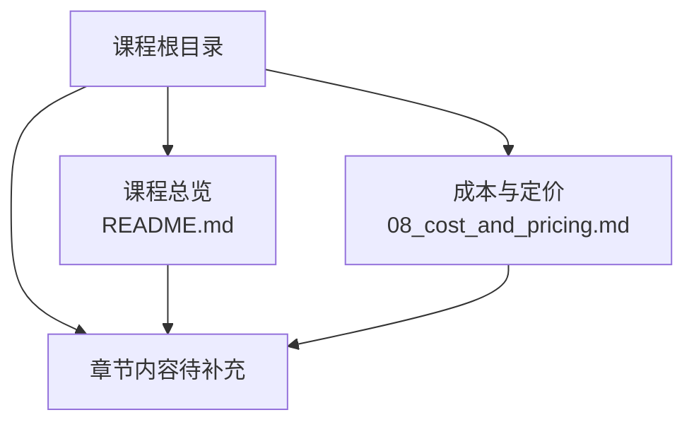
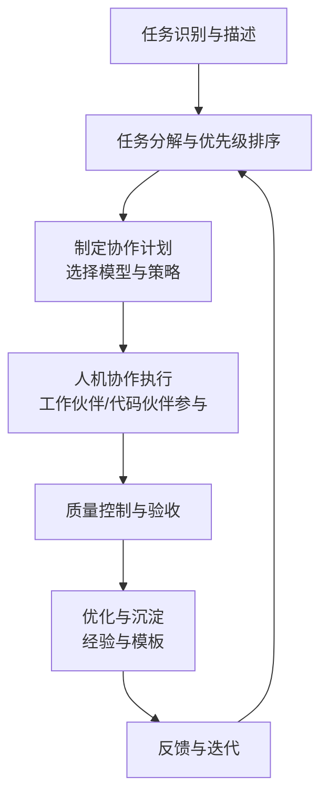
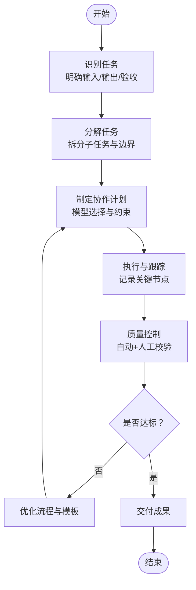
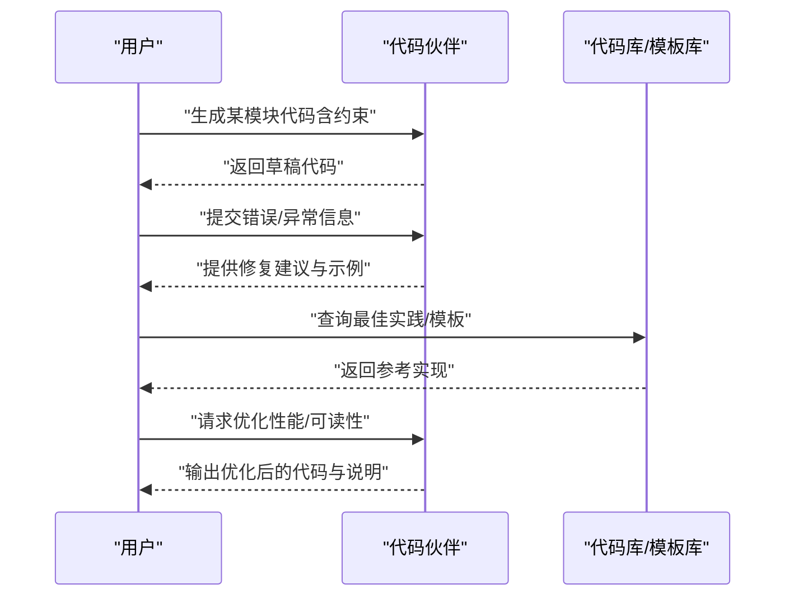
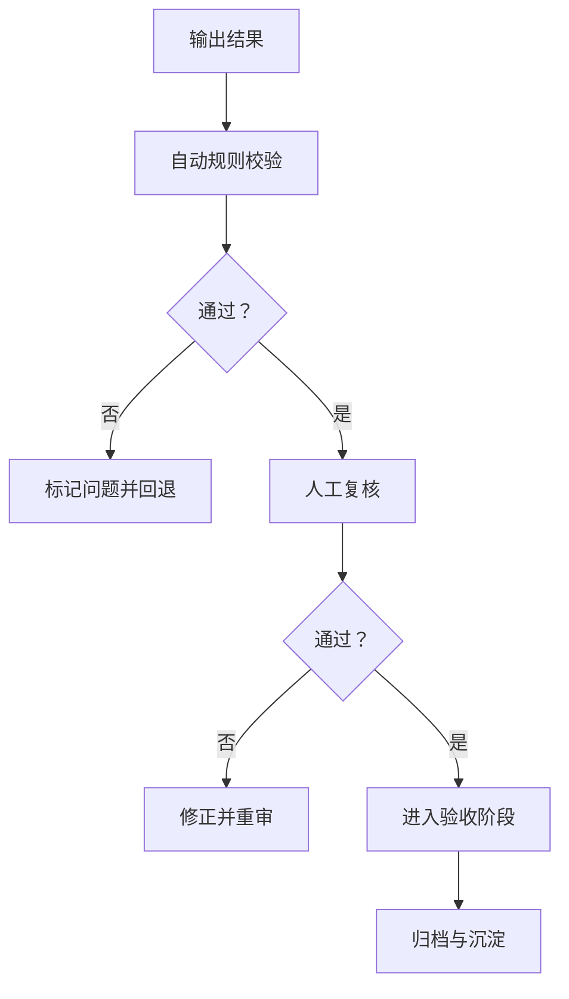
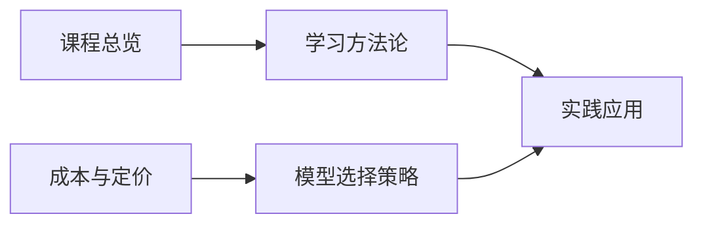

# 工作伙伴与代码伙伴

<cite>
**本文引用的文件**
- [README.md](file://README.md)
- [08_cost_and_pricing.md](file://08_cost_and_pricing.md)
</cite>

## 目录
1. [引言](#引言)
2. [项目结构](#项目结构)
3. [核心组件](#核心组件)
4. [架构总览](#架构总览)
5. [详细组件分析](#详细组件分析)
6. [依赖分析](#依赖分析)
7. [性能考虑](#性能考虑)
8. [故障排查指南](#故障排查指南)
9. [结论](#结论)
10. [附录](#附录)

## 引言
本章围绕“工作伙伴（WorkBuddy）与代码伙伴（CodeBuddy）”展开教学，目标是帮助读者建立“人机协作”的高效工作范式。内容涵盖：
- 明确AI作为工作助手与代码伙伴的应用边界与价值
- 通过任务分解、协作流程与质量控制三要素提升整体效率
- 给出代码生成、调试与优化的实操步骤与最佳实践
- 结合成本与定价知识，指导在不同场景下选择合适的模型与使用策略

本章强调“先框架、后细节”的学习节奏，配合课程导图与章节正文，逐步构建可迁移的人机协作能力。

## 项目结构
本仓库为“AI科普课程”的知识体系，围绕13个章节组织内容，其中与本章直接相关的关键信息集中在课程总览与成本定价两章。课程采用“导图+正文”的双轨学习方式，便于快速建立知识骨架与深入理解细节。

**图表来源**
- [README.md:1-70](file://README.md#L1-L70)
- [08_cost_and_pricing.md:1-151](file://08_cost_and_pricing.md#L1-L151)

**章节来源**
- [README.md:24-41](file://README.md#L24-L41)
- [README.md:43-60](file://README.md#L43-L60)

## 核心组件
- 课程总览与学习路径：明确“工作伙伴/代码伙伴”的定位与学习顺序，强调“从导图到正文再到导图”的循环学习法。
- 成本与定价：为“工作伙伴/代码伙伴”的日常使用提供经济性依据，指导在不同场景下选择合适模型与使用策略，降低试错成本。
- 实践导向：结合章节正文与导图，将AI能力转化为可执行的任务与流程，形成“用中学”的闭环。

**章节来源**
- [README.md:13-22](file://README.md#L13-L22)
- [README.md:43-60](file://README.md#L43-L60)
- [08_cost_and_pricing.md:79-99](file://08_cost_and_pricing.md#L79-L99)

## 架构总览
下图展示了“工作伙伴/代码伙伴”在日常工作中的应用架构：从任务识别与分解，到人机协作执行，再到质量控制与反馈迭代，最终形成可持续优化的工作流。

该架构强调：
- 任务分解：将复杂任务拆分为可由AI独立完成或与人类协同完成的子任务
- 协作流程：明确何时使用工作伙伴（文案、日程、会议纪要等）与代码伙伴（代码生成、调试、重构等）
- 质量控制：建立验收标准与校验机制，确保输出符合预期
- 持续优化：将成功经验沉淀为模板与规范，提升后续效率

## 详细组件分析

### 任务分解与协作流程
- 任务识别：明确输入、期望输出、验收标准与交付时间
- 任务分解：将大任务拆分为若干小任务，区分“可由AI独立完成”和“需要人类审阅/决策”的环节
- 协作计划：根据任务类型与紧急程度，选择合适的模型与参数，设定输出长度与风格约束
- 执行与跟踪：在执行过程中记录关键节点与变更，便于回溯与优化
- 质量控制：建立多层级校验（自动规则+人工审核），确保输出满足业务需求
- 反馈与迭代：收集使用反馈，持续改进提示词、流程与模板

### 代码生成、调试与优化
- 代码生成：基于清晰的需求描述与约束条件，引导AI生成可运行的代码草稿；随后进行结构化评审与单元测试
- 调试：将错误信息与上下文一并提供给AI，要求其给出可验证的修复方案；优先采用“最小修改”原则
- 优化：在保证正确性的前提下，关注性能、可读性与可维护性；通过模板化与规则化固化最佳实践
- 版本与回滚：在协作过程中保留历史版本与变更记录，便于回溯与审计

### 质量控制与验收
- 自动校验：通过静态检查、单元测试、覆盖率等手段快速筛选明显问题
- 人工复核：针对复杂逻辑、边界条件与业务规则进行深度审查
- 验收标准：明确“可接受范围”，避免过度优化导致的返工
- 持续改进：将常见问题与解决方案纳入知识库，形成可复用的经验模板

### 成本与效率平衡
- 选择合适模型：根据任务类型与预算，选择性价比高的模型；日常轻度使用可优先考虑轻量版
- 精简输入与控制输出：减少不必要的上下文，明确输出长度与格式，降低Token消耗
- 批量处理与缓存利用：合并相似任务，复用系统提示词以享受缓存折扣
- 免费额度与促销：合理利用平台提供的免费额度与限时优惠，降低长期成本

**章节来源**
- [08_cost_and_pricing.md:79-99](file://08_cost_and_pricing.md#L79-L99)
- [08_cost_and_pricing.md:115-123](file://08_cost_and_pricing.md#L115-L123)

## 依赖分析
- 课程总览为“工作伙伴/代码伙伴”章节提供学习路径与方法论支撑，强调“导图—正文—导图”的循环学习
- 成本与定价章节为实际使用提供经济性依据，指导在不同场景下做出理性选择
- 两者共同构成“理念—实践—成本”的完整闭环，既保证可用性，又兼顾可持续性

**图表来源**
- [README.md:43-60](file://README.md#L43-L60)
- [08_cost_and_pricing.md:115-123](file://08_cost_and_pricing.md#L115-L123)

**章节来源**
- [README.md:43-60](file://README.md#L43-L60)
- [08_cost_and_pricing.md:115-123](file://08_cost_and_pricing.md#L115-L123)

## 性能考虑
- 任务粒度：过大的任务会增加上下文负担与错误传播风险；过小的任务会带来管理成本与重复开销
- 模型选择：根据任务类型与预算选择合适模型；在保证质量的前提下尽量选择轻量版
- 提示词设计：清晰、可执行的提示词能显著提升首次成功率，减少往返沟通
- 输出控制：在提示词中明确输出长度、格式与风格，避免冗余与歧义
- 缓存与复用：在连续对话中复用系统提示词与常用模板，充分利用缓存Token

## 故障排查指南
- 任务失败
  - 检查任务描述是否清晰、边界是否明确
  - 确认是否遗漏了关键上下文或约束条件
  - 尝试将任务拆分为更小的子任务
- 输出不符合预期
  - 重新审视提示词，增加约束与示例
  - 控制输出长度与格式，减少歧义
  - 使用“先草稿、再细化”的两阶段策略
- 成本过高
  - 评估是否选择了过于昂贵的模型
  - 检查是否存在重复输入与冗余上下文
  - 合理利用缓存与批量处理
- 效率低下
  - 建立标准化模板与检查清单
  - 在团队内共享经验与最佳实践
  - 定期回顾与优化协作流程

## 结论
“工作伙伴与代码伙伴”的核心在于“人机协作的系统化”。通过任务分解、协作流程与质量控制的有机结合，并辅以成本与效率的平衡策略，可以在日常工作中稳定地提升产出质量与速度。建议以“导图—正文—导图”的方式持续迭代，将经验沉淀为可复用的模板与规范，形成可持续的生产力提升路径。

## 附录
- 推荐学习顺序：先通读课程总览，再按章节深入学习，最后回到导图回顾与巩固
- 实战建议：每学完一章，尝试用AI完成一个身边的实际任务，将理论转化为实践