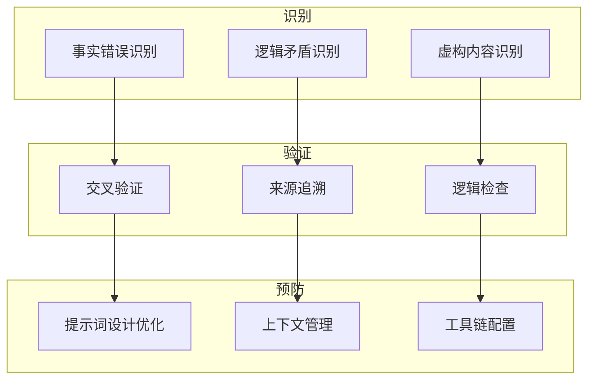
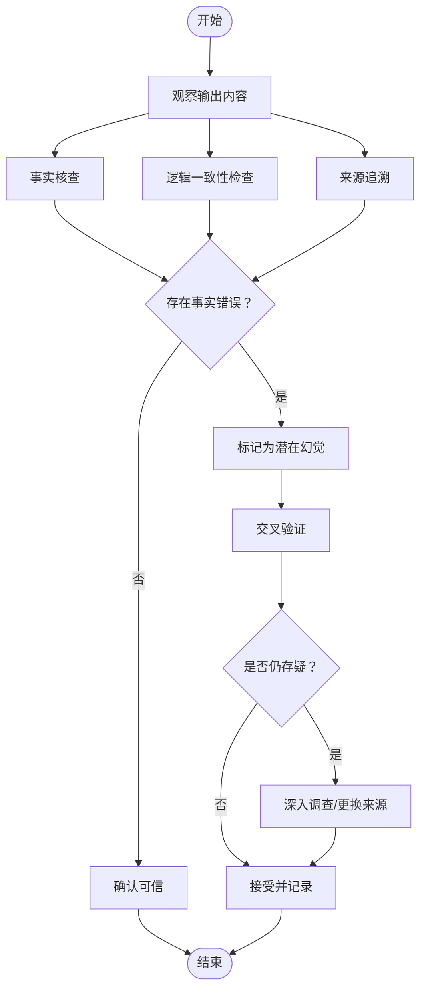
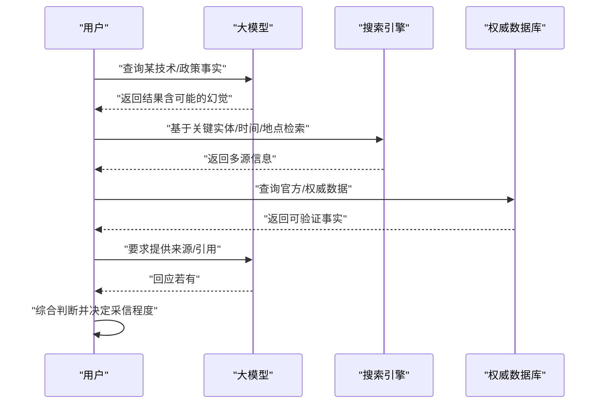
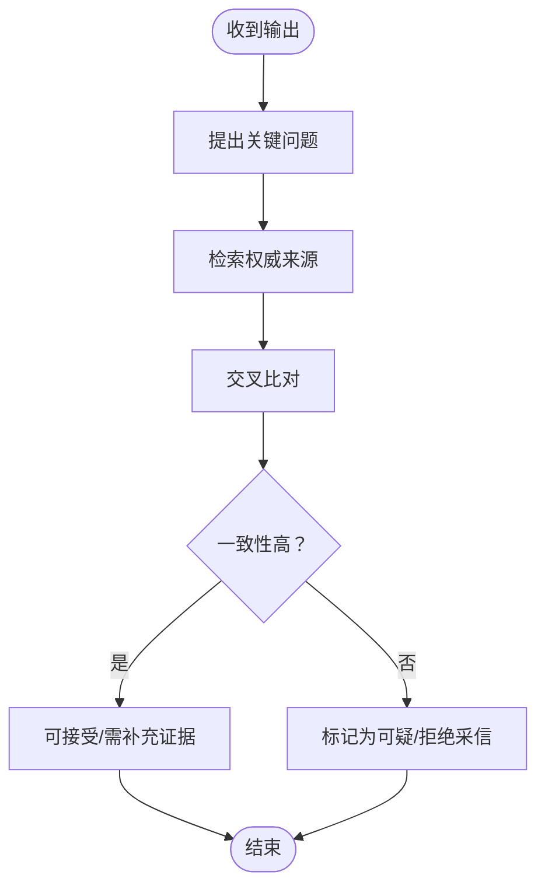
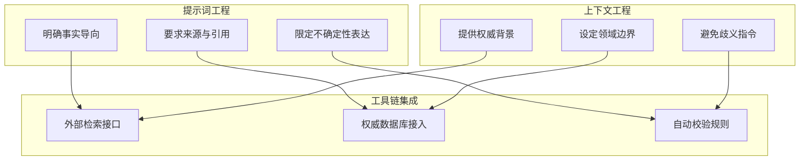
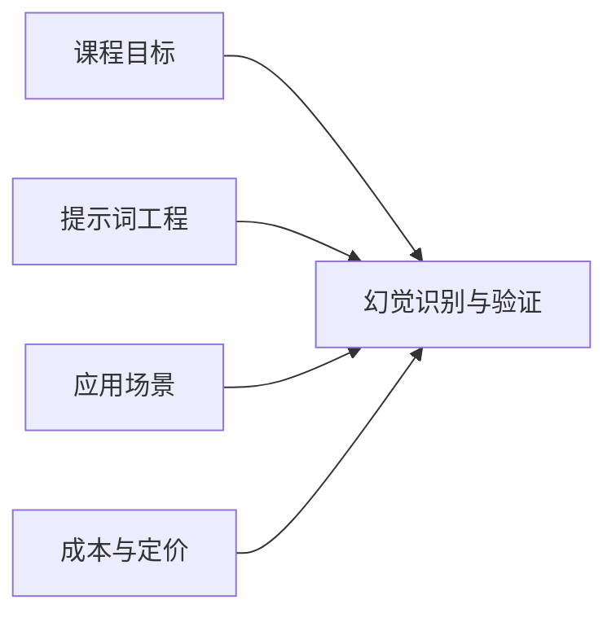

# 幻觉识别与验证

<cite>
**本文引用的文件**
- [README.md](file://README.md)
- [08_cost_and_pricing.md](file://08_cost_and_pricing/08_cost_and_pricing.md)
</cite>

## 目录
1. [引言](#引言)
2. [项目结构](#项目结构)
3. [核心组件](#核心组件)
4. [架构总览](#架构总览)
5. [详细组件分析](#详细组件分析)
6. [依赖分析](#依赖分析)
7. [性能考虑](#性能考虑)
8. [故障排查指南](#故障排查指南)
9. [结论](#结论)
10. [附录](#附录)

## 引言
本章围绕“AI 幻觉与验证”主题，系统讲解如何识别与防范大模型输出中的事实错误、逻辑矛盾与虚构内容，帮助读者建立批判性思维与信息验证能力。结合课程整体定位与学习路径，本章强调“从现象到方法、从工具到实践”的渐进式教学，使零基础读者也能快速掌握幻觉识别的关键技能。

## 项目结构
本仓库为一套面向零基础成年人的 AI 通识课程，采用“思维导图作骨架、文字作详解”的组织方式。课程共 13 章，其中第 12 章即“AI 幻觉与验证”，聚焦幻觉识别与验证方法论。课程配套每个章节包含两份材料：章节正文与思维导图，便于复习与分享。

```mermaid
graph TB
Root["课程根目录"] --> Overview["00_overview<br/>课程总览"]
Root --> Intro["01_ai_intro<br/>AI 是什么"]
Root --> HowWorks["02_ai_how_it_works<br/>AI 如何工作"]
Root --> Capabilities["03_llm_capabilities<br/>大模型能做什么"]
Root --> Differences["04_llm_differences<br/>大模型的差异化"]
Root --> Tiers["05_llm_tiers<br/>大模型的能力梯队"]
Root --> IQParams["06_iq_and_params<br/>智商与参数的关系"]
Root --> APIvsLocal["07_api_vs_local<br/>API 与自部署"]
Root --> CostPricing["08_cost_and_pricing<br/>成本与定价"]
Root --> Applications["09_applications<br/>应用场景"]
Root --> WorkBuddy["10_workbuddy_codebuddy<br/>WorkBuddy 与 CodeBuddy"]
Root --> PromptEng["11_prompt_engineering<br/>提示词与上下文工程"]
Root --> Hallucination["12_hallucination<br/>AI 幻觉与验证"]
Root --> Summary["13_summary<br/>总结与展望"]
```

图表来源
- [README.md:24-41](file://README.md#L24-L41)

章节来源
- [README.md:1-70](file://README.md#L1-L70)

## 核心组件
- 幻觉识别方法论：涵盖事实核查、来源追溯、逻辑一致性检查与交叉验证等实用技巧。
- 信息验证流程：建立“质疑—检索—交叉—确认”的闭环验证机制。
- 批判性思维训练：通过提问与拆解，降低对单一来源输出的盲目信任。
- 预防幻觉的策略与最佳实践：从提示词设计、上下文管理、工具链配置等方面降低幻觉风险。

## 架构总览
本章的知识体系可抽象为“识别—验证—预防”的三层架构，贯穿提示词工程与信息验证两条主线。

## 详细组件分析

### 组件一：幻觉的本质与表现
- 事实错误：输出与权威事实不符，常见于时间、地点、数据、事件等。
- 逻辑矛盾：前后表述不一致，或与常识相悖。
- 虚构内容：凭空捏造事实、人物、机构或技术细节。
- 产生原因：训练数据偏差、过度泛化、上下文缺失、提示词引导不当等。

### 组件二：识别幻觉的方法与工具
- 交叉验证：对关键信息在多个权威来源进行比对，发现不一致即警惕。
- 来源追溯：要求模型给出可验证的出处或参考链接，若无法提供则需谨慎。
- 逻辑检查：检查输出是否符合常理、是否存在自相矛盾或极端表述。
- 工具辅助：使用搜索引擎、百科全书、官方文档、数据库等作为外部验证器。

### 组件三：验证信息准确性的流程
- 质疑：对所有输出保持适度怀疑，尤其是首次出现的信息。
- 检索：针对关键实体与时间点进行定向检索。
- 交叉：对比多个独立来源的一致性与完整性。
- 确认：在多方印证后形成结论，并标注不确定性区间。

### 组件四：建立批判性思维
- 多角度提问：Who/What/When/Where/Why/How，以及“依据何在？”“是否有反例？”
- 拆解复杂陈述：将长句拆分为若干子命题，逐一验证。
- 区分事实与观点：区分客观事实与主观推断、预测与既成事实。
- 记录与回溯：对验证过程与结论进行记录，便于后续复核。

### 组件五：预防幻觉的策略与最佳实践
- 提示词设计优化：明确要求“仅基于事实回答”“提供可验证来源”“指出不确定之处”等。
- 上下文管理：提供清晰背景与边界条件，避免模型“自由发挥”。
- 工具链配置：将模型输出接入外部检索与数据库，实现“边生成边验证”。
- 分层验证：对高风险领域（法律、医疗、金融、技术标准）实施更严格的验证流程。

## 依赖分析
- 与课程整体目标的耦合：本章服务于“识别 AI 的一本正经胡说八道，不被它带偏”的学习目标，与提示词工程、应用场景等章节形成互补。
- 与成本与定价章节的间接关联：合理的成本控制有助于在验证环节投入更多外部资源（如 API 调用、订阅权威数据库）。

图表来源
- [README.md:13-22](file://README.md#L13-L22)
- [README.md:24-41](file://README.md#L24-L41)

章节来源
- [README.md:13-22](file://README.md#L13-L22)
- [README.md:24-41](file://README.md#L24-L41)

## 性能考虑
- 验证效率：优先使用权威、稳定的检索入口，减少无效往返。
- 成本控制：在高风险场景增加验证强度，在低风险场景简化流程，平衡质量与成本。
- 自动化辅助：对重复性验证任务引入规则引擎或脚本，提升一致性与速度。

## 故障排查指南
- 症状：模型输出与权威事实明显不符
  - 排查：使用搜索引擎与权威数据库交叉验证；要求模型提供来源
  - 处置：拒绝采信该条目，必要时更换模型或调整提示词
- 症状：前后表述存在逻辑矛盾
  - 排查：拆分长句，逐项验证；检查上下文是否引发歧义
  - 处置：修正提示词，明确逻辑边界
- 症状：无法提供来源或引用
  - 排查：检查提示词是否要求“仅基于事实回答”“提供可验证来源”
  - 处置：强化提示词约束，必要时接入外部检索与数据库

## 结论
幻觉并非不可战胜，而是可以通过系统化的方法与工具加以识别与预防。本章以“识别—验证—预防”为主线，配合批判性思维训练与最佳实践，帮助读者在日常使用中守住信息质量的最后一道防线。

## 附录
- 实战建议
  - 对关键决策类问题，至少进行两次独立来源交叉验证
  - 在提示词中明确要求“指出不确定之处”，降低确定性幻觉
  - 建立个人“验证清单”，覆盖时间、地点、人物、数据、来源等关键要素
- 与课程其他章节的衔接
  - 与提示词工程协同，提升输出质量与可验证性
  - 与应用场景结合，针对不同领域制定差异化验证策略