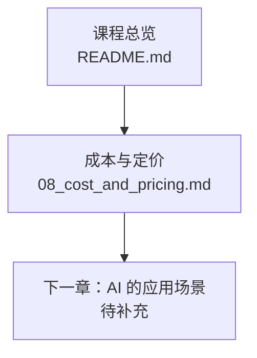
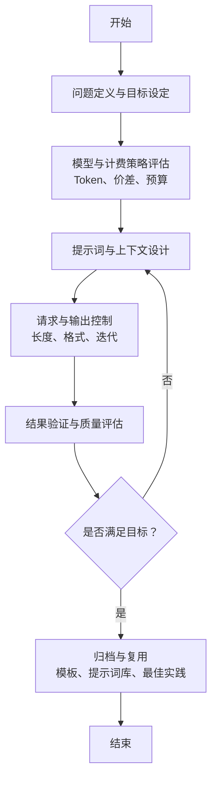

# 应用场景实践

<cite>
**本文引用的文件**
- [README.md](file://README.md)
- [08_cost_and_pricing.md](file://08_cost_and_pricing/08_cost_and_pricing.md)
</cite>

## 目录
1. [引言](#引言)
2. [项目结构](#项目结构)
3. [核心组件](#核心组件)
4. [架构总览](#架构总览)
5. [详细组件分析](#详细组件分析)
6. [依赖分析](#依赖分析)
7. [性能考虑](#性能考虑)
8. [故障排除指南](#故障排除指南)
9. [结论](#结论)
10. [附录](#附录)

## 引言
本章节围绕“应用场景实践”展开，目标是帮助读者将大模型能力转化为解决实际问题的生产力工具。结合课程整体定位与现有材料，我们将聚焦以下主题：
- 明确不同场景下的使用边界与目标
- 选择合适的大模型与计费模式
- 设计可落地的操作流程与最佳实践
- 识别常见问题与解决方案

为确保内容可操作、可迁移，本章节不直接展示具体代码片段，而是通过“章节来源”的方式指引到仓库中的权威文档。

## 项目结构
课程采用“章节化+配套导图”的组织方式，便于循序渐进地建立知识框架与实操路径。与“应用场景实践”直接相关的已有材料包括：
- 课程总览与学习路径
- 成本与定价（Token、价差、模型对比、省钱技巧）
- 下一章“AI 的应用场景”（当前仓库中尚未包含该章节内容）

图表来源
- [README.md:24-41](file://README.md#L24-L41)
- [README.md:36-37](file://README.md#L36-L37)
- [08_cost_and_pricing.md:149-151](file://08_cost_and_pricing/08_cost_and_pricing.md#L149-L151)

章节来源
- [README.md:24-41](file://README.md#L24-L41)
- [README.md:36-37](file://README.md#L36-L37)
- [08_cost_and_pricing.md:149-151](file://08_cost_and_pricing/08_cost_and_pricing.md#L149-L151)

## 核心组件
围绕“应用场景实践”，本节提炼出三个关键支撑点：
- 场景目标与边界：明确“做什么”“达到什么效果”
- 模型与计费策略：基于 Token 与价差进行成本估算与模型选择
- 流程与最佳实践：将提示词、上下文、输出长度控制等工程化手段融入日常任务

章节来源
- [08_cost_and_pricing.md:7-31](file://08_cost_and_pricing/08_cost_and_pricing.md#L7-L31)
- [08_cost_and_pricing.md:34-45](file://08_cost_and_pricing/08_cost_and_pricing.md#L34-L45)
- [08_cost_and_pricing.md:48-76](file://08_cost_and_pricing/08_cost_and_pricing.md#L48-L76)
- [08_cost_and_pricing.md:103-123](file://08_cost_and_pricing/08_cost_and_pricing.md#L103-L123)

## 架构总览
下面给出一个概念性的“应用场景实践”工作流图，帮助读者建立从“问题定义”到“结果验证”的闭环：

说明
- 该图为概念性流程，用于指导多场景实践的通用方法论，不对应具体源码文件。

## 详细组件分析

### 组件一：写作辅助（日志/周报/总结）
- 场景目标
  - 快速产出结构化、简洁、符合规范的文本
  - 降低重复劳动，提升写作效率
- 模型与计费策略
  - 日常轻度使用场景下，优先选择轻量级模型，以降低成本
  - 控制输出长度，减少不必要的 Token 消耗
- 操作流程
  1) 明确输入：提供背景信息、关键事实、期望格式
  2) 明确输出：限定字数、风格、结构（如标题层级、要点编号）
  3) 迭代优化：基于初稿调整提示词与上下文
- 最佳实践
  - 使用“先总后分”的提示词结构
  - 在提示词中加入“检查清单”（如是否包含时间、行动项、结论）
- 常见问题与解决
  - 输出啰嗦：在提示词中强调“用简洁语言表达”
  - 结构混乱：提供“模板样例”作为上下文
  - 重复生成：启用缓存策略，保持系统提示词稳定

章节来源
- [08_cost_and_pricing.md:79-99](file://08_cost_and_pricing/08_cost_and_pricing.md#L79-L99)
- [08_cost_and_pricing.md:115-123](file://08_cost_and_pricing/08_cost_and_pricing.md#L115-L123)

### 组件二：代码生成与改写
- 场景目标
  - 快速生成脚手架、补全函数、重构逻辑
  - 保证输出与团队规范一致
- 模型与计费策略
  - 代码生成通常需要更强的推理能力，可适度提高模型等级
  - 批量处理多个小任务，减少重复输入 Token
- 操作流程
  1) 明确输入：编程语言、框架、约束条件、期望接口
  2) 明确输出：代码风格、注释规范、测试用例要求
  3) 迭代优化：基于初稿补充上下文（如错误信息、边界条件）
- 最佳实践
  - 将“代码规范”写入提示词
  - 提供“失败样例”作为负样本，帮助模型规避常见陷阱
- 常见问题与解决
  - 语法错误：在提示词中强调“先思考再输出”
  - 逻辑偏差：增加“边界条件”与“异常处理”的上下文

章节来源
- [08_cost_and_pricing.md:115-123](file://08_cost_and_pricing/08_cost_and_pricing.md#L115-L123)

### 组件三：数据分析与可视化建议
- 场景目标
  - 快速梳理数据维度、提出可视化方向、生成报告摘要
- 模型与计费策略
  - 分析类任务通常输入较长，需关注输入 Token 的成本
  - 通过“缓存 Token”策略降低重复对话成本
- 操作流程
  1) 明确输入：数据字段、统计口径、业务背景
  2) 明确输出：图表类型建议、关键指标、结论要点
  3) 迭代优化：基于初稿补充“业务解释”和“受众需求”
- 最佳实践
  - 在提示词中明确“面向非技术读者的语言风格”
  - 提供“示例图表描述”作为上下文
- 常见问题与解决
  - 偏离业务：在提示词中强调“以业务价值为导向”
  - 图表建议不实用：要求“给出具体字段与维度说明”

章节来源
- [08_cost_and_pricing.md:48-76](file://08_cost_and_pricing/08_cost_and_pricing.md#L48-L76)
- [08_cost_and_pricing.md:115-123](file://08_cost_and_pricing/08_cost_and_pricing.md#L115-L123)

### 组件四：客户服务与FAQ应答
- 场景目标
  - 快速生成标准化、一致性的客服回复
  - 降低人工成本，提升响应速度
- 模型与计费策略
  - 采用轻量模型处理高频、低复杂度问题
  - 对重复问题启用缓存策略
- 操作流程
  1) 明确输入：问题类型、产品信息、政策条款
  2) 明确输出：标准话术模板、后续引导语
  3) 迭代优化：基于真实对话反馈调整话术
- 最佳实践
  - 将“合规与风险提示”纳入提示词
  - 提供“反向用例”（如敏感问题的处理方式）
- 常见问题与解决
  - 回复生硬：在提示词中强调“人性化表达”
  - 政策变更滞后：定期更新提示词库与FAQ

章节来源
- [08_cost_and_pricing.md:115-123](file://08_cost_and_pricing/08_cost_and_pricing.md#L115-L123)

### 组件五：跨场景通用工程化方法
- 提示词工程
  - 明确角色、目标、约束、输出格式
  - 使用“分步骤”“分条件”提示词降低歧义
- 上下文管理
  - 将“模板”“规则”“样例”固化为上下文
  - 控制上下文长度，避免无关信息干扰
- 输出控制
  - 限定字数、语气、格式
  - 通过“检查清单”确保覆盖关键要素
- 成本控制
  - 选对模型等级
  - 精简输入、批量处理、控制输出长度
  - 利用缓存 Token 与免费额度

章节来源
- [08_cost_and_pricing.md:7-31](file://08_cost_and_pricing/08_cost_and_pricing.md#L7-L31)
- [08_cost_and_pricing.md:34-45](file://08_cost_and_pricing/08_cost_and_pricing.md#L34-L45)
- [08_cost_and_pricing.md:103-123](file://08_cost_and_pricing/08_cost_and_pricing.md#L103-L123)

## 依赖分析
“应用场景实践”的成功实施依赖于以下内部依赖关系：
- 课程总览提供学习路径与目标定位
- 成本与定价提供模型选择与预算约束
- 下一章“AI 的应用场景”提供更丰富的场景范式与案例

图表来源
- [README.md:24-41](file://README.md#L24-L41)
- [08_cost_and_pricing.md:149-151](file://08_cost_and_pricing/08_cost_and_pricing.md#L149-L151)

章节来源
- [README.md:24-41](file://README.md#L24-L41)
- [08_cost_and_pricing.md:149-151](file://08_cost_and_pricing/08_cost_and_pricing.md#L149-L151)

## 性能考虑
- 模型选择与成本
  - 日常轻度使用优先选择轻量模型，避免旗舰模型带来的高额输出成本
  - 通过“缓存 Token”与“重复对话”降低总体费用
- 输入与输出优化
  - 精简输入，仅保留必要上下文
  - 明确输出长度与格式，减少无效 Token
- 批量处理
  - 将多个相似任务合并为一次请求，减少重复输入 Token
- 计费模式选择
  - 个人日常使用优先订阅制，简化管理
  - 自动化与集成场景优先 API 按量付费，灵活可控

章节来源
- [08_cost_and_pricing.md:34-45](file://08_cost_and_pricing/08_cost_and_pricing.md#L34-L45)
- [08_cost_and_pricing.md:103-123](file://08_cost_and_pricing/08_cost_and_pricing.md#L103-L123)
- [08_cost_and_pricing.md:126-134](file://08_cost_and_pricing/08_cost_and_pricing.md#L126-L134)

## 故障排除指南
- 输出不符合预期
  - 检查提示词是否明确目标、格式与约束
  - 增加“样例”与“检查清单”作为上下文
- 成本过高
  - 评估是否选择了过高等级模型
  - 优化输入长度与输出长度，减少 Token 消耗
- 重复任务效率低
  - 启用缓存策略，保持系统提示词稳定
  - 将通用模板固化为上下文，减少重复输入
- 业务一致性差
  - 在提示词中强化“合规与风险提示”
  - 建立反向用例库，帮助模型规避常见陷阱

章节来源
- [08_cost_and_pricing.md:103-123](file://08_cost_and_pricing/08_cost_and_pricing.md#L103-L123)

## 结论
“应用场景实践”强调“目标导向、工程化落地、成本可控”。通过明确场景边界、合理选择模型与计费模式、建立标准化流程与最佳实践，可以在写作、代码、分析、客服等多个领域快速获得稳定收益。随着下一章“AI 的应用场景”的完善，读者将获得更多具体范式与案例，进一步提升实战能力。

## 附录
- 学习建议
  - 每章约 12-15 分钟阅读量，建议采用“导图→阅读→导图回顾”的循环学习法
  - 学完一章后，选取身边实际任务尝试用 AI 完成
- 工具提示
  - 课程中提到的工具（如 WorkBuddy、CodeBuddy）仅为举例，请以官方最新版本为准

章节来源
- [README.md:43-64](file://README.md#L43-L64)