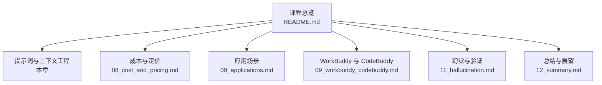
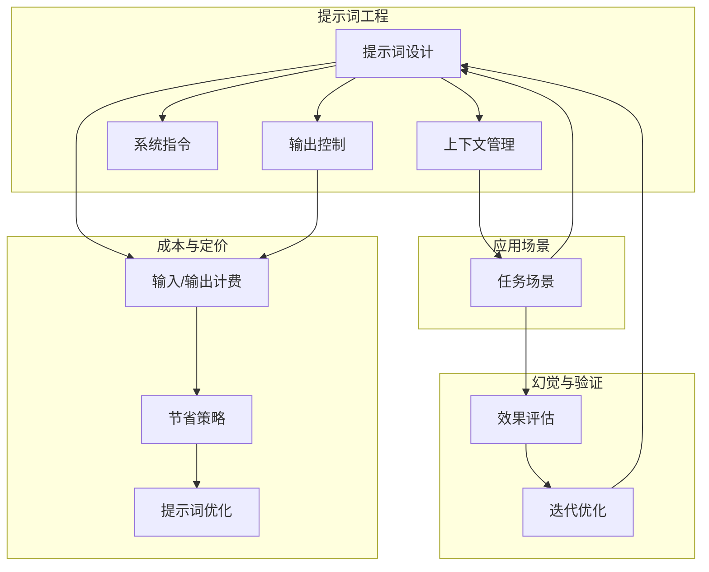
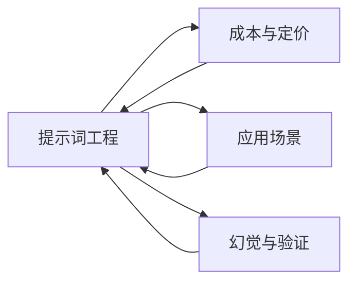

# 提示词工程

<cite>
**本文引用的文件**
- [README.md](file://README.md)
- [08_cost_and_pricing.md](file://08_cost_and_pricing/08_cost_and_pricing.md)
</cite>

## 目录
1. [引言](#引言)
2. [项目结构](#项目结构)
3. [核心组件](#核心组件)
4. [架构总览](#架构总览)
5. [详细组件分析](#详细组件分析)
6. [依赖分析](#依赖分析)
7. [性能考量](#性能考量)
8. [故障排查指南](#故障排查指南)
9. [结论](#结论)
10. [附录](#附录)

## 引言
本章围绕“提示词工程”展开教学，目标是帮助读者掌握如何设计与优化提示词，使其能稳定地引导大模型产生高质量、可预期的输出。我们将系统讲解提示词的基本原理、常见类型（指令式、问答式、思维链式等）、优化方法与迭代策略，并总结常见陷阱与高质量标准。同时，结合课程整体定位，强调“用好提示词与上下文，让 AI 输出真正有用的内容”。

## 项目结构
该课程采用“章节化+导图”的组织方式，便于快速建立知识框架并深入细节。提示词工程作为独立章节，与“成本与定价”“应用场景”等章节共同构成完整的知识体系。

图表来源
- [README.md:24-41](file://README.md#L24-L41)

章节来源
- [README.md:13-23](file://README.md#L13-L23)
- [README.md:24-41](file://README.md#L24-L41)

## 核心组件
- 提示词（Prompt）：用户向大模型发出的指令或问题，决定模型的理解边界与输出方向。
- 上下文（Context）：为模型提供背景信息，帮助其在特定语境下给出更贴切的回答。
- 系统指令（System Instruction）：用于设定角色、风格、约束等全局规则，影响模型的整体行为模式。
- 输出控制（Output Control）：通过长度、格式、语气等约束减少无效输出，提升性价比与可用性。

章节来源
- [README.md:19](file://README.md#L19)
- [README.md:38](file://README.md#L38)
- [08_cost_and_pricing.md:27-30](file://08_cost_and_pricing/08_cost_and_pricing.md#L27-L30)
- [08_cost_and_pricing.md:38-42](file://08_cost_and_pricing/08_cost_and_pricing.md#L38-L42)

## 架构总览
提示词工程在课程中的位置与作用如下：它既是对“成本与定价”的实践补充（通过精简输入、控制输出降低成本），也是“应用场景”的前置能力（让模型在不同任务中稳定产出）。同时，它与“幻觉与验证”形成闭环：好的提示词能降低幻觉风险，而验证则帮助我们评估与改进提示词质量。

图表来源
- [README.md:19](file://README.md#L19)
- [README.md:38](file://README.md#L38)
- [08_cost_and_pricing.md:27-30](file://08_cost_and_pricing/08_cost_and_pricing.md#L27-L30)
- [08_cost_and_pricing.md:118-120](file://08_cost_and_pricing/08_cost_and_pricing.md#L118-L120)

## 详细组件分析

### 组件一：提示词类型与结构
- 指令式提示词：直接给出明确指令，适合结构化任务与固定流程。要点在于清晰、可执行、可验证。
- 问答式提示词：以问题形式表达需求，适合探索性与开放性任务。要点在于问题聚焦、边界清晰、必要时提供背景。
- 思维链式提示词：引导模型逐步推理，适合复杂逻辑与多步骤任务。要点在于分步拆解、中间产物可见、可回溯校验。
- 角色扮演式提示词：设定角色与风格，适合创意写作、客服、教学等场景。要点在于角色一致性、风格稳定、边界约束。

章节来源
- [README.md:19](file://README.md#L19)
- [README.md:38](file://README.md#L38)

### 组件二：提示词优化与迭代策略
- 明确目标与验收标准：在设计提示词前先定义“好结果”的特征，便于后续评估与迭代。
- 小步快跑与对照实验：每次只改一个变量，对比输出差异，逐步收敛。
- 结构化反馈循环：将“输出→评估→修正→再测试”形成闭环，持续提升稳定性与准确性。
- 可解释性优先：尽量让提示词具备可解释性，便于团队协作与知识沉淀。

章节来源
- [README.md:19](file://README.md#L19)

### 组件三：常见陷阱与规避方法
- 过度模糊：导致模型输出漂移，应明确任务边界与期望格式。
- 角色冲突：角色设定与系统指令矛盾时，模型可能产生内耗，需统一口径。
- 信息冗余：过多无关信息会稀释重点，应提炼关键上下文。
- 忽视输出成本：长输出不仅昂贵，还可能增加错误率，应在提示词中显式限制长度与风格。

章节来源
- [08_cost_and_pricing.md:27-30](file://08_cost_and_pricing/08_cost_and_pricing.md#L27-L30)
- [08_cost_and_pricing.md:38-42](file://08_cost_and_pricing/08_cost_and_pricing.md#L38-L42)
- [08_cost_and_pricing.md:118-120](file://08_cost_and_pricing/08_cost_and_pricing.md#L118-L120)

### 组件四：高质量提示词的标准
- 清晰的目标与约束：任务目标明确、边界清晰、格式与长度可控。
- 一致的角色与风格：角色设定稳定，风格与语气前后一致。
- 有效的上下文：提供必要的背景信息，去除噪声。
- 可验证的输出：具备可衡量的验收指标，便于快速判断优劣。

章节来源
- [README.md:19](file://README.md#L19)
- [README.md:38](file://README.md#L38)

### 组件五：成本与提示词优化的协同
- 输入成本：通过精简提示词与上下文，减少不必要的 Token 消耗。
- 输出成本：在提示词中明确“用简洁、要点式、限定字数”等约束，降低输出长度。
- 缓存策略：在连续对话中保持系统提示词稳定，充分利用缓存 Token 降低费用。

章节来源
- [08_cost_and_pricing.md:27-30](file://08_cost_and_pricing/08_cost_and_pricing.md#L27-L30)
- [08_cost_and_pricing.md:38-42](file://08_cost_and_pricing/08_cost_and_pricing.md#L38-L42)
- [08_cost_and_pricing.md:118-120](file://08_cost_and_pricing/08_cost_and_pricing.md#L118-L120)

## 依赖分析
提示词工程与其他章节存在强关联：
- 与“成本与定价”：提示词直接影响输入/输出 Token 数量，进而影响成本。
- 与“应用场景”：不同任务场景需要不同的提示词结构与约束。
- 与“幻觉与验证”：提示词质量决定输出稳定性，验证环节用于评估与改进。

图表来源
- [README.md:19](file://README.md#L19)
- [README.md:38](file://README.md#L38)
- [08_cost_and_pricing.md:27-30](file://08_cost_and_pricing/08_cost_and_pricing.md#L27-L30)

章节来源
- [README.md:19](file://README.md#L19)
- [README.md:38](file://README.md#L38)
- [08_cost_and_pricing.md:27-30](file://08_cost_and_pricing/08_cost_and_pricing.md#L27-L30)

## 性能考量
- 降低 Token 消耗：通过精简提示词、限制输出长度、复用稳定系统指令，有效控制成本。
- 提升响应速度：减少冗余信息与复杂嵌套，使模型更快聚焦核心任务。
- 稳定性优先：在提示词中加入一致性约束与边界条件，降低模型“发散”概率。

章节来源
- [08_cost_and_pricing.md:27-30](file://08_cost_and_pricing/08_cost_and_pricing.md#L27-L30)
- [08_cost_and_pricing.md:118-120](file://08_cost_and_pricing/08_cost_and_pricing.md#L118-L120)

## 故障排查指南
- 输出过长或啰嗦：在提示词中明确“用简洁、要点式、限定字数”等约束，减少输出 Token。
- 输出偏离主题：检查提示词是否包含相互冲突的指令，确保角色与约束一致。
- 成本异常升高：核对输入/输出 Token 是否超出预期，确认是否存在重复上下文或冗余信息。
- 任务失败率高：尝试将复杂任务拆分为多个子任务，使用思维链式提示词逐步推进。

章节来源
- [08_cost_and_pricing.md:27-30](file://08_cost_and_pricing/08_cost_and_pricing.md#L27-L30)
- [08_cost_and_pricing.md:38-42](file://08_cost_and_pricing/08_cost_and_pricing.md#L38-L42)
- [08_cost_and_pricing.md:118-120](file://08_cost_and_pricing/08_cost_and_pricing.md#L118-L120)

## 结论
提示词工程是让大模型稳定、高效、低成本地服务于实际任务的关键能力。通过明确目标、结构化优化、成本控制与持续验证，可以显著提升提示词质量与交付效率。建议在实践中将“提示词设计—成本控制—效果验证”形成闭环，不断迭代，逐步形成可复用的提示词模板与最佳实践。

## 附录
- 实践建议
  - 在设计提示词前先定义“好结果”的特征与验收标准。
  - 使用对照实验，每次只改变一个变量，记录输出差异。
  - 在提示词中显式限制输出长度与风格，兼顾成本与可用性。
  - 将高质量提示词沉淀为模板，便于团队复用与传承。