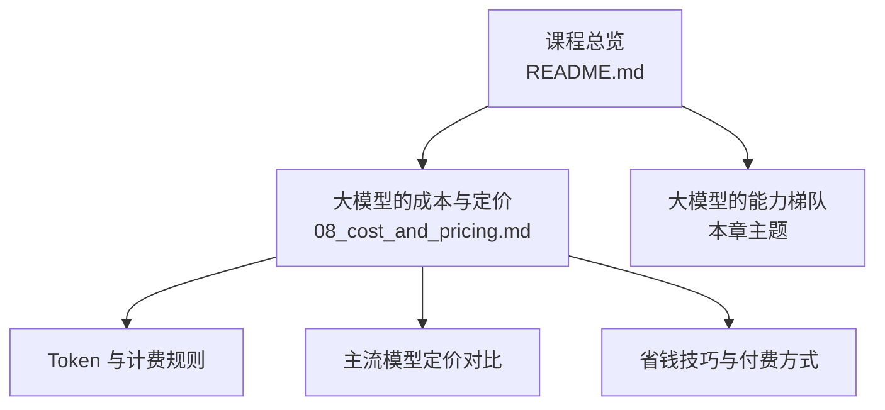
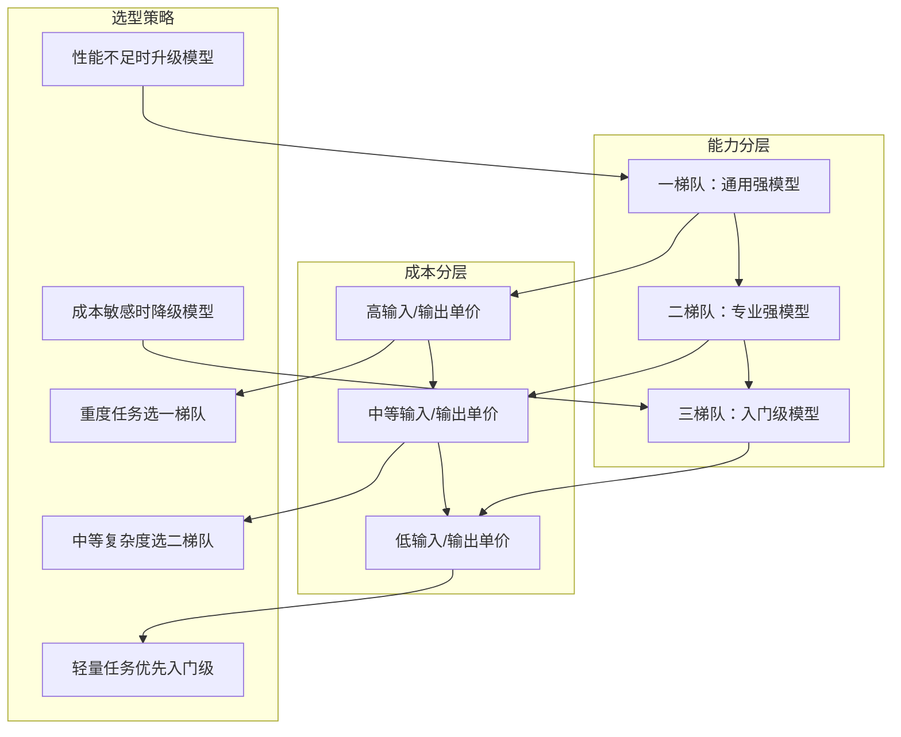
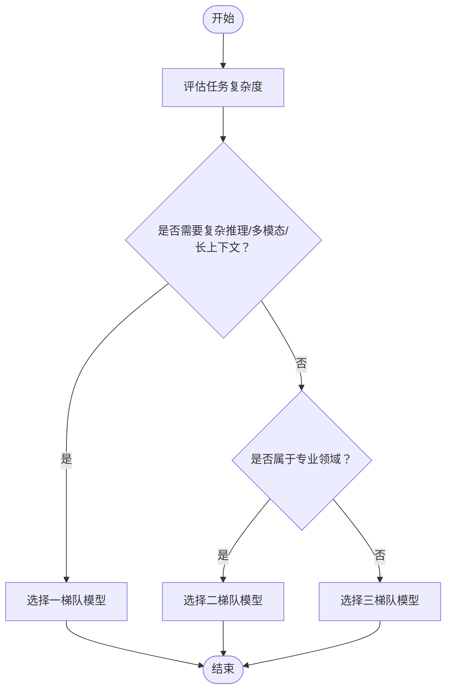
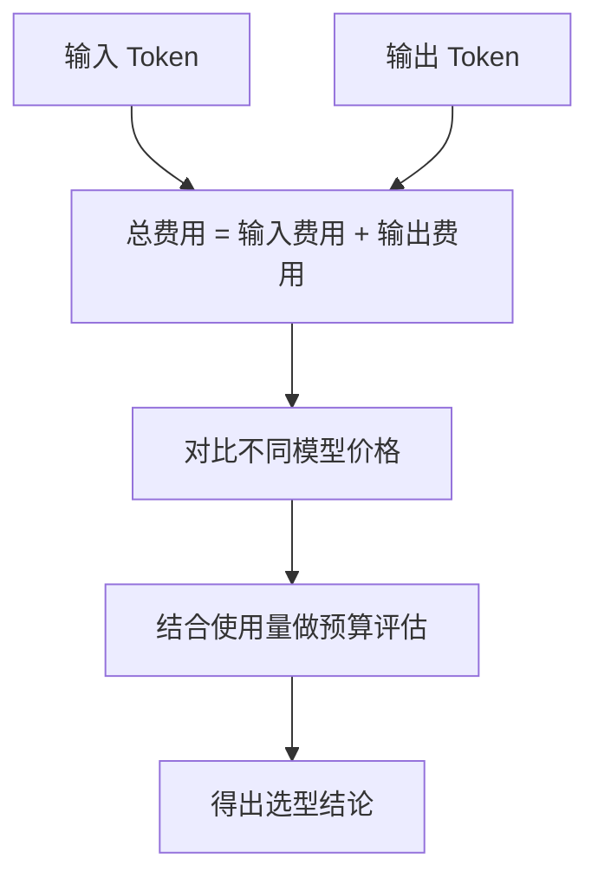
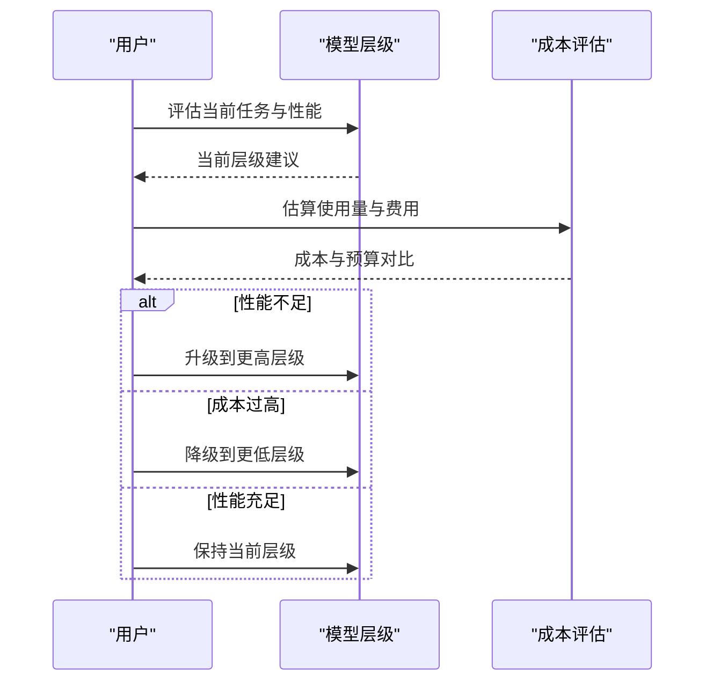

# 模型层级认知

<cite>
**本文引用的文件**
- [README.md](file://README.md)
- [08_cost_and_pricing.md](file://08_cost_and_pricing.md)
</cite>

## 目录
1. [引言](#引言)
2. [项目结构](#项目结构)
3. [核心组件](#核心组件)
4. [架构总览](#架构总览)
5. [详细组件分析](#详细组件分析)
6. [依赖分析](#依赖分析)
7. [性能考量](#性能考量)
8. [故障排查指南](#故障排查指南)
9. [结论](#结论)
10. [附录](#附录)

## 引言
本章围绕“模型层级认知”展开，目标是帮助读者建立对大模型能力与成本的系统性理解，掌握如何依据任务复杂度、预算约束与性能要求进行模型层级选择与切换。结合仓库现有材料，我们将从“能力分层”“成本与定价”“选型与升级降级策略”三个维度构建教学内容。

## 项目结构
该课程以“章节”为单位组织内容，每章包含讲解文档与配套思维导图。与本章主题直接相关的内容主要分布在“课程总览”“大模型的成本与定价”等章节中，后者提供了模型价格对比、Token 计费规则与实用的省钱策略，为模型层级选择提供量化依据。

图表来源
- [README.md:24-41](file://README.md#L24-L41)
- [08_cost_and_pricing.md:1-151](file://08_cost_and_pricing.md#L1-L151)

章节来源
- [README.md:24-41](file://README.md#L24-L41)

## 核心组件
- 能力分层认知：通过“一梯队、二梯队、三梯队”的能力梯度，帮助区分通用强、专业强与入门级模型的适用边界。
- 成本与定价：以“Token”为最小计费单元，明确输入/输出价差、主流模型价格区间与月度使用估算，支撑“选型即省钱”的决策。
- 选型策略：基于任务复杂度与预算约束，给出“先入门、再进阶”的模型层级选择路径；同时提供升级与降级的决策指引。

章节来源
- [README.md:33](file://README.md#L33)
- [08_cost_and_pricing.md:7-31](file://08_cost_and_pricing.md#L7-L31)
- [08_cost_and_pricing.md:48-76](file://08_cost_and_pricing.md#L48-L76)
- [08_cost_and_pricing.md:115-123](file://08_cost_and_pricing.md#L115-L123)

## 架构总览
本章的知识架构由“能力分层”“成本分层”“选型策略”三层构成，形成“从能力到成本再到行动”的闭环。

## 详细组件分析

### 组件A：能力分层与层级划分
- 一梯队：通用强模型，适合复杂推理、多模态、长上下文等高难度任务。
- 二梯队：专业强模型，适合垂直领域问答、代码生成、数据分析等专业场景。
- 三梯队：入门级模型，适合日常问答、摘要、翻译等轻量任务。
- 划分依据：任务复杂度、推理深度、专业领域覆盖、多模态能力与上下文长度等。

章节来源
- [README.md:33](file://README.md#L33)

### 组件B：成本与定价（Token 计费）
- Token 是计费最小单位，输入与输出均按 Token 计费，输出通常比输入贵 2~4 倍。
- 主流模型价格差异可达几十倍，需结合使用量与预算做选择。
- 实例估算：以每日写 5 篇 800 字日报为例，月度输入/输出 Token 量与不同模型的费用估算可作为选型参考。

图表来源
- [08_cost_and_pricing.md:26-31](file://08_cost_and_pricing.md#L26-L31)
- [08_cost_and_pricing.md:48-76](file://08_cost_and_pricing.md#L48-L76)
- [08_cost_and_pricing.md:79-99](file://08_cost_and_pricing.md#L79-L99)

章节来源
- [08_cost_and_pricing.md:7-31](file://08_cost_and_pricing.md#L7-L31)
- [08_cost_and_pricing.md:48-76](file://08_cost_and_pricing.md#L48-L76)
- [08_cost_and_pricing.md:79-99](file://08_cost_and_pricing.md#L79-L99)

### 组件C：选型与升级/降级策略
- 升级策略：当任务复杂度提升、性能不足或稳定性不足时，向更高层级模型迁移。
- 降级策略：当任务简化、成本压力增大或性能已满足需求时，向更低层级模型迁移。
- 省钱技巧：选对模型等级、精简输入、善用缓存 Token、批量处理、控制输出长度、关注限时优惠等。

章节来源
- [08_cost_and_pricing.md:115-123](file://08_cost_and_pricing.md#L115-L123)

### 组件D：付费方式与使用场景
- API 按量付费：适合开发者与需要集成的用户，灵活可控。
- 订阅制：适合普通用户日常网页/APP 对话。
- 免费使用：适合偶尔使用的用户，注意额度与功能限制。

章节来源
- [08_cost_and_pricing.md:126-134](file://08_cost_and_pricing.md#L126-L134)

## 依赖分析
- 能力分层与成本分层相互映射：高层级模型通常单价更高，但能更好满足复杂任务；低层级模型单价低，适合轻量任务。
- 选型策略依赖于成本评估：只有在明确使用量与预算的前提下，才能做出合理的升级/降级决策。
- 付费方式影响选型倾向：订阅制更适合日常对话，API 按量付费更适合自动化与集成场景。

## 性能考量
- 任务复杂度与模型层级匹配：复杂推理与长上下文更适合高层级模型；轻量任务可用低层级模型。
- 成本与性能的权衡：在满足性能前提下优先选择低成本模型；若预算充足且任务复杂，可选择高层级模型以降低人工干预与返工成本。
- 性能监控与迭代：上线后持续观察响应时间、准确率与成本，必要时进行模型层级调整。

## 故障排查指南
- 问题：模型层级过低导致输出质量不达标
  - 排查：确认任务复杂度是否超出当前层级能力范围；核对输入是否冗余导致理解偏差。
  - 处置：适度升级模型层级，优化提示词与上下文。
- 问题：模型层级过高导致成本过高
  - 排查：统计使用量与费用，评估是否存在输入冗余或输出过长。
  - 处置：降级模型层级，采用“精简输入+控制输出长度+批量处理”等策略。
- 问题：付费方式不适合业务场景
  - 排查：区分日常对话与自动化集成场景。
  - 处置：日常对话优先订阅制；自动化与集成场景优先 API 按量付费。

章节来源
- [08_cost_and_pricing.md:115-123](file://08_cost_and_pricing.md#L115-L123)
- [08_cost_and_pricing.md:126-134](file://08_cost_and_pricing.md#L126-L134)

## 结论
模型层级的选择应以“任务复杂度”为起点，“成本与预算”为约束，“性能与稳定性”为目标，通过“升级/降级”的动态调整实现最佳性价比。结合 Token 计费规则与主流模型价格对比，可快速完成从能力到成本再到行动的闭环决策。

## 附录
- 术语表
  - Token：大模型计费的最小单位，输入与输出均按 Token 计费。
  - 输入 Token：用户发送给模型的提示词、上下文与系统指令。
  - 输出 Token：模型生成的回复内容。
  - 缓存 Token：重复对话中相同内容的廉价部分。

章节来源
- [08_cost_and_pricing.md:7-31](file://08_cost_and_pricing.md#L7-L31)