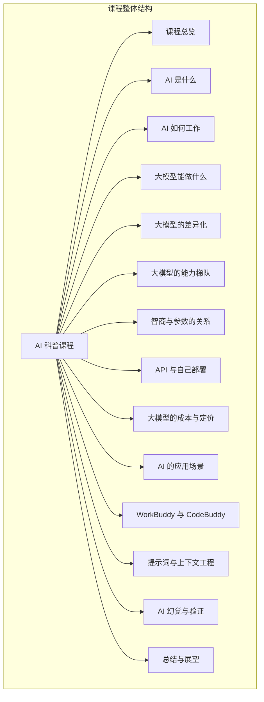
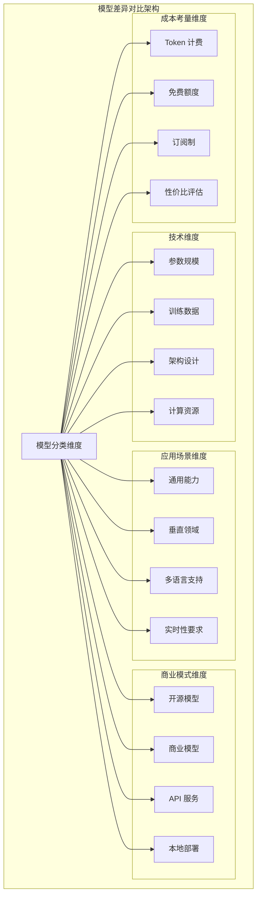
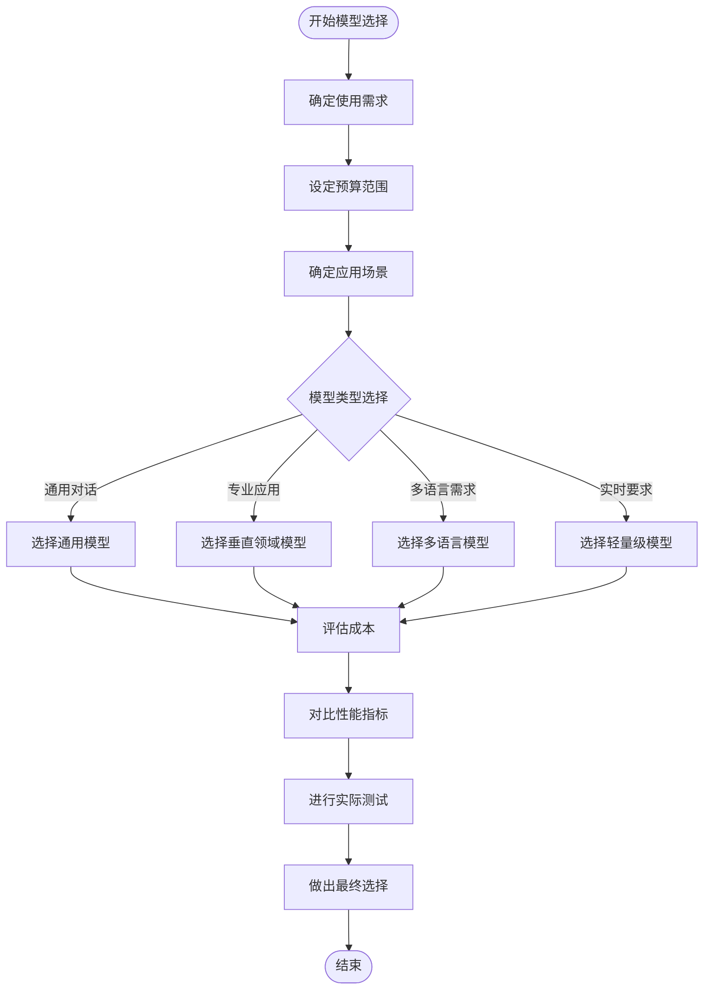
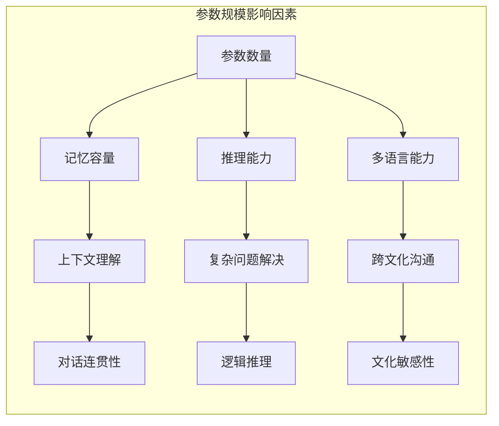
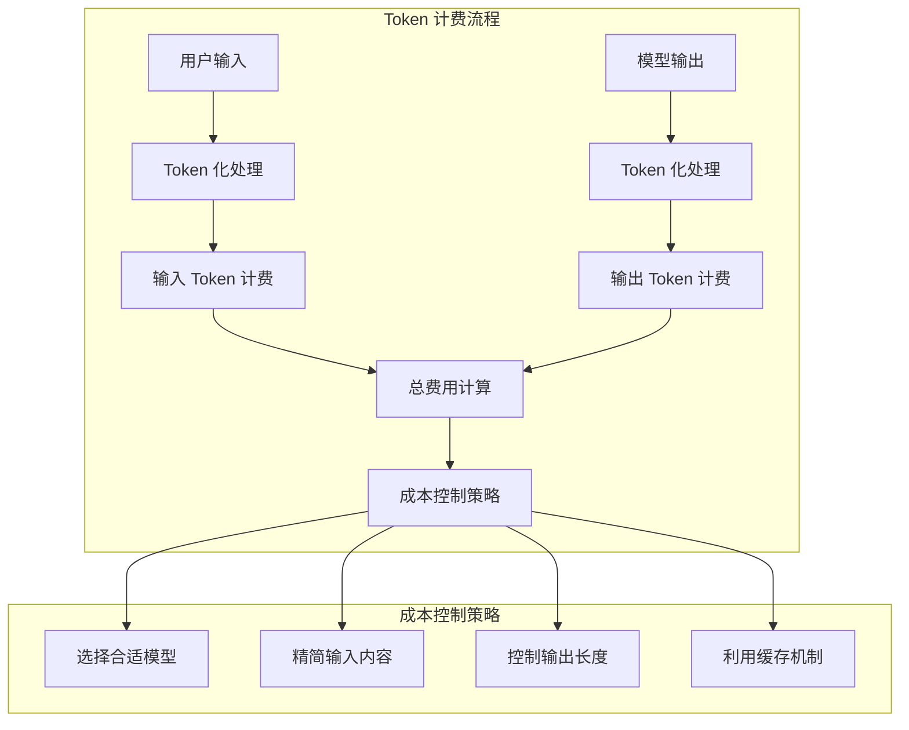
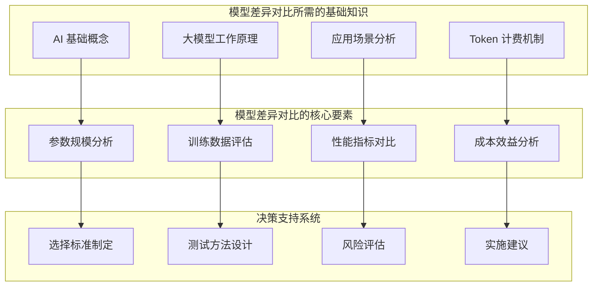
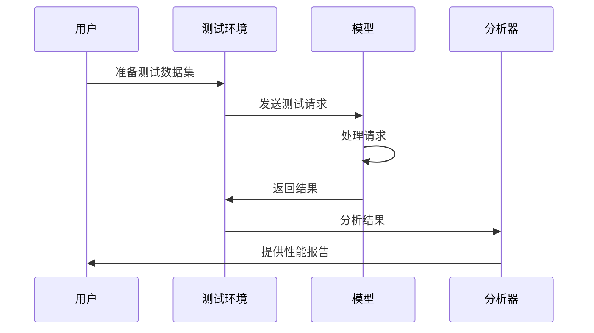

# 模型差异对比

<cite>
**本文档引用的文件**
- [README.md](file://README.md)
- [08_cost_and_pricing.md](file://08_cost_and_pricing/08_cost_and_pricing.md)
</cite>

## 目录
1. [引言](#引言)
2. [项目结构](#项目结构)
3. [核心组件](#核心组件)
4. [架构概览](#架构概览)
5. [详细组件分析](#详细组件分析)
6. [依赖分析](#依赖分析)
7. [性能考虑](#性能考虑)
8. [故障排除指南](#故障排除指南)
9. [结论](#结论)
10. [附录](#附录)

## 引言

本章节旨在为读者提供一个全面的大语言模型差异对比教学内容，帮助零基础成年人理解不同大语言模型的特点、优势和适用场景。通过对比开源模型和商业模型的差异，分析模型参数规模、训练数据、应用场景等因素对性能的影响，为读者提供模型选择的指导原则和决策框架。

本课程特别强调实用性，避免复杂的数学公式和编程代码，专注于让读者"看懂市面上大模型的差异，知道哪款适合你"。

## 项目结构

该项目采用"思维导图作骨架，文字作详解"的方式组织内容，每个章节包含两个文件：
- `XX_xxx.md` —— 详细讲解，建议从头读到尾
- `XX_xxx.xmind` —— 思维导图，适合复习、分享、打印贴在墙上

课程结构设计遵循循序渐进的学习路径，确保读者能够在3.5小时的学习时间内掌握AI通识知识。

**图表来源**
- [README.md:24-41](file://README.md#L24-L41)

**章节来源**
- [README.md:1-70](file://README.md#L1-L70)

## 核心组件

### 课程目标与受众定位

本课程针对以下人群设计：
- 听说过 ChatGPT、文心、豆包、Claude，但说不清它们到底是什么的人群
- 想在工作、学习、生活中真正用上 AI，却不知道从哪里下手的人群
- 不想看公式和代码，只想搞懂"AI 是什么、能做什么、怎么挑、怎么用、怎么避坑"的人群

### 学习成果预期

完成课程后，学员能够：
1. 用一句话讲清楚 AI 和大模型是什么
2. 看懂市面上大模型的差异，知道哪款适合你
3. 理解"参数""API""自部署"这些概念
4. 用好提示词与上下文，让 AI 输出真正有用的内容
5. 识别 AI 的"一本正经胡说八道"，不被它带偏
6. 把 WorkBuddy、CodeBuddy 等工具用成日常生产力

### 教学方法论

课程采用"思维导图+详细讲解"的双轨教学模式：
- **思维导图**：建立知识框架和整体认知
- **详细讲解**：补充细节和深入分析
- **循环学习**：看导图建立框架 → 读 md 补充细节 → 再看导图回顾

**章节来源**
- [README.md:7-23](file://README.md#L7-L23)
- [README.md:43-61](file://README.md#L43-L61)

## 架构概览

### 模型差异对比的知识架构

### 模型选择决策框架

## 详细组件分析

### 开源模型 vs 商业模型对比

#### 开源模型特点

开源模型具有以下优势：
- **成本优势**：通常免费或成本较低
- **灵活性**：可自由定制和修改
- **透明度**：训练过程和参数相对透明
- **社区支持**：活跃的开发者社区

#### 商业模型特点

商业模型具有以下优势：
- **专业支持**：专业的技术支持和服务
- **稳定性**：经过充分测试和优化
- **集成便利**：易于集成到现有系统
- **安全性**：专业的安全防护措施

### 参数规模对性能的影响

参数规模是衡量模型能力的重要指标，但并非唯一决定因素：

#### 参数规模与能力关系

#### 参数规模的局限性

需要注意的是，"参数越大越聪明"这一观点存在误区：
- **训练质量更重要**：高质量的训练数据比单纯的参数数量更有价值
- **应用场景匹配**：某些垂直领域的专业模型可能比通用大模型更适合
- **成本效益**：过度的参数规模可能导致不必要的成本增加

### 训练数据对模型性能的影响

#### 数据质量的重要性

训练数据的质量直接影响模型的性能表现：
- **多样性**：涵盖各种话题和语境的数据
- **时效性**：最新的数据有助于模型了解当前情况
- **准确性**：错误的数据会导致模型产生误导
- **平衡性**：避免过度偏向某一特定群体或观点

#### 数据来源的考量

不同模型的训练数据来源各有特点：
- **互联网文本**：覆盖面广但可能存在偏见
- **专业文献**：质量高但数量有限
- **多语言数据**：支持国际化但需要平衡
- **实时数据**：保持时效性但成本较高

### 应用场景对模型选择的影响

#### 通用对话场景

适用于日常交流和信息查询：
- **响应速度**：需要快速响应用户请求
- **理解能力**：准确理解用户意图
- **表达能力**：清晰表达信息
- **容错能力**：能够处理模糊或多义请求

#### 专业应用场景

适用于特定领域的深度应用：
- **领域知识**：具备丰富的专业知识
- **术语准确性**：正确使用专业术语
- **逻辑推理**：进行复杂的推理分析
- **合规性**：符合行业规范和标准

#### 多语言支持场景

适用于国际化应用：
- **语言切换**：流畅地在多种语言间切换
- **文化适应**：理解不同文化的表达习惯
- **翻译质量**：提供准确的翻译服务
- **本地化**：适应不同地区的使用习惯

### 成本考量与性价比评估

#### Token 计费机制

Token 是大模型计费的最小单位，理解其计费机制对控制成本至关重要：

#### 实际成本计算示例

以日常工作场景为例，展示不同模型的成本差异：

| 模型 | 输入单价 | 输出单价 | 月费用估算 |
|------|----------|----------|------------|
| GPT-4o | $2.50 | $10.00 | 约 $1.53 |
| GPT-4o mini | $0.15 | $0.60 | 约 ¥0.6 |
| DeepSeek-V3 | ¥2 | ¥8 | 约 ¥1.2 |
| 豆包 Pro | ¥0.8 | ¥2.0 | 约 ¥0.3 |

#### 省钱技巧与最佳实践

1. **选对模型等级**：根据使用频率和需求选择合适的模型级别
2. **精简输入内容**：只提供必要的上下文信息
3. **控制输出长度**：在提示词中明确字数限制
4. **善用缓存机制**：重复对话中保持系统提示词不变
5. **批量处理任务**：将多个小任务合并处理
6. **关注优惠活动**：及时了解平台的促销信息

**章节来源**
- [08_cost_and_pricing.md:7-31](file://08_cost_and_pricing/08_cost_and_pricing.md#L7-L31)
- [08_cost_and_pricing.md:48-76](file://08_cost_and_pricing/08_cost_and_pricing.md#L48-L76)
- [08_cost_and_pricing.md:79-99](file://08_cost_and_pricing/08_cost_and_pricing.md#L79-L99)
- [08_cost_and_pricing.md:103-123](file://08_cost_and_pricing/08_cost_and_pricing.md#L103-L123)

## 依赖分析

### 知识依赖关系

### 学习路径依赖

课程设计遵循递进式学习路径，确保知识的连贯性和完整性：
- **前置知识**：AI基础概念和工作原理
- **核心技能**：模型差异分析和对比方法
- **实践应用**：实际测试和性能评估
- **综合运用**：模型选择和决策制定

## 性能考虑

### 测试方法与实践技巧

#### 实际测试方法

#### 性能评估指标

1. **响应时间**：模型处理请求的速度
2. **准确性**：回答的正确性和相关性
3. **一致性**：在相同条件下的稳定表现
4. **鲁棒性**：处理异常情况的能力
5. **成本效率**：性能与成本的平衡

#### 实践测试步骤

1. **准备测试数据**：收集代表性的问题和场景
2. **设定评估标准**：确定关键性能指标
3. **执行基准测试**：在相同条件下测试各模型
4. **分析测试结果**：对比各模型的表现差异
5. **得出测试结论**：形成客观的评估报告

### 性能优化建议

1. **提示词工程**：优化提示词设计提高模型效率
2. **上下文管理**：合理控制上下文长度提升性能
3. **批量处理**：合并相似请求减少重复计算
4. **缓存策略**：利用缓存机制提高响应速度
5. **负载均衡**：合理分配请求避免过载

## 故障排除指南

### 常见问题与解决方案

#### 模型选择困惑

**问题表现**：面对众多模型不知如何选择
**解决方案**：
- 明确自己的具体需求和预算范围
- 优先考虑使用频率和场景匹配度
- 进行小规模试用验证模型性能
- 关注长期成本而非仅看初始价格

#### 性能不达标

**问题表现**：模型输出质量不符合预期
**解决方案**：
- 优化提示词设计和上下文设置
- 调整模型参数和温度设置
- 增加训练数据的多样性和质量
- 考虑更换更适合的模型类型

#### 成本过高

**问题表现**：使用成本超出预算
**解决方案**：
- 选择更合适的模型等级
- 优化输入内容减少 Token 消耗
- 利用免费额度和优惠活动
- 实施批量处理和缓存策略

### 质量保证措施

1. **多模型对比**：同时测试多个候选模型
2. **A/B 测试**：在真实环境中验证效果
3. **持续监控**：跟踪模型性能变化趋势
4. **定期评估**：定期重新评估模型适用性

**章节来源**
- [README.md:13-22](file://README.md#L13-L22)

## 结论

通过本章节的学习，读者应该能够：

1. **理解模型差异的本质**：认识到不同模型在参数规模、训练数据、应用场景等方面的差异
2. **掌握对比分析方法**：学会从多个维度客观评估和对比不同模型
3. **制定选择决策框架**：建立基于需求、成本、性能的综合决策体系
4. **实施测试验证流程**：掌握实际测试和性能评估的方法技巧

记住，没有完美的模型，只有最适合的模型。关键在于根据自己的具体需求和约束条件，做出明智的选择。

## 附录

### 快速参考表

#### 模型选择决策清单

- [ ] 明确使用需求和场景
- [ ] 设定预算范围和成本上限
- [ ] 收集候选模型信息
- [ ] 进行小规模试用测试
- [ ] 对比性能和成本指标
- [ ] 制定实施计划
- [ ] 建立监控和评估机制

#### 成本控制要点

- 选择合适的模型等级
- 优化输入内容设计
- 控制输出长度要求
- 利用缓存和批量处理
- 关注免费额度和优惠
- 定期评估性价比