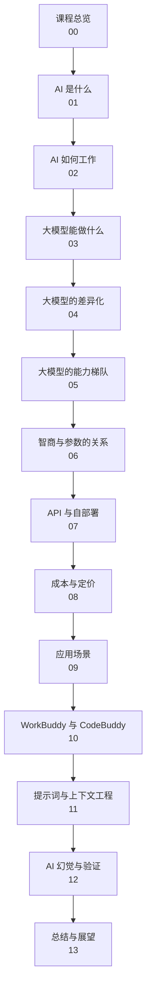
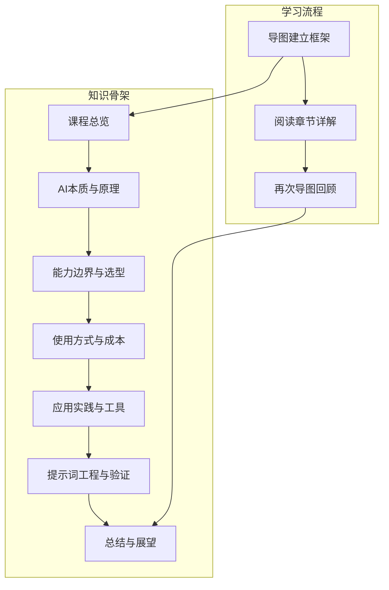
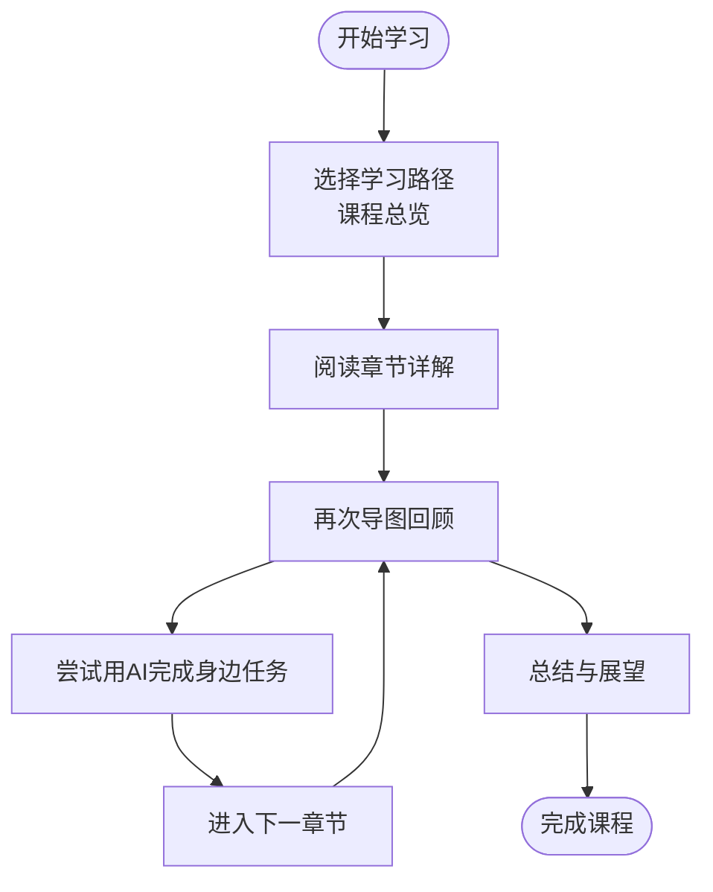

# 课程总览

<cite>
**本文档引用的文件**
- [README.md](file://README.md)
</cite>

## 目录
1. [引言](#引言)
2. [项目结构](#项目结构)
3. [核心组件](#核心组件)
4. [架构总览](#架构总览)
5. [详细组件分析](#详细组件分析)
6. [依赖分析](#依赖分析)
7. [性能考虑](#性能考虑)
8. [故障排除指南](#故障排除指南)
9. [结论](#结论)
10. [附录](#附录)

## 引言
本课程是一套面向零基础成年人的AI通识教育内容，采用“思维导图作骨架、文字作详解”的设计思路，帮助学习者从“完全不懂”逐步走向“熟练用AI解决问题”。课程强调实用性与可操作性，避免复杂的数学公式与编程代码，聚焦于“AI是什么、能做什么、怎么挑、怎么用、怎么避坑”等实用主题。

课程目标是通过系统化的13个章节（含课程总览），构建一个完整且易于迁移的知识框架，使学习者能够在工作、学习、生活中有效运用AI工具与方法，同时具备识别风险与规避陷阱的能力。

**章节来源**
- [README.md:1-70](file://README.md#L1-L70)

## 项目结构
课程以“章节化+配套资源”的组织方式呈现：
- 每个章节包含两份材料：一份为详细讲解的Markdown文档；另一份为便于复习与分享的思维导图文件。
- 推荐学习顺序为“先看导图建立框架 → 再读文档补充细节 → 最后再看导图回顾”，形成“导图-文字-导图”的闭环学习路径。
- 课程整体时长约3.5小时，建议每天完成1-2章，持续一周即可通盘掌握。

**图表来源**
- [README.md:24-41](file://README.md#L24-L41)

**章节来源**
- [README.md:43-61](file://README.md#L43-L61)

## 核心组件
- 教学理念与目标
  - 面向零基础学习者，强调“从实用出发、从现象到机制、从概念到方法”的渐进式学习。
  - 通过“导图-文字”的双轨资料，兼顾快速浏览与深度理解。
- 学习成果预期
  - 能用一句话讲清楚AI与大模型的本质；
  - 能对比不同大模型的差异并做出合理选择；
  - 理解参数、API、自部署等关键概念；
  - 掌握提示词与上下文工程，提升输出质量；
  - 具备识别“幻觉”与验证信息的能力；
  - 能将AI工具（如WorkBuddy、CodeBuddy）融入日常生产力。
- 实用性导向
  - 每章提供约12-15分钟的阅读量，便于碎片时间学习；
  - 强调“学完一章就尝试用AI完成身边的一个小任务”，实现学以致用。

**章节来源**
- [README.md:7-23](file://README.md#L7-L23)
- [README.md:56-61](file://README.md#L56-L61)

## 架构总览
课程整体采用“导图-文字-导图”的循环学习架构，配合13个核心章节，形成“总览-分章-总结”的完整闭环：

**图表来源**
- [README.md:49-54](file://README.md#L49-L54)
- [README.md:24-41](file://README.md#L24-L41)

## 详细组件分析
本节按课程章节顺序梳理核心知识点与学习要点，帮助学习者把握每章重点与前后关联。

- 课程总览（00）
  - 目标：帮助学习者看清整张地图，选好学习路径。
  - 关键点：明确学习顺序、学习节奏与预期成果。
  - 学习建议：先看导图建立整体框架，再细读章节详解，最后回看导图巩固记忆。

- AI是什么（01）
  - 目标：用一杯咖啡的时间，搞懂AI的本质。
  - 关键点：从现象到机制，建立对AI的基本认知。

- AI如何工作（02）
  - 目标：用“超级鹦鹉”类比理解大模型的工作原理。
  - 关键点：避免复杂公式，强调可理解的类比与机制。

- 大模型能做什么（03）
  - 目标：列出文字、图像、语音、视频、代码等多模态能力清单。
  - 关键点：覆盖常见应用场景，帮助学习者建立“能做什么”的直观认知。

- 大模型的差异化（04）
  - 目标：区分通用与垂直、闭源与开源、国内外差异。
  - 关键点：为后续“如何挑选”打下基础。

- 大模型的能力梯队（05）
  - 目标：划分一、二、三梯队及其代表，给出选型建议。
  - 关键点：结合差异与能力，指导实际选型决策。

- 智商与参数的关系（06）
  - 目标：澄清“参数越大越聪明”的误区。
  - 关键点：帮助学习者理性看待参数与能力的关系。

- API与自部署（07）
  - 目标：解释两种使用方式的区别与适用人群。
  - 关键点：结合场景与需求，选择合适路径。

- 成本与定价（08）
  - 目标：解释Token计费方式、各模型价格与省钱策略。
  - 关键点：降低使用门槛，提升性价比意识。

- 应用场景（09）
  - 目标：覆盖办公、学习、创作、生活、专业领域的典型应用。
  - 关键点：将AI与实际任务结合，强化迁移能力。

- WorkBuddy与CodeBuddy（10）
  - 目标：介绍腾讯的AI助手（口语中也称“龙虾”），作为生产力工具的入门案例。
  - 关键点：以具体工具为例，建立实操认知。

- 提示词与上下文工程（11）
  - 目标：掌握让AI输出你想要结果的实战技巧。
  - 关键点：强调提示词设计与上下文管理对输出质量的影响。

- AI幻觉与验证（12）
  - 目标：识别“一本正经胡说八道”，守住最后一道防线。
  - 关键点：培养批判性思维与事实核查能力。

- 总结与展望（13）
  - 目标：回顾趋势、学习路径与持续精进建议。
  - 关键点：帮助学习者制定长期学习与实践计划。

**图表来源**
- [README.md:49-54](file://README.md#L49-L54)
- [README.md:24-41](file://README.md#L24-L41)

**章节来源**
- [README.md:24-41](file://README.md#L24-L41)
- [README.md:49-54](file://README.md#L49-L54)

## 依赖分析
- 知识依赖
  - 前置知识：零基础，无需高等数学或编程背景。
  - 依赖关系：章节之间存在递进关系，例如“AI本质与原理”为后续“能力与选型”奠定基础，“提示词工程”与“幻觉识别”贯穿全课程。
- 资源依赖
  - 导图与文字资料相互支撑，导图用于建立框架，文字用于补充细节，二者共同构成完整的知识骨架。
- 工具依赖
  - 课程中提及的工具（如WorkBuddy、CodeBuddy）仅为举例，实际使用应以官方最新版本为准。

**章节来源**
- [README.md:62-64](file://README.md#L62-L64)

## 性能考虑
- 时间效率
  - 每章约12-15分钟，总时长约3.5小时，适合碎片化学习。
- 学习效率
  - “导图-文字-导图”的循环有助于加深记忆与迁移应用。
- 实践效率
  - 强调“学完一章就尝试用AI完成身边的小任务”，提升学习迁移速度。

**章节来源**
- [README.md:56-61](file://README.md#L56-L61)

## 故障排除指南
- 学习节奏问题
  - 如果进度过快或过慢，可调整为每天1-2章，持续一周完成，确保消化吸收。
- 理解困难
  - 若某章节难以理解，建议先看导图建立整体框架，再回看文字细节，最后再次导图回顾。
- 工具使用偏差
  - 课程中举例的工具以帮助建立认知为主，请以官方最新版本为准，避免因版本差异导致的操作偏差。

**章节来源**
- [README.md:56-61](file://README.md#L56-L61)
- [README.md:62-64](file://README.md#L62-L64)

## 结论
本课程通过“导图-文字-导图”的学习架构与13个核心章节，构建了从零基础到实用落地的完整AI通识体系。课程强调“从实用出发、从现象到机制、从概念到方法”，帮助学习者在工作、学习、生活中真正用上AI，并具备识别风险与持续精进的能力。

## 附录
- 学习建议
  - 每章约12-15分钟，总时长约3.5小时；
  - 推荐学习顺序：看导图建立框架 → 读文档补充细节 → 再看导图回顾；
  - 学完一章后，尝试用AI完成身边的一个小任务，效果最佳。

**章节来源**
- [README.md:56-54](file://README.md#L56-L54)