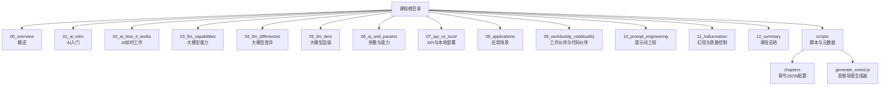
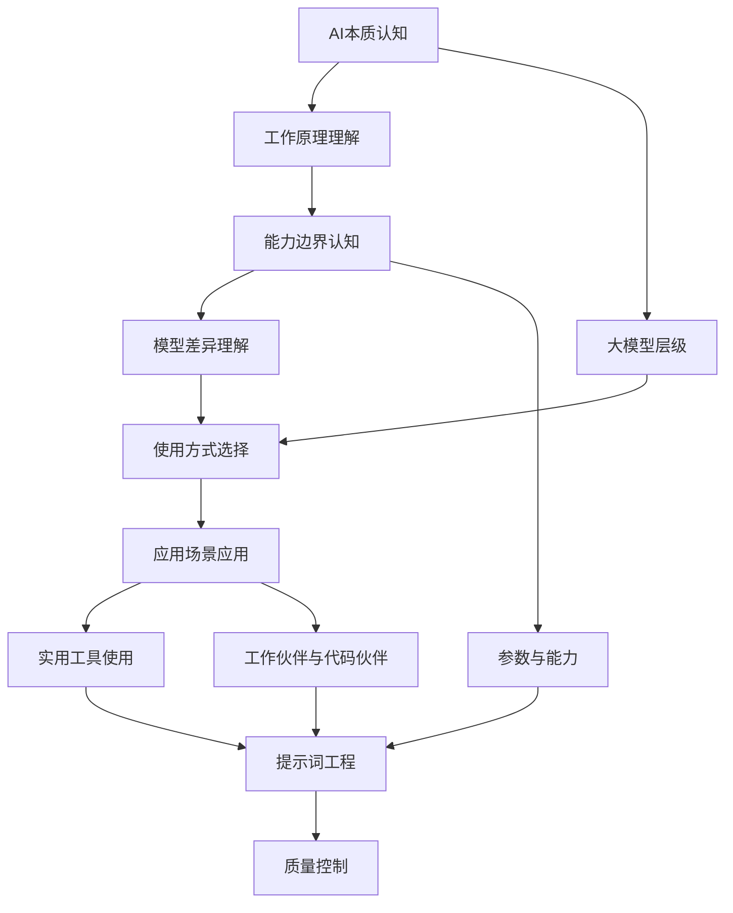
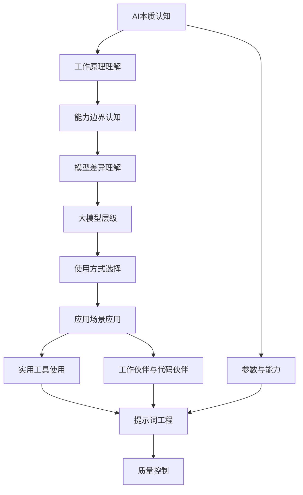

# 课程结构说明

<cite>
**本文档引用的文件**
- [README.md](file://README.md)
- [00_overview.md](file://00_overview/00_overview.md)
- [02_ai_how_it_works.md](file://02_ai_how_it_works/02_ai_how_it_works.md)
- [05_llm_tiers.md](file://05_llm_tiers/05_llm_tiers.md)
- [09_workbuddy_codebuddy.md](file://09_workbuddy_codebuddy/09_workbuddy_codebuddy.md)
- [generate_xmind.js](file://scripts/generate_xmind.js)
- [00_overview.json](file://scripts/chapters/00_overview.json)
- [01_ai_intro.json](file://scripts/chapters/01_ai_intro.json)
- [02_ai_how_it_works.json](file://scripts/chapters/02_ai_how_it_works.json)
- [03_llm_capabilities.json](file://scripts/chapters/03_llm_capabilities.json)
- [04_llm_differences.json](file://scripts/chapters/04_llm_differences.json)
- [05_llm_tiers.json](file://scripts/chapters/05_llm_tiers.json)
- [06_iq_and_params.json](file://scripts/chapters/06_iq_and_params.json)
- [07_api_vs_local.json](file://scripts/chapters/07_api_vs_local.json)
- [08_applications.json](file://scripts/chapters/08_applications.json)
</cite>

## 目录
1. [引言](#引言)
2. [项目结构](#项目结构)
3. [核心组件](#核心组件)
4. [架构总览](#架构总览)
5. [详细组件分析](#详细组件分析)
6. [依赖分析](#依赖分析)
7. [性能考虑](#性能考虑)
8. [故障排除指南](#故障排除指南)
9. [结论](#结论)
10. [附录](#附录)

## 引言
本课程面向不同背景的学习者，系统性地构建从AI本质认知到实践应用的完整知识体系。课程以12个核心主题为主线，覆盖AI基础概念、工作原理、能力边界、模型差异、部署与使用方式、应用场景、实用工具、提示词工程以及质量控制等关键领域。通过明确的学习目标、重点内容与前置知识要求，帮助学习者制定个性化学习路径与时间安排，并提供实践练习建议、学习资源链接与评估标准。

## 项目结构
仓库采用按主题分章节的组织方式，每个章节对应一个独立的知识模块，便于学习者按需选择与组合学习路径。脚本目录包含用于生成思维导图的自动化工具与各章节元数据配置文件，支持课程内容的可视化与结构化管理。

图表来源
- [README.md](file://README.md)
- [00_overview.md](file://00_overview/00_overview.md)
- [02_ai_how_it_works.md](file://02_ai_how_it_works/02_ai_how_it_works.md)
- [05_llm_tiers.md](file://05_llm_tiers/05_llm_tiers.md)
- [09_workbuddy_codebuddy.md](file://09_workbuddy_codebuddy/09_workbuddy_codebuddy.md)

章节来源
- [README.md](file://README.md)

## 核心组件
- 概述与导航：提供课程整体定位、学习目标与学习路径建议，帮助学习者快速建立全局认知。
- 基础概念与原理：涵盖AI本质、工作原理、大模型能力边界与差异，奠定理论基础。
- 部署与使用方式：对比API与本地部署的优劣与适用场景，指导选择合适的使用方式。
- 应用场景与工具：结合具体行业与任务场景，介绍实用工具与工作流设计。
- 提示词工程与质量控制：聚焦提示词设计、效果评估与质量保障策略。
- 总结与复习：梳理知识要点，形成可复用的学习框架与评估标准。

章节来源
- [README.md](file://README.md)

## 架构总览
课程内容以“主题驱动”的方式组织，各章节之间存在递进关系与交叉关联。下图展示了课程主题之间的逻辑关系与依赖方向，帮助学习者理解从基础到应用的整体学习路径。

图表来源
- [README.md](file://README.md)
- [00_overview.md](file://00_overview/00_overview.md)
- [02_ai_how_it_works.md](file://02_ai_how_it_works/02_ai_how_it_works.md)
- [05_llm_tiers.md](file://05_llm_tiers/05_llm_tiers.md)
- [09_workbuddy_codebuddy.md](file://09_workbuddy_codebuddy/09_workbuddy_codebuddy.md)

## 详细组件分析

### 章节一：AI本质认知（00_overview）
- 学习目标
  - 明确AI在现代技术生态中的定位与价值
  - 建立对AI能力与局限性的基本认知
  - 制定个人学习目标与阶段性里程碑
- 重点内容
  - AI的发展脉络与关键里程碑
  - 常见误解与现实期望的平衡
  - 课程学习路径与时间安排建议
- 前置知识要求
  - 无需特殊背景，具备基本的信息素养与学习动机
- 实践练习建议
  - 绘制个人学习目标树，标注阶段性节点
  - 对比不同AI产品的宣传与实际能力，记录观察结果
- 学习资源链接
  - 官方课程资料与扩展阅读清单（由课程提供）
- 评估标准
  - 能清晰阐述AI的核心价值与适用场景
  - 能制定可执行的个人学习计划并定期回顾调整

章节来源
- [README.md](file://README.md)
- [00_overview.md](file://00_overview/00_overview.md)

### 章节二：AI如何工作（02_ai_how_it_works）
- 学习目标
  - 理解AI系统的基本工作流程与关键环节
  - 掌握输入处理、推理与输出反馈的闭环机制
- 重点内容
  - 数据预处理与特征工程
  - 模型推理与决策过程
  - 结果解释与不确定性表达
- 前置知识要求
  - 具备基本的数据与算法概念理解
- 实践练习建议
  - 选择一个简单任务，模拟从输入到输出的全流程
  - 记录不同输入变化对输出的影响，分析敏感性
- 学习资源链接
  - 在线教程与可视化工具（由课程提供）
- 评估标准
  - 能描述AI系统的典型工作流程
  - 能识别关键影响因素并提出优化思路

章节来源
- [02_ai_how_it_works.md](file://02_ai_how_it_works/02_ai_how_it_works.md)

### 章节三：大模型能力（03_llm_capabilities）
- 学习目标
  - 全面认识大模型的能力范围与典型表现
  - 区分通用能力与专业能力，避免过度期待
- 重点内容
  - 多模态理解与生成能力
  - 上下文学习与长文本处理
  - 语言理解与逻辑推理的边界
- 前置知识要求
  - 具备基础的语言与信息处理经验
- 实践练习建议
  - 设计多类问题进行测试，记录成功与失败案例
  - 对比不同模型在同一任务上的表现差异
- 学习资源链接
  - 官方评测基准与社区讨论（由课程提供）
- 评估标准
  - 能列举至少三种典型能力与限制
  - 能基于实证结果调整预期与使用策略

章节来源
- [README.md](file://README.md)

### 章节四：大模型差异（04_llm_differences）
- 学习目标
  - 理解不同模型的差异化特点与适用场景
  - 掌握比较与选择模型的方法论
- 重点内容
  - 训练数据与目标差异对能力的影响
  - 性能、成本与可用性的权衡
- 前置知识要求
  - 具备基本的比较分析能力
- 实践练习建议
  - 选取同一任务在多个模型上进行对比实验
  - 归纳不同模型的优劣势与典型适用场景
- 学习资源链接
  - 模型评测报告与基准测试（由课程提供）
- 评估标准
  - 能总结至少两种模型的差异化特征
  - 能给出针对特定任务的选型建议

章节来源
- [README.md](file://README.md)

### 章节五：大模型层级（05_llm_tiers）
- 学习目标
  - 理解大模型的层级划分与能力梯度
  - 基于任务复杂度与预算约束做出合理选择
- 重点内容
  - 不同层级模型的能力与成本特征
  - 任务分解与层级匹配策略
- 前置知识要求
  - 具备基本的成本与效率意识
- 实践练习建议
  - 将复杂任务拆解为子任务，评估所需模型层级
  - 制作成本-性能权衡表，辅助决策
- 学习资源链接
  - 成本与性能基准数据（由课程提供）
- 评估标准
  - 能根据任务需求选择合适的模型层级
  - 能量化评估不同层级的性价比

章节来源
- [05_llm_tiers.md](file://05_llm_tiers/05_llm_tiers.md)

### 章节六：参数与能力（06_iq_and_params）
- 学习目标
  - 理解参数规模与模型能力的关系
  - 掌握参数与性能、成本之间的权衡方法
- 重点内容
  - 参数规模对能力的影响机制
  - 训练成本与推理开销的估算
- 前置知识要求
  - 具备基本的数学与统计概念
- 实践练习建议
  - 分析不同参数规模模型的性能曲线
  - 建立参数-性能-成本的三维评估模型
- 学习资源链接
  - 技术白皮书与基准测试（由课程提供）
- 评估标准
  - 能解释参数与能力的典型关系
  - 能基于成本与性能做出合理取舍

章节来源
- [README.md](file://README.md)

### 章节七：API与本地部署（07_api_vs_local）
- 学习目标
  - 明确API与本地部署的适用场景与权衡点
  - 掌握两种方式的选择策略与实施要点
- 重点内容
  - 安全性、可控性与易用性的权衡
  - 成本、延迟与功能的对比
- 前置知识要求
  - 具备基本的技术基础设施理解
- 实践练习建议
  - 在相同任务下对比API与本地部署的效果与成本
  - 制定迁移与切换的应急预案
- 学习资源链接
  - 部署指南与安全最佳实践（由课程提供）
- 评估标准
  - 能识别两种方式的关键差异
  - 能为具体场景制定部署策略

章节来源
- [README.md](file://README.md)

### 章节八：应用场景（08_applications）
- 学习目标
  - 识别AI在不同领域的典型应用场景
  - 掌握场景适配与方案设计方法
- 重点内容
  - 行业应用模式与关键成功要素
  - 场景分解与技术栈选型
- 前置知识要求
  - 具备一定的行业或业务背景
- 实践练习建议
  - 选择一个具体业务场景，设计AI解决方案
  - 评估技术可行性与业务价值
- 学习资源链接
  - 行业案例与最佳实践（由课程提供）
- 评估标准
  - 能列举至少三个典型应用场景
  - 能提出可落地的实施方案

章节来源
- [README.md](file://README.md)

### 章节九：工作伙伴与代码伙伴（09_workbuddy_codebuddy）
- 学习目标
  - 理解AI作为工作伙伴与代码伙伴的价值与边界
  - 掌握高效协作与质量把关的方法
- 重点内容
  - 人机协作的模式与最佳实践
  - 代码生成、审查与调试的流程
- 前置知识要求
  - 具备基本的编程或办公技能
- 实践练习建议
  - 使用AI工具完成一次完整的任务周期（从构思到交付）
  - 建立质量检查清单，持续改进协作流程
- 学习资源链接
  - 工具使用手册与协作规范（由课程提供）
- 评估标准
  - 能描述AI协作的典型流程
  - 能识别并规避常见陷阱

章节来源
- [09_workbuddy_codebuddy.md](file://09_workbuddy_codebuddy/09_workbuddy_codebuddy.md)

### 章节十：提示词工程（10_prompt_engineering）
- 学习目标
  - 掌握提示词设计的原则与技巧
  - 能够针对不同任务设计高质量提示词
- 重点内容
  - 结构化提示词的设计方法
  - 迭代优化与效果评估
- 前置知识要求
  - 具备清晰的表达与逻辑思维能力
- 实践练习建议
  - 针对一类任务设计提示词模板，持续迭代优化
  - 建立效果评估指标，量化改进成果
- 学习资源链接
  - 提示词设计指南与案例库（由课程提供）
- 评估标准
  - 能设计出可复用的提示词模板
  - 能通过实验验证提示词的有效性

章节来源
- [README.md](file://README.md)

### 章节十一：幻觉与质量控制（11_hallucination）
- 学习目标
  - 认识AI“幻觉”现象及其成因
  - 建立系统性的质量控制与风险治理机制
- 重点内容
  - 幻觉的类型、成因与影响
  - 质量评估、校验与纠偏策略
- 前置知识要求
  - 具备基本的质量意识与风险识别能力
- 实践练习建议
  - 设计质量检查流程，覆盖关键风险点
  - 建立问题追踪与持续改进机制
- 学习资源链接
  - 质量控制与风险管理材料（由课程提供）
- 评估标准
  - 能识别典型幻觉类型并提出应对策略
  - 能建立可执行的质量控制流程

章节来源
- [README.md](file://README.md)

### 章节十二：课程总结（12_summary）
- 学习目标
  - 回顾课程核心要点，形成可复用的学习框架
  - 建立持续学习与自我评估机制
- 重点内容
  - 知识要点梳理与知识图谱构建
  - 学习成果评估与后续发展路径
- 前置知识要求
  - 完成前述各章节的学习与实践
- 实践练习建议
  - 绘制个人知识图谱，标注关键联系
  - 制定下一阶段的学习与应用计划
- 学习资源链接
  - 进阶学习资源与社区参与指南（由课程提供）
- 评估标准
  - 能系统性总结课程要点
  - 能制定可持续的学习与应用计划

章节来源
- [README.md](file://README.md)

## 依赖分析
课程内容在主题层面具有明显的递进关系与交叉关联。下图展示了章节间的依赖关系与相互支撑点，有助于学习者理解学习顺序与知识衔接。

图表来源
- [README.md](file://README.md)
- [00_overview.md](file://00_overview/00_overview.md)
- [02_ai_how_it_works.md](file://02_ai_how_it_works/02_ai_how_it_works.md)
- [05_llm_tiers.md](file://05_llm_tiers/05_llm_tiers.md)
- [09_workbuddy_codebuddy.md](file://09_workbuddy_codebuddy/09_workbuddy_codebuddy.md)

## 性能考虑
- 学习效率
  - 建议采用“先理解、后实践”的节奏，确保理论与实践结合
  - 通过阶段性小测验与反思日志提升学习效果
- 时间分配
  - 基础概念与原理：占总时间的30%
  - 实战演练与案例分析：占总时间的50%
  - 总结与复盘：占总时间的20%
- 资源利用
  - 充分利用官方提供的学习资源与工具，减少重复探索成本
  - 建立个人知识库，沉淀可复用的方法论与模板

## 故障排除指南
- 学习动力不足
  - 明确短期目标与奖励机制，保持学习节奏稳定
- 实践缺乏反馈
  - 建立最小可行实验，快速验证假设并迭代
- 资源分散导致效率低
  - 固定学习路径与优先级，避免无效信息干扰
- 评估标准缺失
  - 制定可量化的评估指标，定期回顾与调整

## 结论
本课程通过系统化的主题组织与渐进式的学习设计，帮助不同背景的学习者建立从理论到实践的完整知识体系。建议学习者结合自身背景与目标，灵活选择学习路径与时间安排，并通过持续的实践与反思不断提升应用能力。

## 附录
- 自动化工具
  - 思维导图生成器：用于将课程内容结构化可视化，便于复习与知识整合
  - 章节元数据：用于维护课程结构与版本管理，支持内容的动态更新与扩展

章节来源
- [generate_xmind.js](file://scripts/generate_xmind.js)
- [00_overview.json](file://scripts/chapters/00_overview.json)
- [01_ai_intro.json](file://scripts/chapters/01_ai_intro.json)
- [02_ai_how_it_works.json](file://scripts/chapters/02_ai_how_it_works.json)
- [03_llm_capabilities.json](file://scripts/chapters/03_llm_capabilities.json)
- [04_llm_differences.json](file://scripts/chapters/04_llm_differences.json)
- [05_llm_tiers.json](file://scripts/chapters/05_llm_tiers.json)
- [06_iq_and_params.json](file://scripts/chapters/06_iq_and_params.json)
- [07_api_vs_local.json](file://scripts/chapters/07_api_vs_local.json)
- [08_applications.json](file://scripts/chapters/08_applications.json)