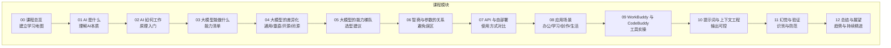
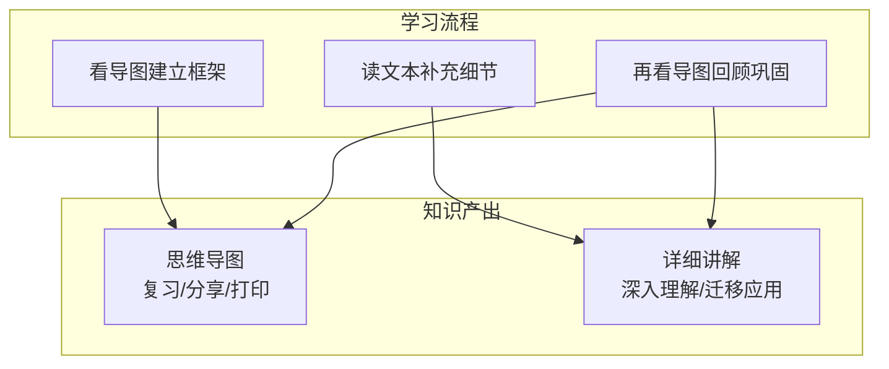

# 项目概述

<cite>
**本文档引用的文件**
- [README.md](file://README.md)
- [00_overview.md](file://00_overview/00_overview.md)
- [02_ai_how_it_works.md](file://02_ai_how_it_works/02_ai_how_it_works.md)
- [05_llm_tiers.md](file://05_llm_tiers/05_llm_tiers.md)
</cite>

## 目录
1. [引言](#引言)
2. [项目结构](#项目结构)
3. [核心组件](#核心组件)
4. [架构总览](#架构总览)
5. [详细组件分析](#详细组件分析)
6. [依赖分析](#依赖分析)
7. [性能考虑](#性能考虑)
8. [故障排除指南](#故障排除指南)
9. [结论](#结论)
10. [附录](#附录)

## 引言
本项目是一套面向零基础成年人的AI通识教育课程，旨在通过“思维导图作骨架、文字作详解”的方式，帮助学习者从“完全不懂”逐步走向“熟练用AI解决问题”。课程强调实用导向，避免复杂的数学公式与编程代码，聚焦于AI的本质、能力边界、使用方法与风险识别，配套WorkBuddy、CodeBuddy等工具的实际应用，帮助学习者在工作、学习与生活中建立可持续的AI使用能力。

- 教育理念：以“少即是多”的原则，用最短时间建立知识框架，再通过实践巩固与迁移。
- 目标受众：对AI感兴趣但缺乏系统认知的普通成年人；希望在实际场景中高效使用AI的人群。
- 学习成果预期：能够清晰表达AI与大模型的概念，理解不同大模型的差异与选型策略，掌握提示词与上下文工程，识别并规避AI幻觉，将AI工具融入日常生产力。

**章节来源**
- [README.md:1-69](file://README.md#L1-L69)

## 项目结构
课程采用模块化章节组织，共12章，每章包含两份材料：
- XX_*.md：详细讲解文本，建议从头读到尾，补充细节与案例；
- XX_*.xmind：思维导图，便于复习、分享与打印。

推荐学习路径遵循“先看导图建立框架 → 再读文本补充细节 → 最后再看导图回顾”的循环模式，帮助快速构建知识体系并加深记忆。

**图表来源**
- [README.md:24-40](file://README.md#L24-L40)

**章节来源**
- [README.md:42-53](file://README.md#L42-L53)

## 核心组件
- 课程总览（00）：帮助学习者认清学习地图，选择合适起点与路径，建立全局认知。
- AI本质（01）：用通俗类比与简洁语言解释AI的基本概念，消除神秘感。
- 原理入门（02）：以“超级鹦鹉”等易懂比喻解释大模型的工作机制，降低理解门槛。
- 能力清单（03）：覆盖文本、图像、语音、视频、代码等多模态能力，形成能力图谱。
- 差异化分析（04）：对比通用与垂直、闭源与开源、国内外产品，指导选型。
- 能力梯队（05）：划分不同梯队的大模型，给出选型建议与适用场景。
- 参数与智商（06）：澄清“参数越大越聪明”的常见误区，建立理性判断标准。
- 使用方式（07）：对比API与本地部署，明确各自的适用人群与边界。
- 应用场景（08）：覆盖办公、学习、创作、生活与专业领域，提供落地参考。
- 工具实操（09）：结合WorkBuddy、CodeBuddy等工具，讲解如何将其融入日常生产力。
- 提示词工程（10）：系统讲解提示词与上下文的设计方法，提升输出质量。
- 幻觉与验证（11）：识别AI“一本正经胡说八道”，建立事实核查意识。
- 总结与展望（12）：总结学习要点，给出持续精进与趋势观察。

**章节来源**
- [README.md:26-40](file://README.md#L26-L40)

## 架构总览
课程采用“导图+文本”的双轨教学架构：
- 导图轨道：快速建立知识骨架，强调结构化与可视化，便于复习与串联；
- 文本轨道：深入细节与案例，强调可操作性与迁移能力，便于内化与应用。

**图表来源**
- [README.md:42-53](file://README.md#L42-L53)

## 详细组件分析

### 组件A：课程总览（00）
- 目标：帮助学习者建立全局视角，明确学习路径与预期收益。
- 设计要点：以“看清整张地图，选好学习路径”为核心，配合章节概览表，引导学习者按需取舍。
- 实践建议：先浏览总览，再根据自身需求选择重点章节，最后回到总览进行复盘。

**章节来源**
- [00_overview.md:1-200](file://00_overview/00_overview.md#L1-L200)

### 组件B：AI本质与原理（01/02）
- 目标：用通俗类比解释AI与大模型的本质，降低认知门槛。
- 设计要点：以“超级鹦鹉”等生动比喻，将复杂机制简化为可感知的类比，便于非技术背景学习者理解。
- 实践建议：结合导图中的核心概念，尝试用自己的话复述“AI是如何工作的”。

**章节来源**
- [02_ai_how_it_works.md:1-200](file://02_ai_how_it_works/02_ai_how_it_works.md#L1-L200)

### 组件C：能力与选型（03/04/05）
- 目标：建立“能力清单”与“选型建议”的决策框架。
- 设计要点：以能力矩阵与梯队划分帮助学习者快速定位适合的产品与场景。
- 实践建议：针对自身工作或学习场景，对照能力清单与梯队建议，选择合适的工具或服务。

**章节来源**
- [05_llm_tiers.md:1-200](file://05_llm_tiers/05_llm_tiers.md#L1-L200)

### 组件D：使用方式与工具实操（07/09）
- 目标：明确API与本地部署的差异，掌握典型工具的使用方法。
- 设计要点：对比两种使用方式的优缺点与适用人群；通过WorkBuddy、CodeBuddy等实例讲解工具在日常中的落地应用。
- 实践建议：结合自身工作流，尝试将工具集成到现有任务中，逐步形成稳定的操作习惯。

**章节来源**
- [README.md:36-38](file://README.md#L36-L38)

### 组件E：提示词与上下文工程（10）
- 目标：提升提示词设计与上下文管理能力，实现更可控的输出结果。
- 设计要点：系统讲解提示词结构、上下文组织与迭代优化方法。
- 实践建议：针对具体任务设计提示词模板，持续迭代以提升稳定性与一致性。

**章节来源**
- [README.md:40](file://README.md#L40)

### 组件F：幻觉与验证（11）
- 目标：识别AI“一本正经胡说八道”，建立事实核查意识。
- 设计要点：提供识别与验证方法，帮助学习者在关键决策中守住“最后一道防线”。
- 实践建议：对重要结论进行交叉验证，必要时引入外部权威信息源。

**章节来源**
- [README.md:40](file://README.md#L40)

## 依赖分析
- 知识依赖：各章节围绕“概念理解—能力认知—选型决策—工具使用—工程实践—风险识别”的链条递进，形成前后呼应的知识网络。
- 材料依赖：每章配套导图与文本，二者相辅相成，导图用于建立框架，文本用于深化细节。
- 实践依赖：建议将所学应用于真实任务，通过“做中学”强化迁移能力。

**图表来源**
- [README.md:24-40](file://README.md#L24-L40)

## 性能考虑
- 学习效率：每章约12-15分钟阅读量，12章总计约3小时，适合碎片化学习与持续巩固。
- 记忆巩固：采用“导图→文本→导图”的循环模式，有助于长期记忆与知识迁移。
- 实践密度：建议学完一章后，挑选1-2个身边实际任务尝试用AI完成，提升迁移与应用能力。

**章节来源**
- [README.md:55-59](file://README.md#L55-L59)

## 故障排除指南
- 理解困难：若某一章节难以理解，建议先看导图建立框架，再回看文本补充细节，最后再次回顾导图。
- 学习焦虑：学习节奏不必过快，每天1-2章，持续一周即可通盘掌握，保持长期坚持比一次性学完更重要。
- 工具使用：课程中提到的工具仅为示例，具体使用以官方最新版本为准，遇到问题优先参考官方文档与社区资源。

**章节来源**
- [README.md:55-63](file://README.md#L55-L63)

## 结论
本课程以“少即是多”的理念，通过模块化的章节设计与“导图+文本”的双轨教学，帮助零基础学习者在短时间内建立对AI的系统认知，并将所学转化为解决实际问题的能力。课程强调实用与可迁移性，既适合初学者循序渐进入门，也为有经验的学习者提供了深入理解与优化实践的空间。

## 附录
- 推荐学习顺序：导图→文本→导图回顾，配合每日1-2章的节奏，持续一周完成全课程。
- 实践建议：每学完一章，选择1-2个实际任务尝试用AI完成，形成“学以致用”的闭环。

**章节来源**
- [README.md:49-53](file://README.md#L49-L53)