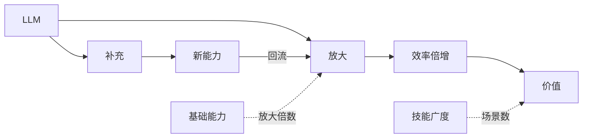

# 第 01 章 AI 是什么

## 内容目录

- [概念层级](#概念层级)
- [如何认知 AI 的作用](#如何认知-ai-的作用)

## 概念层级

```text
AI（人工智能）
│
├─ 传统AI：规则明确、边界清楚
│  ├─ 规则系统：靠人工写规则
│  └─ 搜索规划：在有限状态里找路径
│
├─ 机器学习：从数据中归纳规律
│  └─ 效果取决于数据和特征
│
└─ 深度学习：神经网络自动学习表征
   ├─ 视觉AI：识别、检测、理解图像
   ├─ 语言AI：理解和生成文本
   ├─ 强化学习：通过奖励学习行动策略
   └─ 生成式AI
       │
       └─ LLM（当前主流）
```

AI（人工智能）是一个总称，指让机器具备感知、学习、推理和决策能力的技术体系。传统 AI 依赖人工规则和搜索规划；机器学习从数据中归纳规律；深度学习通过神经网络自动学习表征。

当前最需要重点理解的是深度学习下的生成式 AI，尤其是 LLM（大语言模型）。LLM 不是 AI 的全部，而是当前通用性最强、使用频率最高、最容易进入办公和生产流程的一类 AI。

---

## 如何认知 AI 的作用

AI 对个人的作用不是替代一切，而是围绕两条路径展开：

| 路径 | 含义 | 关键判断 |
| --- | --- | --- |
| 放大 | 放大个人已有技能 | 你越懂目标、标准和流程，AI 越容易变成生产力 |
| 补充 | 帮你接触暂时不会的技能 | 补充本身不是终点，要回流成新的可判断能力 |



> 上一章：[第 00 章 课程总览](../00_课程总览/00_课程总览.md)  
> 下一章：[第 02 章 大模型的差异化](../02_大模型的差异化/02_大模型的差异化.md)
