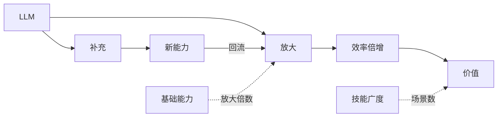

# 第 01 章 AI 是什么

```
AI（人工智能）
│
├─ 传统AI
│  ├─ 规则系统
│  └─ 搜索规划
│
├─ 机器学习
│  └─ 数据中学习规律
│
├─ 深度学习
│  ├─ 视觉AI
│  ├─ 语言AI
│  ├─ 强化学习
│  └─ 生成式AI
│       │
│       └─ LLM（当前主流）
│           ├─ ChatGPT
│           ├─ Claude
│           ├─ Gemini
│           └─ DeepSeek
│
└─ Agent（AI应用形态）
```

AI（人工智能）是一个总称，指让机器具备类似人类的感知、学习、推理和决策能力的技术体系。经过几十年的发展，AI 已形成多个重要方向，包括规则系统、机器学习、计算机视觉、强化学习和生成式 AI 等。其中，生成式 AI 是当前最活跃的领域，而大语言模型（LLM）则是生成式 AI 的核心代表。ChatGPT、Claude、Gemini、DeepSeek 等产品都属于 LLM 应用。换句话说，LLM 不是 AI 的全部，而是 AI 发展到当前阶段最重要、最受关注的一种实现形态。


---
## 如何认知ai的作用


> 上一章：[第 00 章 课程总览](../00_课程总览/00_课程总览.md)  
> 下一章：[第 02 章 大模型的差异化](../02_大模型的差异化/02_大模型的差异化.md)
