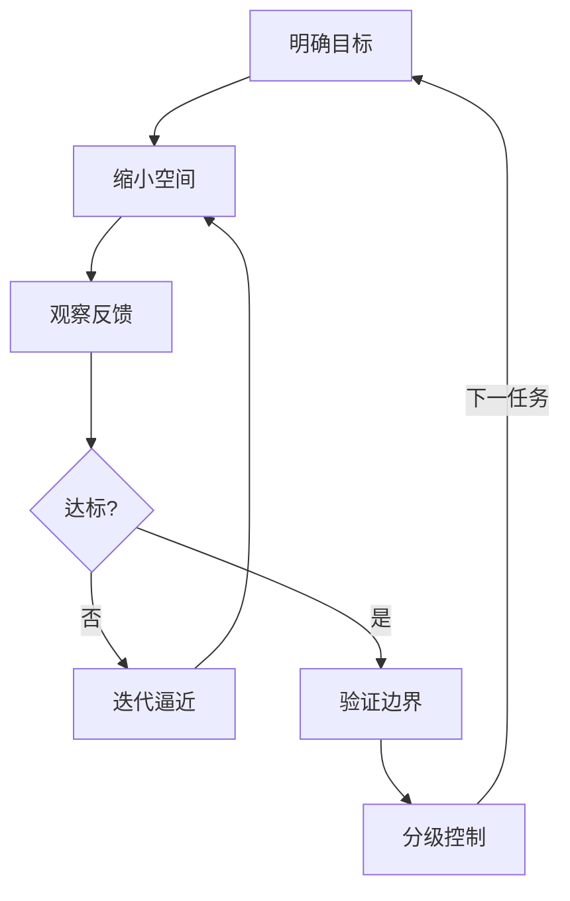
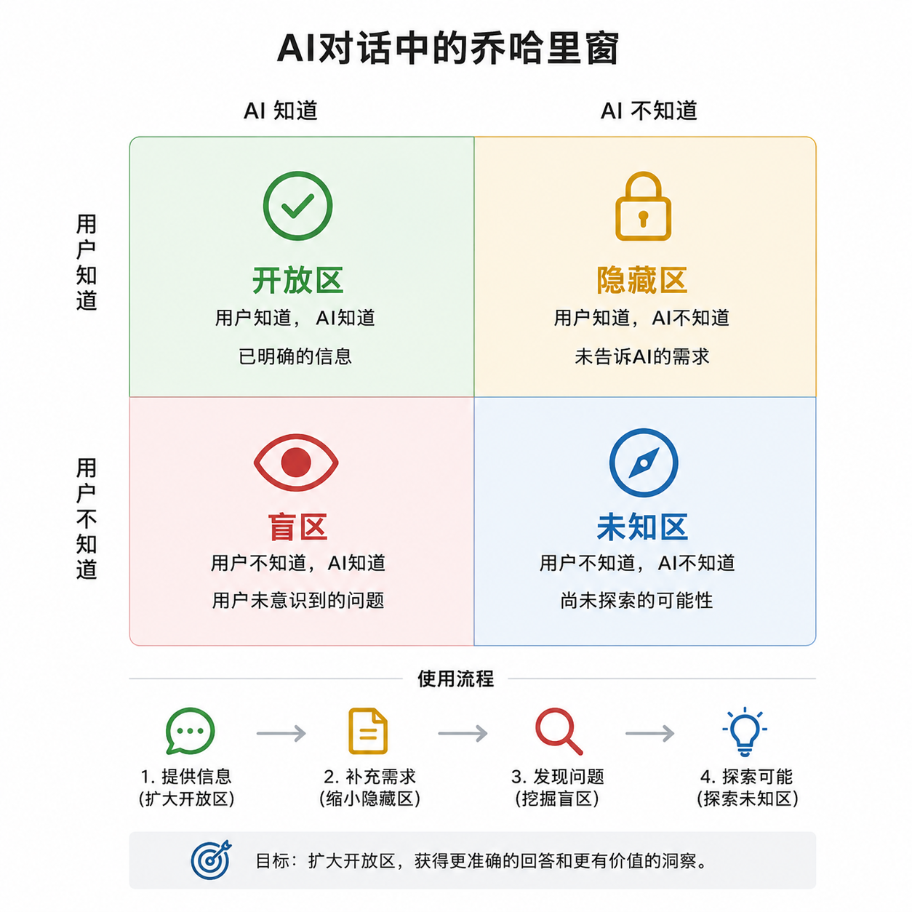

# 第 04 章 如何正确让 AI 工作

> 本章框架来自金观涛《控制论与科学方法论》：让 AI 工作是一个控制问题——你控制输入，观察输出，逐步逼近目标。

## 总纲



## 核心概念

| 概念 | 定义 |
| --- | --- |
| 可能性空间 | 事物发展变化中所有可能结果的集合 |
| 控制 | 通过选择缩小可能性空间，使输出向目标转化 |
| 黑箱 | 内部机制不可见，只能通过输入输出关系研究的系统 |

AI 是黑箱。你看不到模型内部如何得出答案，只能控制输入、观察输出。

| 变量 | 含义 | AI 中的对应 |
| --- | --- | --- |
| 可控制变量 | 你能调整的输入 | 提示词、模型选择、参数设置 |
| 可观察变量 | 你能判断的输出 | 回复的内容、格式、准确性 |

## 可控制变量

你手里有哪些可控制变量，决定了你能对 AI 施加多强的控制：

| 变量 | 作用 | 规则 |
| --- | --- | --- |
| 提示词 | 缩小可能性空间，最核心 | 写清角色、任务、背景、格式、约束 |
| 模型选择 | 不同模型能力边界不同 | 难任务用高能力模型 |
| 参数设置 | 温度、输出长度等 | 事实低温度，创意中高温度 |

## 缩小可能性空间

提示词的每条约束都在缩小 AI 的输出范围：

| 约束 | 排除的可能性 |
| --- | --- |
| "写一封邮件" | 报告、论文、聊天记录等格式 |
| "对象是客户" | 内部同事、朋友等语气 |
| "不超过 200 字" | 长篇大论 |

模糊提示 = 大可能性空间 = 输出不可控。"帮我写一下"是典型失控提示。



### 提示词结构

```text
角色：你以什么身份回答
任务：要完成什么
背景：已知信息和限制
格式：按什么结构输出
标准：什么算合格
```

### 基础模板

```text
你是[角色]。
请完成[任务]。
背景：[材料/目标/受众/限制]。
要求：
- [字数/语气/格式]
- [必须包含]
- [不能包含]
输出格式：[表格/列表/邮件/JSON/Markdown]
```

### 常用模板

**写作**

```text
请根据以下要点写一版[邮件/报告/文案]。
对象：[对象]
目的：[目的]
语气：[正式/简洁/委婉]
限制：[字数/不能承诺的内容]
要点：[粘贴]
```

**总结**

```text
请总结以下材料，输出：
1. 核心结论
2. 支撑证据
3. 风险或限制
4. 需要核验的信息
材料：[粘贴]
```

**分析**

```text
请分析以下问题。
先列已知条件，再列可能方案。
每个方案说明：收益、成本、风险、适用条件。
问题：[粘贴]
```

**验证**

```text
请回答以下问题。
要求：
1. 不确定就写"不确定"
2. 对数字、日期、人名、出处标注来源
3. 将结论分为：确定 / 待核验 / 无法判断
问题：[粘贴]
```

## 反馈调节

**负反馈**：输出→检查差距→调整输入→再输出→逐步逼近目标。

| 操作 | 控制论概念 |
| --- | --- |
| 写提示词 | 给出初始控制条件 |
| 检查输出 | 观察可观察变量 |
| 调整提示 | 修正可控制变量 |
| 多轮修正 | 负反馈迭代 |

| 常见失误 | 说明 |
| --- | --- |
| 不检查就采用 | 跳过观察，等于没有反馈 |
| 照搬 AI 修改建议 | AI 自我修正时可能性空间仍然很大 |
| 每轮换新方向 | 正反馈振荡，不收敛 |

每轮只修与目标差距最大的部分。

### 上下文管理

| 问题 | 处理 |
| --- | --- |
| 对话太长 | 开新对话，重新贴关键背景 |
| 输出跑偏 | 重申任务、约束、格式 |
| 材料太多 | 分段处理，最后合并 |
| 多轮修改混乱 | 让 AI 先复述当前版本和目标 |

## 共轭控制

**共轭控制** = 用工具扩大控制范围。AI 就是你的共轭控制工具。

| 你直接做不到 | AI 作为中介 |
| --- | --- |
| 写语气恰当的客户邮件 | 给要点，AI 组织结构 |
| 快速理解英文长文 | 给原文，AI 提取结论 |
| 对比方案成本和风险 | 给条件，AI 列对比表 |

前提：**你要有明确目标和判断标准**。没目标，工具再强也无法缩小可能性空间。

## 控制边界

可能性空间太大，提示词无法缩小到可靠范围的内容：

| 内容 | 原因 |
| --- | --- |
| 数字、日期、人名、机构名 | 错误值无限多 |
| 法律、医疗、金融建议 | 需要专业责任主体 |
| 最新新闻、实时价格 | 模型可能不知道最新信息 |
| 引用、论文、链接 | 可能不存在 |
| 复杂推理链 | 一步错，结论错 |

### 验证方法

| 方法 | 用法 |
| --- | --- |
| 搜索核验 | 查数字、日期、人名、法规 |
| 官方来源 | 优先官网、公告、监管文件、论文原文 |
| 交叉验证 | 至少两个独立来源一致 |
| 回到原文 | 总结类任务必须核对原材料 |
| 让 AI 标注不确定 | 要求输出"确定/待核验/无法判断" |
| 多模型对比 | 不一致时以外部来源为准 |

## 分级控制

| 风险 | 力度 | 操作 |
| --- | --- | --- |
| 低 | 轻控制 | 直接用初稿，浏览确认 |
| 中 | 反馈调节 | 检查后调整再用 |
| 高 | 强控制 | AI 辅助整理，结论外部核验 |

### 信任分级

| 场景 | 信任级别 | 处理 |
| --- | --- | --- |
| 改写、润色、格式整理 | 高 | 人工浏览 |
| 总结、翻译、学习解释 | 中 | 抽查关键点 |
| 数据、日期、引用 | 低 | 必须核验 |
| 医疗、法律、金融决策 | 不信任 | 找专业人士 |

> 本章方法论参照金观涛、华国凡《控制论与科学方法论》（广东人民出版社, 2025 再版）  
> 上一章：[第 03 章 能力和价格](../03_能力和价格/03_能力和价格.md)  
> 回到开头：[第 00 章 课程总览](../00_课程总览/00_课程总览.md)
