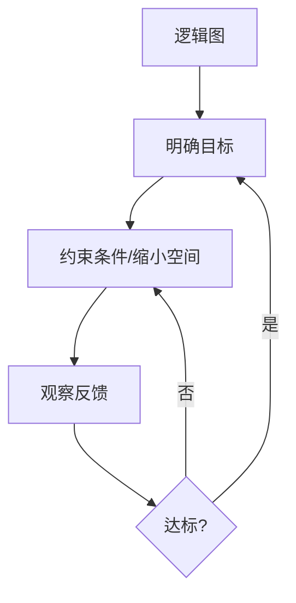

# 第 04 章 如何正确让 AI 工作

## 内容目录

- [思维模型](#思维模型)
  - [乔哈里窗思维](#乔哈里窗思维)
  - [第一性原理思维](#第一性原理思维)
  - [奥卡姆剃刀思维](#奥卡姆剃刀思维)
  - [证伪思维](#证伪思维)
- [控制模型](#控制模型)
  - [逻辑图](#逻辑图)
  - [明确目标](#明确目标)
  - [缩小空间](#缩小空间)
  - [观察反馈](#观察反馈)
  - [迭代逼近](#迭代逼近)
- [可控制变量和方法](#可控制变量和方法)
  - [核心概念](#核心概念)
  - [提示词定方向](#提示词定方向)
  - [提示词结构](#提示词结构)
  - [基础模板](#基础模板)
  - [常用模板](#常用模板)
  - [上下文管理](#上下文管理)
- [验证与信任](#验证与信任)
  - [验证方法](#验证方法)
  - [信任分级](#信任分级)

让 AI 工作，本质是控制问题：你不能直接控制模型内部，只能控制输入、观察输出，再通过反馈逐步逼近目标。

## 思维模型

### 乔哈里窗思维

乔哈里窗用来判断任务该怎么交给 AI。关键不是“AI 会不会”，而是“你是否能判断它的输出”。

| 区域 | 含义 | 使用方式 |
| --- | --- | --- |
| 我知道，AI 知道 | 你有判断标准，AI 也有足够知识 | 可让 AI 生成初稿，你负责筛选和修正 |
| 我知道，AI 不知道 | 你掌握内部信息，AI 缺少上下文 | 先补材料、规则、样例，再让 AI 工作 |
| 我不知道，AI 知道 | AI 可能能给出知识或方法，但你不具备判断力 | 只能当学习入口，必须查证关键结论 |
| 我不知道，AI 不知道 | 你和 AI 都缺少可靠依据 | 不要让 AI 直接下结论，先找资料或专家 |


### 第一性原理思维

第一性原理要求先拆到底层目标和约束，再让 AI 生成方案。不要从“别人怎么做”开始问，而要从“我要达成什么、受什么限制、什么算合格”开始。

| 错误问法 | 更好的问法 |
| --- | --- |
| 帮我写一个方案 | 目标是提高复购率，预算 3 万，周期 14 天，不能降价，请列 3 个方案并说明取舍 |
| 帮我优化提示词 | 目标是让模型稳定输出合同风险清单，输入是合同原文，输出必须含风险等级和依据，请重写提示词 |

### 奥卡姆剃刀思维

奥卡姆剃刀用于删除 AI 输出里的冗余结构和虚假复杂度。能用一个判断标准解决的问题，不要让 AI 扩成一套空泛框架。

| 检查点 | 处理 |
| --- | --- |
| 是否有重复观点 | 合并 |
| 是否有无证据判断 | 删除或标注待核验 |
| 是否有无用背景铺垫 | 删除 |
| 是否把简单任务复杂化 | 收回到目标和约束 |

### 证伪思维

证伪思维要求 AI 不只给答案，还要暴露可能错在哪里。尤其是事实、数字、法律、医疗、金融、采购和代码架构类任务，必须让 AI 给出依据、反例和不确定项。

```text
请不要只给结论。请同时输出：
1. 结论
2. 支撑依据
3. 可能错误的地方
4. 需要外部核验的信息
5. 如果结论相反，最可能因为什么
```

## 控制模型

### 逻辑图



这个循环的重点是：先定义目标，再用约束缩小输出空间；看结果后，只修最大偏差，直到输出达到当前目标。

### 明确目标

目标要先于工具。不要先问“AI 能做什么”，而要先说清楚“我想得到什么结果”。

| 模糊目标 | 可执行目标 |
| --- | --- |
| 帮我写一下 | 写一封发给老客户的续约提醒邮件，语气克制，不超过 200 字 |
| 帮我分析 | 根据这 3 个报价方案，从成本、风险、交付周期做对比 |
| 帮我学习 | 用初学者能懂的方式解释 MoE，并给 3 个判断题检查理解 |

### 缩小空间

每条约束都在排除错误输出。约束越贴近真实任务，输出越可控。

| 约束 | 排除的可能性 |
| --- | --- |
| 输出给客户看 | 排除内部讨论口吻 |
| 不超过 200 字 | 排除长篇解释 |
| 必须引用原文句子 | 排除无依据总结 |
| 只列风险，不给法律意见 | 排除越权判断 |

### 观察反馈

观察反馈不是让 AI “再优化一下”，而是指出偏差在哪里。

| 偏差 | 反馈方式 |
| --- | --- |
| 内容跑偏 | 重申目标和受众 |
| 格式不对 | 给出目标格式或样例 |
| 结论过满 | 要求标注确定/待核验/无法判断 |
| 太空泛 | 要求每个判断绑定材料依据 |

### 迭代逼近

每轮只修最大偏差。一次同时改目标、语气、结构、事实和格式，容易让模型方向振荡。

| 轮次 | 只处理一类问题 |
| --- | --- |
| 第 1 轮 | 目标是否对 |
| 第 2 轮 | 结构是否对 |
| 第 3 轮 | 内容是否准确 |
| 第 4 轮 | 表达是否适合使用 |

## 可控制变量和方法

### 核心概念

| 概念 | 定义 | 对 AI 的含义 |
| --- | --- | --- |
| AI 黑箱 | 内部机制不可见，只能通过输入输出关系研究 | 不要假设模型“理解了”，要看输出是否达标 |
| 模型定上限 | 不同模型能力、上下文、工具调用和稳定性不同 | 难任务先选高能力模型，轻任务再降成本 |
| 参数定稳定性/发散度 | 温度、top_p、输出长度等会改变随机性 | 事实任务低发散，创意任务可适当提高发散 |
| 可能性空间 | 所有可能输出的集合 | 提示词、材料和格式都在缩小这个集合 |
| 控制 | 通过选择缩小可能性空间，使输出向目标转化 | 控制输入、检查输出、迭代修正 |

### 提示词定方向

提示词不是咒语，而是控制条件。它要同时告诉 AI：做什么、基于什么做、怎么做、做到什么标准。

| 控制项 | 要写清什么 |
| --- | --- |
| 角色 | 以什么专业身份或工作视角处理任务 |
| 任务 | 具体产出是什么 |
| 背景 | 已知材料、受众、限制、上下文 |
| 格式 | 表格、清单、邮件、JSON、Markdown 等 |
| 标准 | 什么算合格，什么不能出现 |

### 提示词结构

```text
角色：你以什么身份回答
任务：要完成什么
背景：已知信息和限制
格式：按什么结构输出
标准：什么算合格
```

### 基础模板

```text
你是[角色]。
请完成[任务]。
背景：[材料/目标/受众/限制]。
要求：
- [字数/语气/格式]
- [必须包含]
- [不能包含]
输出格式：[表格/列表/邮件/JSON/Markdown]
```

### 常用模板

**写作**

```text
请根据以下要点写一版[邮件/报告/文案]。
对象：[对象]
目的：[目的]
语气：[正式/简洁/委婉]
限制：[字数/不能承诺的内容]
要点：[粘贴]
```

**总结**

```text
请总结以下材料，输出：
1. 核心结论
2. 支撑证据
3. 风险或限制
4. 需要核验的信息
材料：[粘贴]
```

**分析**

```text
请分析以下问题。
先列已知条件，再列可能方案。
每个方案说明：收益、成本、风险、适用条件。
问题：[粘贴]
```

**验证**

```text
请回答以下问题。
要求：
1. 不确定就写“不确定”
2. 对数字、日期、人名、出处标注来源
3. 将结论分为：确定 / 待核验 / 无法判断
问题：[粘贴]
```

### 上下文管理

| 问题 | 处理 |
| --- | --- |
| 对话太长 | 开新对话，重新贴关键背景 |
| 输出跑偏 | 重申任务、约束、格式 |
| 材料太多 | 分段处理，最后合并 |
| 多轮修改混乱 | 让 AI 先复述当前版本和目标 |
| Agent 多步任务失控 | 给阶段目标、停止条件和检查点 |

## 验证与信任

### 验证方法

| 方法 | 用法 |
| --- | --- |
| 官方来源 | 优先官网、公告、监管文件、论文原文 |
| 搜索核验 | 查数字、日期、人名、法规、价格、版本 |
| 交叉验证 | 至少两个独立来源一致 |
| 回到原文 | 总结类任务必须核对原材料 |
| 多模型对比 | 不一致时不要投票，以外部来源为准 |
| 让 AI 标注不确定 | 要求输出“确定 / 待核验 / 无法判断” |

### 信任分级

| 场景 | 信任级别 | 处理 |
| --- | --- | --- |
| 改写、润色、格式整理 | 高 | 人工浏览即可 |
| 总结、翻译、学习解释 | 中 | 抽查关键点 |
| 数据、日期、引用、价格 | 低 | 必须核验 |
| 医疗、法律、金融、合规、人事、采购 | 不直接信任 | AI 只做辅助整理，结论由专业来源或责任人确认 |

> 本章方法论参照金观涛、华国凡《控制论与科学方法论》（广东人民出版社, 2025 再版）  
> 上一章：[第 03 章 能力和价格](../03_能力和价格/03_能力和价格.md)  
> 回到开头：[第 00 章 课程总览](../00_课程总览/00_课程总览.md)
